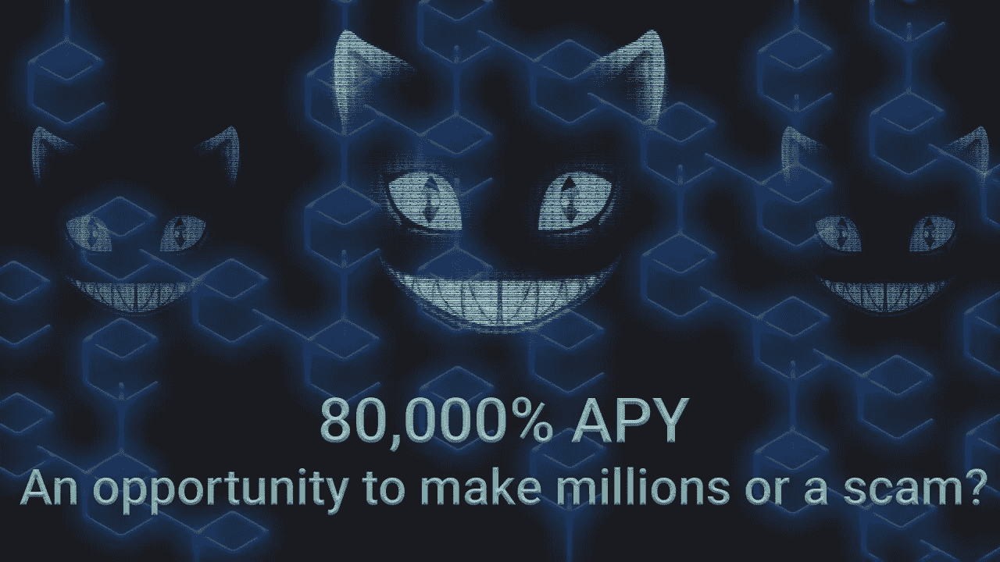
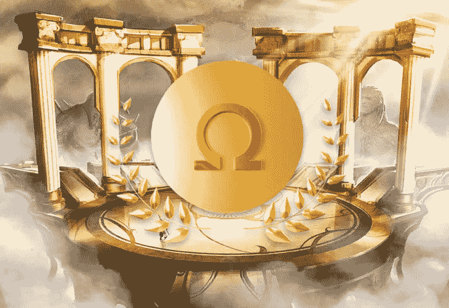
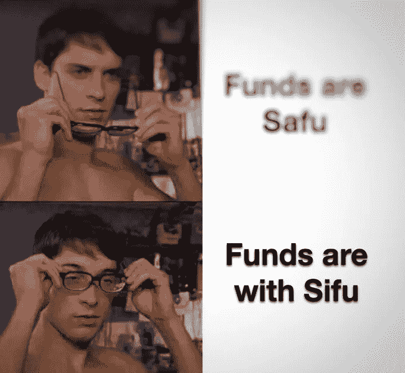
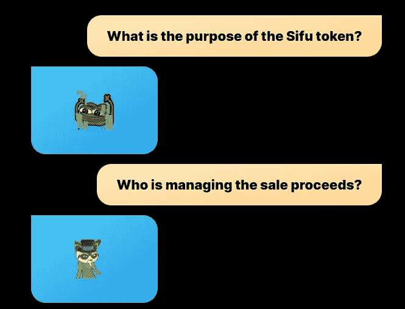

# 和洛奇·巴尔博亚一样，《蛙国》的首席财务官也不断回归。

> 原文：<https://medium.com/coinmonks/like-rocky-balboa-the-cfo-of-frog-nation-keeps-coming-back-4a53a6415a7a?source=collection_archive---------26----------------------->

If you recognise this, congratulations! You are a fellow degen!

四福。

想起什么了吗？

可能是《功夫熊猫》里的师傅(小熊猫)，也可能是在菜饭摊上给你更多食物的叔叔。

不知道你是否知道这个名字。

但阿福又名“ **OxSifu”，是一个颇有争议的人物。**

Sifu 是蛙国的 CFO，领导了一系列的 DeFi 项目。

他被曝光为 QuadrigaCX 的联合创始人迈克尔·帕特林(Michael Patryn)，“2019 年损失了 1.9 亿美元客户存款的臭名昭著的加密交易所”。

我们都想知道他是如何逃脱的。

这就是为什么 web3 中的大多数人喜欢保持不依赖。

因为上帝知道他们有什么龌龊的秘密，上帝禁止公众进一步信任他们。

他因时间仙境而走红，这是奥林巴斯在雪崩网络上运营的一个分支。

Launched in March 2021, Olympus DAO is **a decentralized finance (DeFi) infrastructure that aims to provide a transparent and stable crypto ecosystem for its users**.

如果这一切对你来说毫无意义，想象一下:

时间仙境基本上是一个网站，你可以投入金钱，并期待随着时间的推移更多的钱。

几乎像魔术一样，除了它开始像纸牌搭的房子一样倒塌的时候。

在定义奥林巴斯-APY 的狂热中，时间仙境绝对是坐在最顶端。

每个人都想加入。

YouTube 影响者、Reddit trolls、每个有 12 美元的大学生和“精明的投资者”都认为这是 DeFi 的突破。

我承认，这确实引起了我的注意，好奇心变成了兴趣。

这种兴趣促使我做了自己的研究。

最终，我对收益率的来源有太多的漏洞和疑问。

当谈到在 DeFi 中“金融化”金钱时，人们可以变得多么令人费解和富有创造力，这真的让我感到惊讶。

Time Wonderland has the Cheshire Cat from Alice in Wonderland right at its home page, don’t even begin to wonder why the cat was chosen.

每个人基本上都在解释和吹捧这种疯狂的 APYs 有多神奇，却懒得解释收益率是如何产生的。

“如果你不能解释收益从何而来，你就是收益”。

因此，本质上，一个美化，分散的庞氏骗局，不断需要新鲜血液进入系统。

令人害怕的是，警告信号就在我们面前，但没有人选择看到它。

时间仙境令牌最终崩溃，掏空了 95%的价值，突然，没有人对它感兴趣了。

Time Wonderland was a tremendous success by all records, till it collapsed like a house of cards in blazing glory, literally as fast as it came.

有趣的是，私服后被赶下台。

那么四福是怎么做的呢？

他接着推出了自己的代币，名为$SIFU。

这是一只投资基金，“大约有 100 万枚代币可供出售，每枚 100 美元，这意味着如果全部认购，将募集 1 亿美元。”

基本上，他是在被认为明显有信任问题和风险管理问题后，要求人们给他钱来管理。

这个网站实际上是一个丰富的迷因。

去看看！

He literally answers questions with a meme and laughs at the very people who are giving him the $.

你猜怎么着。

人们买了它。

现在他带着 UwU lend 回来了，这是一个从 Aave 派生出来的新的货币市场协议。

更疯狂的是，它锁定了 5550 万澳元的总价值(TVL)。

他可能有不光彩的过去和更阴暗的人格。

然而人们仍然给他钱。

我想人类的贪婪是普遍的。

赚快钱的需求超过了对逻辑和谨慎风险管理的需求。

像 FTX，3AC，露娜/泰拉，所有疯狂的 NFT 拉格拉和产量农业诈骗。

一个问题一直困扰着我:他本可以在被勒索后带着数亿美元逃跑，然后藏起来，那么他为什么没有呢？

他真的对 DeFi 有热情，并在这场骚乱后想留在游戏中吗？

-

贪婪是所有这些秘密骗局和内爆背后的原因吗？

-

# startups # business # startupx # growth # success # social media # culture # entrepreneurs # strategy # eth # BTC # crypto # sifu token # quadrigacx # NFT # profits # meme # tvl # defi

> 交易新手？试试[加密交易机器人](/coinmonks/crypto-trading-bot-c2ffce8acb2a)或者[复制交易](/coinmonks/top-10-crypto-copy-trading-platforms-for-beginners-d0c37c7d698c)