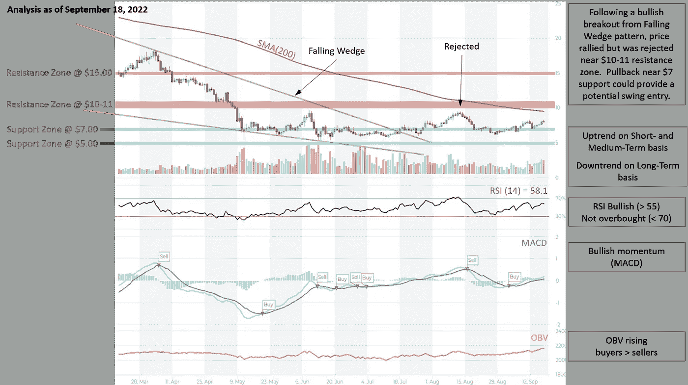
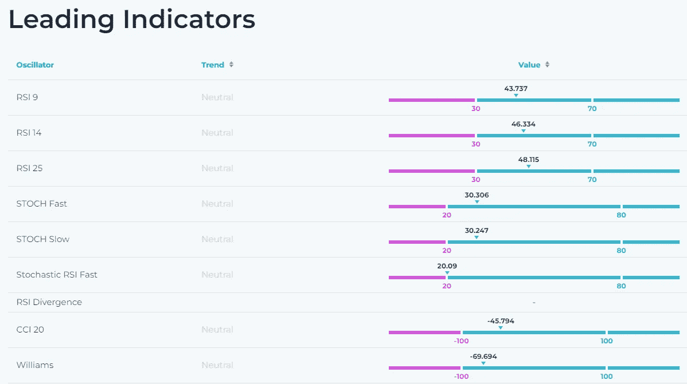
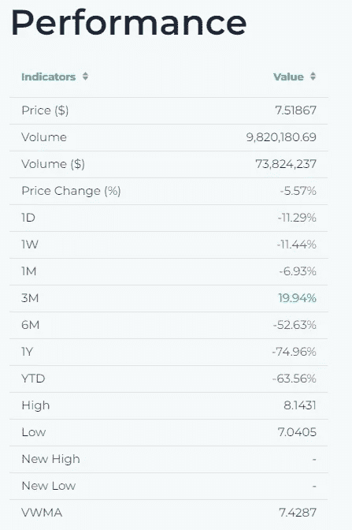
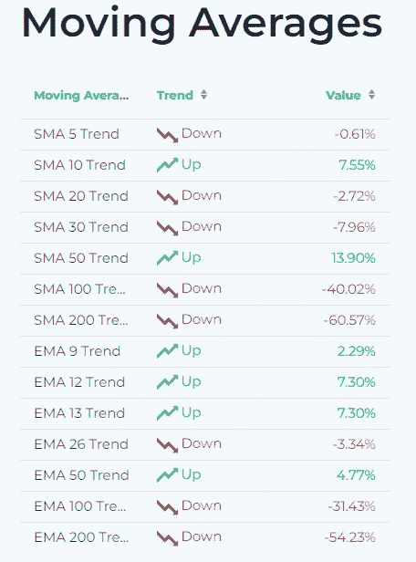
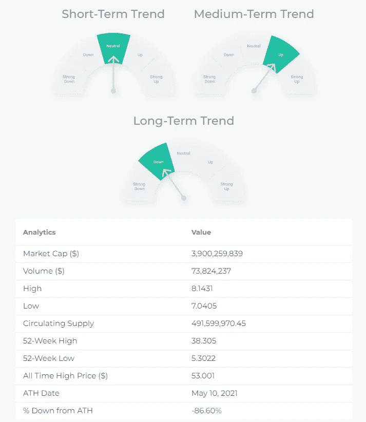
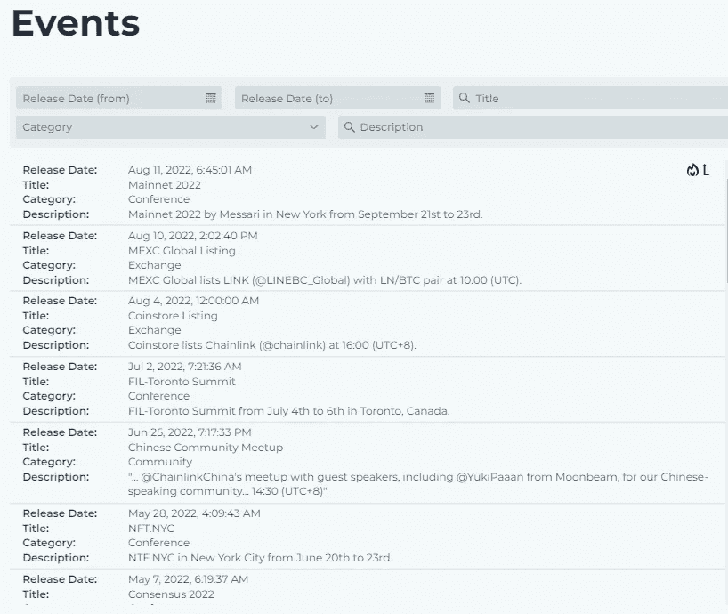
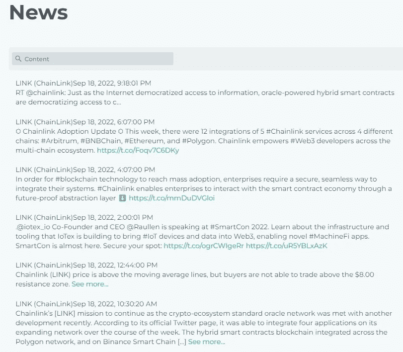

# 链接(chain LINK)——价格分析，图表模式，技术指标，新闻…

> 原文：<https://medium.com/coinmonks/link-chainlink-price-analysis-chart-patterns-technical-indicators-news-5e44cd4bd5d0?source=collection_archive---------46----------------------->

# 链接的技术分析:

Source: [altFINS](https://altfins.com/curatedCharts)

**交易设置:**在下跌楔形形态的牛市突破后，价格上涨，但在 10-11 美元阻力区附近被拒绝。(设定价格[警报](https://altfins.com/knowledge-base/create-alert-for-cryptocurrencies/))。在 7 美元附近的回调可能会提供一个有上升潜力的到 10-11 美元阻力区的机会。

**趋势:**中短期趋势上升，长期趋势下降。

**动能**看涨( [MACD](https://altfins.com/knowledge-base/macd-line-and-macd-signal-line/) 线在 MACD 信号线上方，RSI 在 55 上方)。

**OBV(平衡成交量):**上涨，表示上涨日成交量大于下跌日成交量。因此，需求(买方)超过供应(卖方)。

**支撑和阻力:**最近的支撑区是 7.00 美元，然后是 5.00 美元。最近的阻力区是 10.00-11.00 美元，然后是 15.00 美元。

# 技术指标:

Source: [altFINS](https://altfins.com/screener)

Source: [altFINS](https://altfins.com/news)

Source: [altFINS](https://altfins.com/news)

访问 altFINS.com 获得更多分析、指标和新闻…

> 交易新手？尝试[加密交易机器人](/coinmonks/crypto-trading-bot-c2ffce8acb2a)或[复制交易](/coinmonks/top-10-crypto-copy-trading-platforms-for-beginners-d0c37c7d698c)