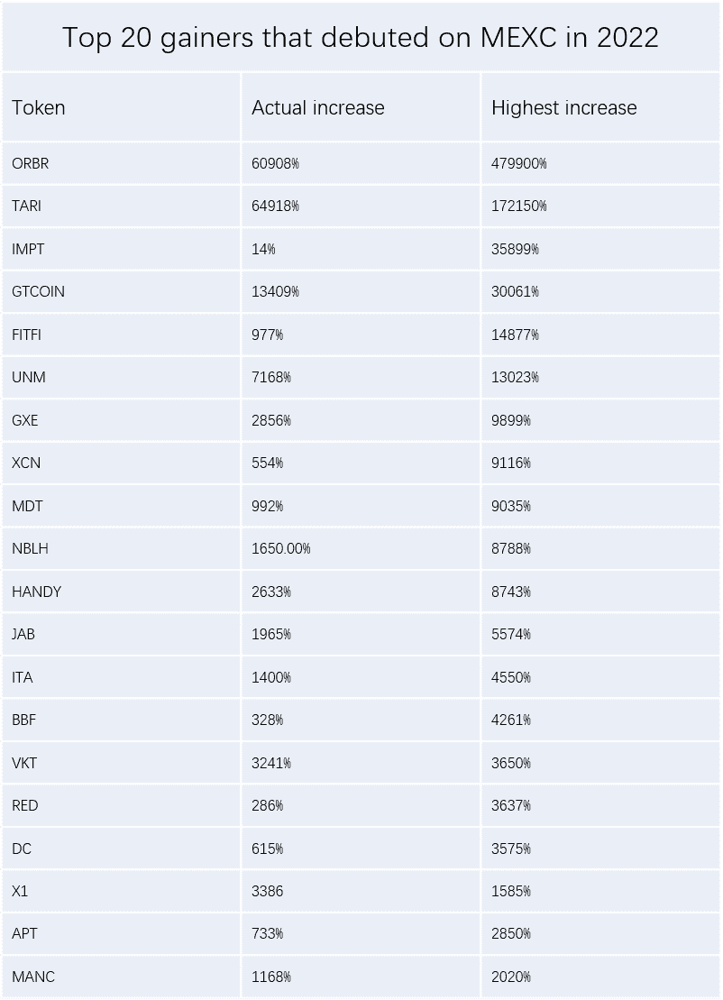
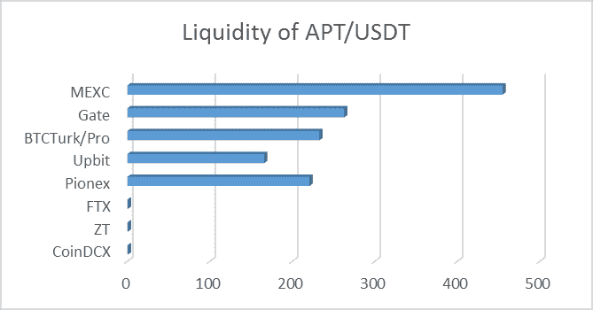
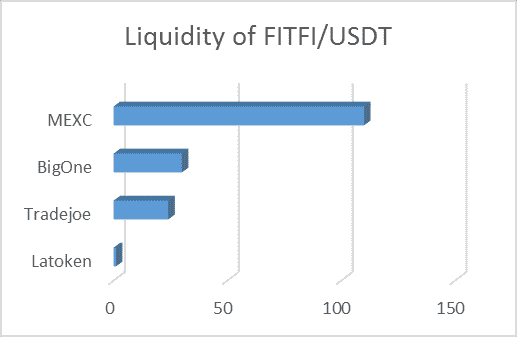
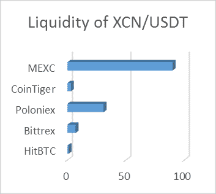
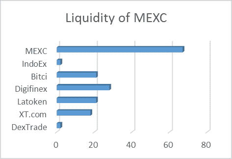
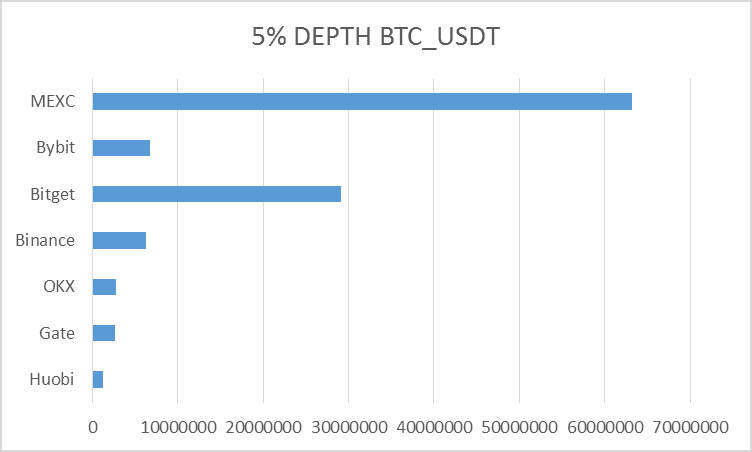
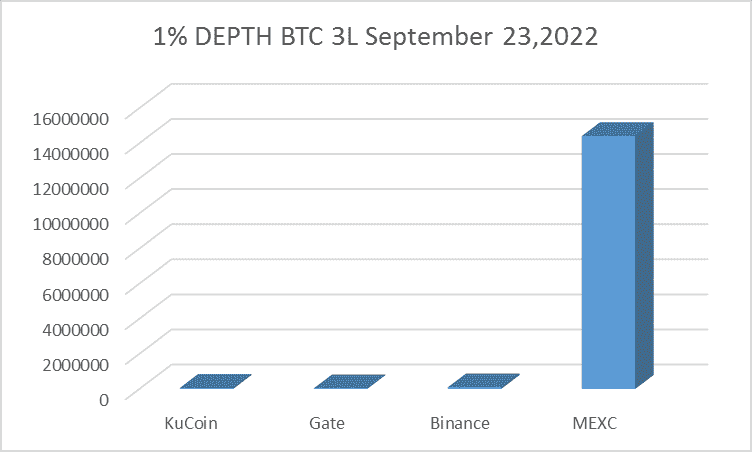
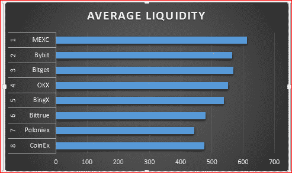

# 几个数字资产交易所之间的流动性

> 原文：<https://medium.com/coinmonks/liquidity-between-digital-asset-exchanges-6feb28e44215?source=collection_archive---------13----------------------->

理解加密货币交易所的流动性至关重要。它帮助我们确定可用加密货币的成功以及将它们转换为法定货币或其他数字资产的能力。

Image Designed by Ojeniyi Rashidat A.

如今，许多投资者和交易者更喜欢在加密货币交易所持有和交易他们的数字资产。从[记录](https://www.sciencedirect.com/science/article/pii/S0927539822000822)来看，大约 5%的比特币交易是在区块链完成的，其余 95%通过世界各地的加密货币交易所转移比特币。这意味着，对于每一笔数字资产交易和转移，很大一部分都是通过加密货币交易所完成的。大部分最高钱包由交易所管理。

在讨论数字资产的价格和数量时，流动性也是一个需要考虑的重要因素。没有人愿意将自己的资产放在泡沫交易所，因此了解加密货币交易所的流动性非常重要。这可以决定加密货币的成功以及将它们转换为法定货币或其他数字资产的能力。

**数字资产交易所的流动性是指交易者在市场上进行交易/互换而不会出现任何价格滑移的难易程度。** [**MEXC，**](https://m.mexc.com/auth/signup?inviteCode=1Wi6t) **最活跃的加密交易所之一，被认为是衍生品、现货和期货方面最具流动性的数字资产交易所。**

在像 MEXC 这样的加密交易所购买 1000 美元的 DOT 更容易，因为该市场每天的交易量不少于 10 亿美元。当交易者可以快速交易他们的数字资产而不会对价格产生负面影响时，加密货币交易所的流动性就会受到影响。

多年来，加密货币投资获得了极大的关注，导致了期货、衍生品和 ETF 交易的引入。这些功能被称为投资/交易工具，需要在加密货币交易所频繁买卖数字资产。

数字资产交易所可以通过允许密码交易员指定他们想要交易的数字资产数量的指令簿来实现其高流动性。加密交易将有助于将交易与可用的市场价格相匹配。**流动性加密交易所受益交易商，能够进行交易而不出现任何价格扭曲。**

最近[报道](https://blog.mexc.com/debut-assets/)GameFi 代币和 NFT 在 2022 年都有不错的表现。根据 MEXC global 的数据，截至 2022 年 10 月 31 日，该平台的首次亮相项目激增，最高增幅为 2020%和 479，900%，目前的实际增幅在 14%- 60，908%之间，平均增幅为 5，605%

从 2022 枚 MEXC 出道币，截至 11 月 12 日，来自 Coinmarketcap 的分析显示，FITFI_USDT 在 MEXC、Tradejoe、BigOne、Latoken 上的流动性分别为 110、24、30、1。ORBIT 在 MEXC、Huobi global、Hotcoin global 上的流动性分别为 39、17、2。

另一方面，XCN 在 MEXC、Poloniex、Bittrex 和 tiger 上分别有 90、31、7 和 3 个。DC 币在 MEXC、Lbank、Bitmart、Hotbiy 上分别有 100、90、65、8 的流动性。APT 在 MEXC、gate、Upbit 和 Pionex 上的流动性分别为 455、263、166、221。像 UNM、NBLH 和 HANDY 这样的令牌在 MEXC 加密交易所只有 liquidy。

然而，在未来交易中，5%的深度显示墨西哥湾在 BTC/USDT 有 63，187，347.00 的流动性表现。与其他交易所相比，这是很高的流动性，其他交易所的 5%深度为 290，856，11.05，其他值低于此值。

与 OKX、Gate.io、Bybit 和 Huobi 的 5%深度相比，MEXC 上的 ETH/USDT 期货显示为 90，243，760，OKX、gate . io、Bybit 和 huo bi 分别为 2，412，711.00、2，400，371、2，388，956 和 506，955。此外，MEXC 在与 AVAX/USDT、LTC 和其他公司的期货交易中具有高流动性。

有关加密交易所硬币流动性的文献为未来的潜力提供了空间。截至 2022 年 9 月 23 日，3L BTC 在 MEXC 上交易的 1%深度显示为 14403439.02，币安给出 87359.56，Gate.io 给出 29545.05，kuCoin 给出 48476。

世界杯即将到来，自 2022 年 8 月以来，球迷代币一直表现良好。墨西哥湾和币安拥有大部分这种代币。LAZIO、SNFT 和 ITA maximum gains 等粉丝代币分别飙升了 814%、2075%和 4550%。随着节日的临近，代币价格可能会飙升，进一步影响 MEXC 和其他拥有这些代币的平台，以提高其流动性水平。到目前为止， [MEXC](https://www.mexc.com/) 已经列出了大约 18 个粉丝代币，其中 5 个已经在 2022 年推出。

# 如何衡量数字资产交易所的流动性？

交易所的流动性由上市的硬币数量、交易量、日常交易活动和其他技术因素决定

## **交易量**

当谈到衍生品市场和现货时，目前流动性最强的市场是 MEXC global。根据 Coinmarketcap 的记录，截至 2022 年 11 月 8 日，MEXC 的平均日交易量约为 149，559，070，747 美元。

低交易量的加密交易所不会对流动性产生好的影响。因此，加密交易所的流动性意味着该交易所在衍生品、交易所交易基金、期货和现货方面的日交易量很高。在流动性加密货币交易所交易数字资产更容易，因为交易订单将因交易者数量众多而更快完成。

## **硬币数量**

我们现在有超过 200 家数字资产交易所。他们中的一些人拥有大量的硬币，而另一些人拥有较少的硬币。

拥有许多数字资产的加密交易所为在交易所上市任何硬币之前进行彻底的筛选和评估提供了空间。因此，在考虑流动性最好的数字资产交易所时，选择有很多硬币的交易所至关重要。

上市数字资产很少的加密货币交易所将让用户陷入有限的交易冒险。这可能会限制他们的利润和交易各种数字资产的能力。拥有更多数字资产的加密货币交易所将拥有更多访问量，并能够影响市场流动性。

## **日常交易活动**

由于交易量低，一些交易所可能被认为缺乏流动性。用户较少的交易平台可能会面临流动性问题。很难进入或退出交易头寸。交易者最喜欢流动的加密货币交易所，因为它更容易进入或退出交易，并且由于高硬币数而具有很多冒险性。

# 加密货币交易所流动性

高流动性的加密货币交易所是交易数字资产的安全场所。每个数字资产交易所都必须为用户确保一个安全的交易环境。就像 MEXC 一样，构建了多层多集群的系统架构，保证安全稳定的交易环境。

[MEXC](https://m.mexc.com/auth/signup?inviteCode=1Wi6t) ，即 MEXC global，在流动性方面是市场领导者。日交易量超过 1490 亿，平均流动性超过 600，已覆盖 20 多个不同语言的国家和地区。作为交易者，你可以在 MEXC 数字资产交易所交易衍生品、现货、保证金、杠杆 ETF、期货和赌注。MEXC 数字资产交易所非常关心用户，这使得他们在用户中建立了良好的声誉。这种加密货币交易所提供了一个一体化的目的地，允许交易者交易最受欢迎的数字资产

## **为什么选择 MEXC？**

*   大约有 1728 种加密货币上市，
*   1，700 个加密货币交易对
*   现货、期货和衍生品的高流动性。
*   149，559，070，747 美元的衍生品交易量
*   提供良好的客户服务
*   为保护数字资产安全提供一站式安全平台
*   频繁升级以提高效率、安全性、稳定性和交易深度。
*   高市场活动和更多的用户访问。

# **总结**

加密交易所的流动性与数字资产的交易活动以及交易所中数字资产的流动性范围有关。可以使用交易所中每个数字资产的订单数据来确定流动性。还要记住，数字资产交易所的流动性和交易量越高，你在交易经历中的冒险就越多。

# 关于作者

Ojeniyi Rashidat Ayobami 是一名 web3 和区块链内容作家、开发人员、图形设计师和视频营销人员。她是一名经验丰富的加密货币交易员，拥有五年的交易经验。你可以通过电报联系她，地址是:t.me/ayobami001

> 交易新手？试试[加密交易机器人](/coinmonks/crypto-trading-bot-c2ffce8acb2a)或者[复制交易](/coinmonks/top-10-crypto-copy-trading-platforms-for-beginners-d0c37c7d698c)