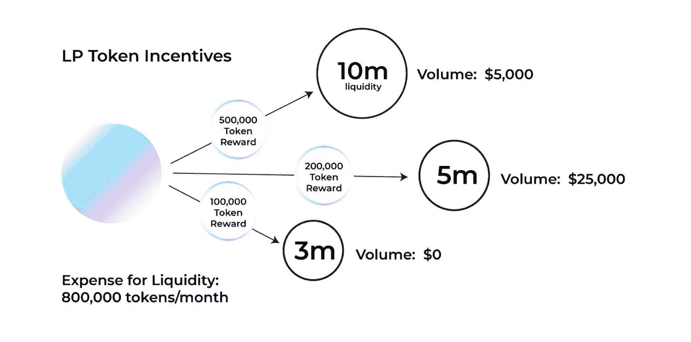

# 流动性挖掘 2.0 (LM2)

> 原文：<https://medium.com/coinmonks/liquidity-mining-2-0-lm2-5b21342dc7fd?source=collection_archive---------21----------------------->

超级火热的 DeFi summer 2020 随着 [Compound 的治理令牌](/@hhe/comp-distribution-design-will-incentivize-phantom-growth-and-open-pandoras-box-6b9a3ac41c01)的推出而火了起来，完全是由流动性采矿(又名产量农业)的概念推动的。毫无疑问，流动性挖掘将 DeFi 推向了聚光灯下，因此更多人可以看到 DeFi 相对于 CeFi 和 TradFi 的力量。另一方面，流动性挖掘的滥用及其对许多不老练的代币购买者的损害绝对损害了 DeFi 的声誉。整体而言，流动性开采对 DeFi 的净收益仍不确定。

> 从顶级交易者那里复制交易机器人。免费试用。

流动性挖掘有一些新颖的用法，比如 [YAM](https://yam.finance/) 的 pool1 设计来引导一个加密社区， [Sushiswap](https://www.sushi.com/) 的吸血鬼攻击来引导 AMM 的流动性。但总的来说，大多数项目都是简单的模仿或直接的分叉。可悲的是，也有许多利用市场叙事的骗局。

显然，当前的流动性挖掘设计并不理想，这也是导致几乎所有项目流动性挖掘计划不可持续的主要根源之一。更糟糕的是，在过去的 2 年里，甚至没有人尝试去修复流动性挖掘设计中的缺陷。

# **流动性挖掘 1.0(LM1)——根据 LP 头寸规模分配奖励**

在支持自动做市商(AMMs)交易的流动性的狭义背景下，流动性挖掘是一种象征性激励计划，旨在吸引流动性提供者(LP)为 AMMs 上的特定交易对/池提供流动性。

Synthetix [率先为其 sETH Uniswap 池在链上实现了向 LP 分发奖励令牌。在高水平上，为了获得奖励，有限合伙人需要首先为 Uniswap 上的 sETH pool 提供流动性，然后将他们的 Uniswap 流动性令牌下注到 2019 年创建的](https://sips.synthetix.io/sips/sip-31)[下注奖励合同](https://github.com/Synthetixio/synthetix/blob/develop/contracts/StakingRewards.sol)。(由于对 DeFi 和 yield 农业的狂热，这份智能合同可能是有史以来使用最广泛、最复杂的合同。)根据有限合伙人持有的流动性代币占所有有限合伙人持有的所有代币的百分比，奖励代币被公平地分配给有限合伙人。

从 tokenomics 激励设计的角度来看，Synthetix 首创的流动性挖掘方法根据流动性头寸的**大小**分配奖励令牌，我们将这种方法定义为流动性挖掘 1.0 (LM1)。基于这些结果，这样的激励计划为 Synthetix 实现了吸引更多用户创造更多 sETH 的目标。

LM1 成为事实上的流动性挖掘设计和实施。它使许多项目能够在一定程度上解决流动性挑战，至少在开始阶段是如此。然而，LM1 有许多导致其[不可持续性](https://twitter.com/hhe08/status/1600895894244626432?s=21&t=epR1sBzz5Ph9RfTFKdkM-A)的问题。

首先，奖励代币被分发给有限合伙人，即使可能没有交易或交易很少，这意味着流动性没有真正被使用。从代币经济学的角度来看，使用项目代币来激励流动性对大多数使用它的项目来说是昂贵的，因为激励不会对协议经济的增长做出太大贡献。当流动性没有被使用时，它使激励计划变得更糟。

第二，在许多情况下，需要激励多个资金池。现有的方法是给每个池分配一定数量的奖励令牌，而不考虑每个池的贡献，例如在每个池中执行多少交易和多少交易量。奖励分配决策要么由治理投票(如 Curve、Balancer)做出，要么由团队(如 Sushiswap)做出，这些决策有时是政治性的或任意的。

# **流动性挖掘 2.0 (LM2)** — **根据 LP 头寸赚取的费用分配奖励**

LM1 可以改进，一个更好的流动性挖掘激励设计是根据流动性头寸赚取的 AMM 交易**费用**分配奖励令牌。这种设计从根本上不同于根据流动性头寸的大小来分配代币，我们姑且将这种方法定义为流动性挖掘 2.0 (LM2)。显然，LM2 解决了上面提到的 LM1 的两个大缺陷。

首先，在固定的令牌分配间隔期间，如果没有交易，那么有限合伙人将不会赚取 AMM 交易费。不收费，不发放奖励代币。此外，这也阻碍了有限合伙人提供超过项目需求的流动性。使用 LM2，项目不会因未使用的流动性而浪费其宝贵的代币，从而减少代币通胀和因流动性挖掘而导致的代币定价下降的压力。

其次，不需要通过治理令牌投票或团队决策将奖励令牌手动分配给多个池。这些人工方法对有限合伙人产生了错误的激励，并且不公平地对待不同池中的流动性。使用 LM2，如果任何池中的 LP 位置赚取更多的 AMM 交易费，那么更多的奖励令牌将被分配给该 LP 位置，就这么简单和公平！

# **LM2 实现——一个难题**

通常，项目会发行一个具有令牌金额上限的 ERC20 令牌(主要用作治理令牌),并将这些 ERC20 令牌的一部分分配给流动性挖掘计划。在流动性挖掘程序期间，固定数量的代币在固定的时间间隔内分发，例如每个块。

在 LM1 实现中，每个时间间隔的固定数量的令牌平均分布在为流动性挖掘而下注的所有 LP 令牌的总量上。每个下注 LP 将根据其下注的 LP 代币的数量赢得奖励代币的数量。在该时间间隔内，只要下注的 LP 令牌数量发生变化，比率就会相应更新，奖励也会相应更新。这种实现方式确保了在所有参与流动性挖掘项目的有限合伙人之间**公平**分配奖励代币。

不幸的是，根据 LP 头寸收取的交易费，每个时间间隔分配固定数量的令牌实际上非常困难。在固定的时间间隔内，交易费用由两个动态的不可预测的参数驱动:1)LP 头寸何时产生和赚取交易费用是动态的和不可预测的，因为没有人能够预测交易者何时交易；2)LP 头寸产生和赚取多少交易费用也是动态和不可预测的，因为交易的规模也是动态和不可预测的。因此，基于两个动态且不可预测的参数分配固定数量的代币将在所有参与流动性挖掘计划的有限合伙人之间造成**不公平的**奖励代币分配。

一个可能的解决方案是针对两个动态参数(交易时间和交易规模)调整相关的数据分布模型。然后开发一个基于每个新交易动态更新模型的链上实现，并相应地分发奖励令牌。该解决方案将更接近于在所有参与流动性挖掘计划的有限合伙人之间公平分配奖励代币。这不是火箭科学，但可能需要博士级别的大脑。

肯定还有其他方法来实现 LM2。一种更好的方法是采用一种新的令牌模型，这种模型不仅具有更好的令牌组学，而且易于实现 LM2。创新解决方案即将推出，敬请关注！在[推特](https://twitter.com/double2winwin)上关注[双](https://www.double2win.xyz/)。

# **结论**

流动性开采将 DeFi 推到了聚光灯下。当前的流动性挖掘设计和实施存在一些缺陷，导致了流动性挖掘计划的不可持续性。可以进行改进，奖励代币应该根据 LP 头寸赚取的交易费来分配，而不是根据 LP 头寸的大小。由于当前的代币模型和奖励分配计划，基于交易费用分配奖励代币是一个难题。创新的解决方案正在出现。请继续关注。

> 加入 Coinmonks [电报频道](https://t.me/coincodecap)和 [Youtube 频道](https://www.youtube.com/c/coinmonks/videos)了解加密交易和投资

# 另外，阅读

*   [加密货币储蓄账户](/coinmonks/cryptocurrency-savings-accounts-be3bc0feffbf) | [YoBit 审核](/coinmonks/yobit-review-175464162c62)
*   [Botsfolio vs nap bots vs Mudrex](/coinmonks/botsfolio-vs-napbots-vs-mudrex-c81344970c02)|[gate . io 交流回顾](/coinmonks/gate-io-exchange-review-61bf87b7078f)
*   [CoinFLEX 评论](https://coincodecap.com/coinflex-review) | [AEX 交易所评论](https://coincodecap.com/aex-exchange-review) | [UPbit 评论](https://coincodecap.com/upbit-review)
*   [AscendEx 保证金交易](https://coincodecap.com/ascendex-margin-trading) | [Bitfinex 赌注](https://coincodecap.com/bitfinex-staking) | [bitFlyer 审核](https://coincodecap.com/bitflyer-review)
*   [Bitget 回顾](https://coincodecap.com/bitget-review) | [双子座 vs BlockFi](https://coincodecap.com/gemini-vs-blockfi) cmd| [OKEx 期货交易](https://coincodecap.com/okex-futures-trading)