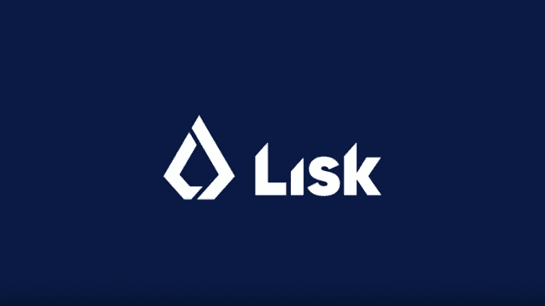

# Lisk，区块链的 Javascript

> 原文：<https://medium.com/coinmonks/lisk-javascript-for-the-blockchain-7c7e4b10d127?source=collection_archive---------41----------------------->

***Js 区块链开发平台。***

credits: Lisk.com

对于我所有的 javascript 开发人员来说，我们无比兴奋。从 web2 转移到 web3 是困难的，有所有的新概念需要学习，以及新的语言，如坚固性，和生锈；不是一件你可以在一周内轻松完成的事情。许多新概念都有一条陡峭的学习曲线，需要大量的过渡时间。然而，它不必是这样了。

如果你知道 javascript 或 typescript，Lisk 可能就是你的出路。Lisk 是一个 javascript 区块链开发平台。有了 Lisk，你可以从头到尾只用 javascript 和 javascript 来开发区块链项目。

Lisk SDK 是一个开源软件开发工具包，允许开发人员完全用 javascript 构建 web3 软件。这提供了一个名为 list 元素的库集合，其中包含项目所需的所有工具；和 Lisk 命令器提供了一个强大的命令行界面来访问和利用与 Lisk 相关的功能，例如引导区块链应用程序。

**你能对 Lisk 做些什么:**

类型脚本的 Javascript 代码

在 Lisk 上为每个项目创建一个可自定义的区块链，它可以与其他区块链项目互操作。

通过在 Lisk 主链上注册为侧链，允许您的应用程序与其他区块链应用程序互操作。

受益于 Lisk 一致性算法(委托的利害关系证明、拜占庭容错)

使用插件扩展应用程序功能

**Lisk 资助计划**

Lisk 基金会有一个赠款计划，提供基于里程碑的资金支持与 Lisk SDK 构建的应用程序。这是为了扩大生态系统

**唯一的问题是，Lisk 目前只支持以下操作系统进行开发:**

Ubuntu——18.04(LTS)，20.04 (LTS)

Mac Os — 0.13(高塞拉)、10.14(莫哈韦)、10.15(卡特琳娜)、11.04(大苏尔)

抱歉，我的同胞 windows 用户有一个 SDK 发行版，我们还没有，不过，这是即将到来的。

你可以在他们的官方网站上了解更多关于 Lisk 的信息:[https://lisk.com/](https://lisk.com/)

> 交易新手？试试[加密交易机器人](/coinmonks/crypto-trading-bot-c2ffce8acb2a)或[拷贝交易](/coinmonks/top-10-crypto-copy-trading-platforms-for-beginners-d0c37c7d698c)