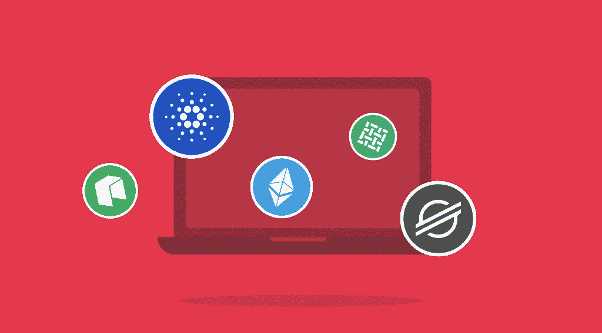

# 最佳智能合约平台列表

> 原文：<https://medium.com/coinmonks/list-of-the-best-smart-contract-platforms-55dabb3d045f?source=collection_archive---------17----------------------->

正如我们在之前的文章中所写的，智能合同是在区块链网络上托管和执行的计算机程序。每个智能合约由指定预定条件的代码组成。只要这些条件得到满足，就会触发结果。通过在分散的区块链而不是集中的服务器上运行，智能合同允许多方以准确和及时的方式达成共享的结果。让我们仔细看看一些智能合约平台。

# 五大智能合约平台

有许多利用智能合约的加密平台。在本文中，我们将看看五个平台，它们将这些构建块作为其操作的基础。

# 以太坊

以太坊可以被称为所有智能合约之母。以太坊区块链创建于 2013 年，专门用于编写和执行这些代码。迄今为止，这是最流行的平台。数百款使用智能合约的应用已经上线运行。像 MakerDAO 和 Compound 这样的知名以太坊应用程序在其核心位置使用它们进行借贷，并允许用户赚取利息。

比特币也提供智能合约，但是以太坊的智能合约为什么这么受欢迎？嗯，有很多原因。虽然比特币在技术上与转移 BTC 的非常基本的智能合约一起工作，但这通常被视为只是冰山一角。是的，比特币是第一个支持基本智能合约的，但与第二大区块链以太坊相比，它们极其有限。

比特币上的每一笔交易都代表着一份智能合同，因为只有在满足特定条件的情况下，网络才会批准交易——用户提供数字签名，证明他们确实拥有他们声称拥有的加密货币。只有比特币私钥的所有者才能生成这样的数字签名。

相比之下，以太坊取代了比特币更具限制性的语言，代之以允许开发者使用区块链处理不仅仅是加密货币交易的语言。这种语言是“图灵完备的”，这意味着它支持更广泛的计算指令集。没有限制，程序员可以写任何他们能想到的智能合同。时至今日，智能合约都与以太坊联系在一起。

# 以太坊:功能

其中，以太坊提供以下功能:

*   **以太坊虚拟机**。以太坊提供了理解智能合约并使人们能够与之交互的底层技术、架构和软件。
*   **分散式应用和 Dao**。通过一点创新和创造，智能契约可以建立在另一个之上，以创建完全去中心化的应用程序(dApps)和去中心化的自治组织(Dao)。

# 超分类帐结构

Hyperledger Fabric 是 Linux 在 2015 年 12 月推出的开源环境。IBM 和 Intel 也支持 Hyperledger 解决方案，它将高安全性和透明性与对等效率和协作设计结合在一起。该平台做两件最重要的事情:它利用区块链架构，同时确保数据隐私。

说到智能合约，每个链码都有一套管理智能合约的规则。这项政策非常重要。它决定了哪些网络参与者(组织)必须签署合同生成的事务以使其生效。例如，卖方和买方都必须签署和执行交易以转移货物。只有可信方必须验证它。因此，这项区块链技术比比特币或以太坊更好地模拟了现实世界的互动。

Hyperledger Fabric 已经用于忠诚度和奖励、保护土地注册、金融资产的清算和结算等。

# Hyperledger 结构:功能

Hyperledger Fabric 的主要功能是:

*   **开源**。Linux 一直处于开源技术的前沿。Hyperledger Fabric 的社区包括超过 120，000 个贡献组织和超过 15，000 个工程师贡献者。所有项目都可以免费下载和使用。
*   **许可进入**。这个网络要求每个参与者的身份都经过认证。因此，Hyperledger Fabric 可以使任何供应链受益，从银行到医疗保健。任何数据暴露受限的环境都可以从其体系结构中受益。
*   **治理和访问控制**。该框架的设计考虑到了私人和保密交易。它由两个或多个网络成员之间的交易通道构成。这些通道中的每一个都需要各方认证和授权。通过这种方式，Hyperledger Fabric 增强了访问控制，并且对于受限的数据公开尤其有价值。
*   **顶级性能**。由于 Hyperledger Fabric 是为企业使用而构建的，其共识机制支持快速交易和令人印象深刻的吞吐量。

# 卡尔达诺

2015 年推出的 Cardano (ADA)区块链是另一个积极使用智能合约的流行平台。卡尔达诺智能合约的程序员使用三种语言中的一种:普路托斯、马洛或 Glow。与其他项目相比，Cardano 智能合同在区块链的实施相对较晚。截至 2022 年 8 月 2 日，智能合约的数量为 3，015 个。智能合约的引入使得 Cardano 更加受欢迎。此外，它确保了卡尔达诺的 ADA 令牌在 2021 年 9 月大幅上涨，硬币创下历史新高。

随着进一步的发展，Cardano 最终可以达到每秒 100，000 次交易的交易速度。这种可扩展性的提高将使 Cardano 在未来比以太坊拥有更大的竞争优势。以太坊目前仍在完成向以太坊 2.0 的过渡，但即使是以太坊 2.0 也很难提供这样的速度。

Cardano 旨在通过替代区块链和系统架构实现可扩展、可持续和实用。此外，该平台拥有业内最强大的社区之一。智能合约还有无数其他潜在用途，无论是金融交易、保险、投票，还是数字身份证。

# 卡尔达诺:特色

Cardano 的主要特点是:

*   **快速交易**。Cardano 最令人兴奋的亮点之一是，与目前可用的任何其他加密货币相比，它支持更快的交易。
*   **放权**。卡尔达诺网络在本质上是高度分散的。在许多方面，它只是现有区块链的一个更好的版本。
*   **环保矿业**。卡尔达诺是“绿色的”，这也是它的众多优点之一。

# 主要的

Stellar 于 2014 年推出，是一种基于分布式账本技术的支付协议，允许任何一对货币之间的跨境交易。目前，Stellar 是十大最受欢迎的区块链平台之一。恒星流明(XLM)是领先的加密货币之一，在市场上的接受度和采用度稳步上升。今年夏天早些时候，Stellar Development Foundation 庆祝了他们即将推出的智能合约平台“Soroban”的预览版，正如该团队所说，该平台有可能成为密码行业的“智能合约标准”。

除了资金转账，Stellar platform 可用于移动和交易客户端、P2P 借贷，或在健康和保险领域提供小额储蓄账户。非营利组织的捐赠系统也可以建立在这个区块链上，它可以向成员分发忠诚度积分。

# 恒星:特征

Stellar 提供以下功能:

*   **去中心化和开源**。恒星数据库本质上是一个 100%原始的区块链平台。
*   **高速**。交易确认时间为 3-5 秒，这得益于其共识机制。
*   **惊人的吞吐能力**。它可以支持每秒数千笔交易。
*   多重签名。该平台支持多重签名。多签名帐户可用于要求交易在被认为有效之前需要多个公钥签名。

# 新的

NEO 是一个开源平台，成立于 2014 年。本质上，它是一个区块链，旨在为所谓的“智能经济”提供一个分布式网络 Neo 的前身是 Antshares，通常被称为中国的以太坊，它推动了数字资产和智能合同的发展。

在智能经济背后的理论中，数字资产和数字身份被视为提高每个人生活质量的关键。NEO 旨在通过智能合同实现数字资产管理的自动化。Neo 的平台允许开发人员使用其软件运行智能合同(称为 NeoContracts)并设计旨在复制现实世界产品和服务的新程序(dApps)。

NeoContracts 不同于其他基于智能合约的协议，因为开发人员可以使用各种流行的现有语言(如 C#和 Java)来构建应用程序，而不是学习一种新的语言。

NEO 与其他标准区块链平台保持着明显的区别，它侧重于符合法规要求，是一个用于分散应用的开发平台。它还使用了一种不同于比特币和以太坊的共识机制，称为委托拜占庭容错(dBFT)。

该网络的使用案例可以包括 DeFi 应用，如数据交换市场、简化的投资管理工具，以及用于创建分散式交易所(dex)和流动性提供商(LP)令牌并与之交互的新流程。

# NEO:功能

近地天体议定书的一些最激动人心的特点是:

*   **分散式文件存储**。由于这是一个一体化的区块链网络，其开发者有兴趣在 NEO 上创建高度可访问、超私有和高安全性的云存储。
*   **域名服务**。DApp 开发者可以在 NEO 区块链上购买域名。
*   **互通**。Neo 区块链与 Poly Network 有很好的联系，Poly Network 是一个 DeFi 平台，在其他三个区块链上运行——币安智能链、以太坊和多边形。

# 区块链上的智能合约:它们是未来吗？

许多专家和密码爱好者对智能合约的前景感到兴奋。然而，这项技术仍处于早期发展阶段。虽然智能合约的用户不需要信任中介，但用户必须相信代码是正确编写的，不幸的是，情况并非总是如此。目前，我们可以希望智能合同的执行最终会变得更好，并在此之后获得更好的认可。

不要忘记，你可以用 StealthEX 购买加密货币和数字代币用于投资或任何其他目的，并享受我们通常向客户提供的低佣金率。

[StealthEX](https://stealthex.io/) 可以帮你购买一种或多种流行的加密货币。你可以私下做这件事，不需要注册服务。我们的加密收藏有超过 450 种不同的硬币，您可以立即和毫无问题地进行钱包到钱包的转账。

完成购买后，只需前往 [StealthEX](https://stealthex.io/) 并遵循以下简单步骤:

1.  选择要兑换的货币对和金额。例如，BTC 到瑞士联邦理工学院。
2.  按下“开始交换”按钮。
3.  提供要将您的加密传送到的收件人地址。
4.  处理交易。
5.  接收您的加密硬币。

在 [Medium](https://stealthex-io.medium.com/) 、 [Twitter](https://twitter.com/Stealthex_io) 、 [Telegram](https://t.me/StealthEX) 、 [YouTube](https://www.youtube.com/channel/UCeES_XBesX76ge7xf1meuSw) 和 [Reddit](https://www.reddit.com/user/Stealthex_io) 上关注我们，了解关于 [StealthEX.io](https://stealthex.io/) 和其他秘密世界的最新消息。

在购买任何密码之前，不要忘记做自己的研究。本文表达的观点和意见仅代表作者个人。

*原载于*[*https://stealthex . io*](https://stealthex.io/blog/list-of-the-best-smart-contract-platforms/)*。*

> 交易新手？尝试[加密交易机器人](/coinmonks/crypto-trading-bot-c2ffce8acb2a)或[复制交易](/coinmonks/top-10-crypto-copy-trading-platforms-for-beginners-d0c37c7d698c)