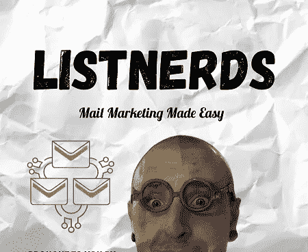
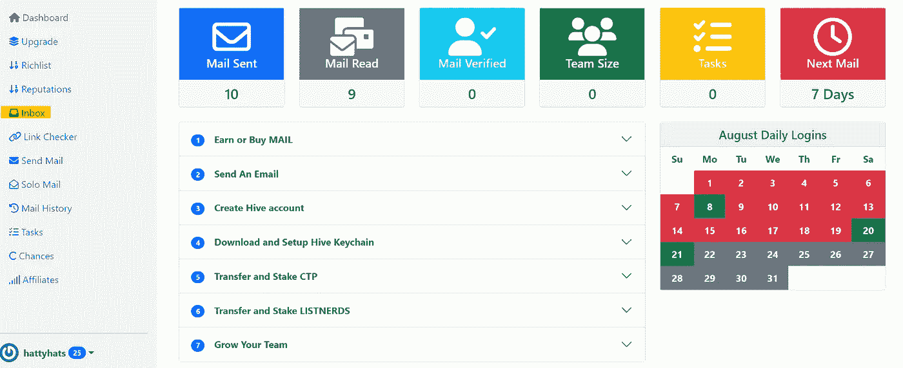
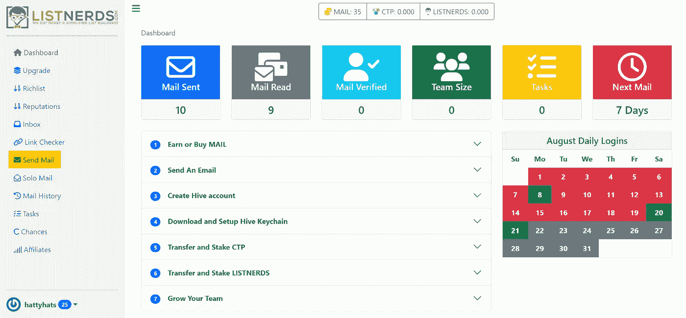

# 听众—电子邮件营销变得简单

> 原文：<https://medium.com/coinmonks/listnerds-email-marketing-made-easy-8cd249907aba?source=collection_archive---------54----------------------->

我希望每个人都度过了愉快的一周，把事情做完了。我一直很难找到时间来写作，但我会尽我所能。如果你没有跟随我，或者在此之前没有读过我的内容，那么我想告诉你我正在做什么。我试图传播我能找到的每一个合法的赚钱网站。当我找到一个我认为值得的站点时，我会尝试赚钱的站点，直到我可以达到最低提现。如果不需要那么长时间，而且有回报，我会和每个人分享。因此，如果你有兴趣了解不同的赚钱网站和一些你能找到的在线赚钱的最好的网站，请关注我的页面。这将有助于我的网页成长，也有助于你找到一些最好的在线赚钱的网站。

我还创建了一个网站，这样每个对我的文章和视频感兴趣的人都可以在一个地方找到我的所有内容。每次我找到一个网站，我就把它添加到我的网站上。在我分享它之前，我要确保这个网站是合法的。我想确保每个人都知道我的网站值得一试，我只给你带来你能找到的最好的赚钱网站。

[哈蒂斯沙克](https://www.hattysshack.org/)

很难找到值得花时间和精力去经历赚钱过程的付费网站。一些网站会把你带到可疑的链接，而另一些网站则不会付费。这就是为什么我认为有一个值得信赖的地方去寻找最赚钱的网站是非常重要的。

[听众们](https://listnerds.com/@hattyhats)

我使用 ListNerds 已经有一段时间了，我意识到这是一个很好的方式来获得你的会员链接。当我第一次加入的时候，我对一切是如何工作的有点困惑，但是通过一点点练习和尝试，我想我已经明白了。

因此，让我们来看看这个网站是如何工作的，它看起来像什么。

[listenders](https://listnerds.com/@hattyhats)是同类产品中的第一款。我不是说这是电子邮件营销中的第一个，但这是第一个，这意味着这是区块链上的第一个电子邮件营销。

如果你没有听说过电子邮件营销，那么你就可以享受一下了。这是一种让你把你喜欢的文章、网站或站点公之于众的方式。这个网站的方式非常有趣，它使你在收件箱中得到的网站得到了控制，并确保它们不会将你发送到恶意网站。当我说“在你的收件箱”时，我指的不是你实际的电子邮件收件箱。我说的是[listeners](https://listnerds.com/@hattyhats)上的收件箱。我将带你了解这是如何运作的。你也可以看看我在 YouTube 上的视频，让你看看让[听众](https://listnerds.com/@hattyhats)开始行动有多容易。

注册后，你会看到一个类似上面的页面。你要做的第一件事是点击屏幕中间的项目，数字数到 7。当你点击每一个，它会告诉你如何着手设置一切，并给你一个如何使用该网站的演练。希望在你读完这篇文章后，你不需要再看视频了。

完成此操作后，您需要点击收件箱，开始赚取一些邮件积分，这样您就可以发送您的第一封营销电子邮件了。每个人发邮件给你，点击链接，你会得到 5 个代币。这些邮件令牌只是向您展示您可以向多少人发送营销电子邮件的一种方式。您使用该网站的次数越多，您获得的邮件代币数量就越多。

如果你已经获得了相当数量的邮件代币，你可以采取下一步行动，发送你的第一封营销邮件。因此，如果你获得了 50 个邮件代币，这意味着你可以向 ListNerds 平台上的 50 个人发送营销邮件。这是一种免费的方式来传播你的网站或一些你认为有回报的赚钱网站。

当你准备好发送你的第一封邮件时，你需要点击屏幕左侧的发送邮件按钮。你只能每 7 天发送一次邮件，所以我建议你在发送邮件之前建立一个相当数量的邮件令牌。

当你决定发送邮件时，你将被带到简单易用的邮件区。你需要创造一个好的标题，让你的邮件简单，切中要害，引人注目。不要让你的邮件太长太多，因为这会让人失去兴趣，跳过你的邮件。无论什么人都需要点击你的链接来赚取他们的邮件积分。所以，如果你让你的邮件简短有趣，这将有希望让人们对你分享的网站感兴趣。

这相当简单，可以让你在分享的网站上获得免费广告。你越是使用这个网站，你就越能发送邮件并获得链接。

有太多的事情需要倾听，但我尽量保持简单明了。

这些是你需要迈出的第一步，让你的脚进入大门，并开始获得免费链接。现在，我不能保证你会获得大量的点击和推荐注册，但我要说的是，这是一个为你使用的网站获得几乎免费广告的好方法。

在我走之前，有一件事我想让你知道。我建议不要急于发送你的第一封邮件。我建议在你决定发送你的第一封邮件之前，不要着急，先挣一大笔代币。在发出第一封邮件之前，尝试赚取至少 1000 个邮件积分。这将确保你获得可观的点击量，并有望为你分享的任何网站带来可观的新推荐。

在[列表中达到 1000 个邮件令牌似乎需要一段时间，但我在几天后就达到了 1000 个。我知道很多人想要立即得到满足，希望看到事情马上发生，但是好事情需要时间。你使用这个网站越多，你就越能发送邮件。所以慢慢来，让听众慢慢帮你建立推荐。](https://listnerds.com/@hattyhats)

我希望你喜欢这篇文章，我希望它能帮助你获得更多的会员。你有越多的分支机构，你将开始赚取越多的被动收入。这就是为什么我说推广是你能做的最好的事情之一。要么让你的朋友知道你使用的网站，让他们使用你的链接注册，要么写文章，制作 YouTube 视频。有多种方法可以获得更多的子公司。有时候你只需要挖掘一点点。这就是为什么我试图帮助每个人了解新的网站，并让人们知道，这是有可能建立你的子公司。只是需要一些时间和一点研究。

我感谢大家花时间阅读我的文章。如果你喜欢这篇关于[听众](https://listnerds.com/@hattyhats)的文章，请喜欢并关注更多内容，帮助我成长。我正努力给每个人带来我能找到的最好的赚钱和学习的网站。

如果我错过了什么，请留下评论，让我知道。我仍在了解这个网站，很想知道人们对它的看法。

查看我的网站，了解我的所有内容和一堆不同的方法来赚取，学习和建立您的加密组合。

[哈蒂斯沙克](https://www.hattysshack.org/)

[read.cash 上的原创文章](https://read.cash/@HattyHats/listnerds-mail-marketing-made-easy-1744859b)

> 交易新手？试试[密码交易机器人](/coinmonks/crypto-trading-bot-c2ffce8acb2a)或者[复制交易](/coinmonks/top-10-crypto-copy-trading-platforms-for-beginners-d0c37c7d698c)