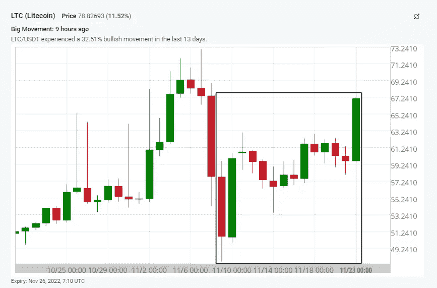

# 莱特币 1 天+30%！

> 原文：<https://medium.com/coinmonks/litecoin-30-in-1-day-8c0ad1b11386?source=collection_archive---------22----------------------->

今天的加密货币价格:周三，加密货币市场再次处于牛市。FTX 崩盘后，大多数主要加密货币都经历了大幅下跌。如今比特币价格上涨了 4%，回到了 16000 美元的水平。

所有加密货币的市值在前一天上涨了 4%，超过 8200 亿美元。然而，总贸易额下降了约 6%，为 622.1 亿美元。

# 莱特币技术分析

在过去的 24 小时里，莱特币(LTC)上涨了 30%。在数字货币经历了数周的重大损失后，莱特币设法将价格维持在两周前的水平之上。2023 年即将减半只是可能提高这种虚拟货币价格的几个因素之一。

现在我们看到[超买指标](https://altfins.com/crypto-screener/ltc-litecoin)闪烁，这意味着我们可以看到价格的修正。莱特币的价格会随着减半事件而走高。

Source: [altFINS.com](https://altfins.com/crypto-screener/ltc-litecoin\)

**交易设置:**尽管有所回落，价格仍保持上升趋势。如果它能保持在 60 美元水平和 200 天移动平均线以上，它可能会重新访问 75 美元的阻力。(设定一个价格[提醒](https://altfins.com/knowledge-base/create-alert-for-cryptocurrencies/))。

**趋势:**所有时间范围内的上升趋势(短期、中期和长期)。

**动能**喜忧参半由于 [MACD](https://altfins.com/knowledge-base/macd-line-and-macd-signal-line/) 线在 MACD 信号线上方(看涨)但 RSI ~ 50(中性)。

**OBV(平衡成交量):**持平，表示上涨日成交量等于下跌日成交量。因此，买方的需求和卖方的供应处于平衡状态

支撑和阻力:最近的支撑区域是 50 美元，然后是 40 美元。最近的阻力区是 60 美元，它打破了，然后是 75 美元。

Soource: [altFINS.com](https://altfins.com/crypto-screener/ltc-litecoin)

Source: [altFINS.com](https://altfins.com/crypto-screener/ltc-litecoin)

Source: [altFINS.com](https://altfins.com/crypto-screener/ltc-litecoin)

Source: [altfins.com](https://altfins.com/crypto-screener/ltc-litecoin)

> 交易新手？尝试[加密交易机器人](/coinmonks/crypto-trading-bot-c2ffce8acb2a)或[复制交易](/coinmonks/top-10-crypto-copy-trading-platforms-for-beginners-d0c37c7d698c)