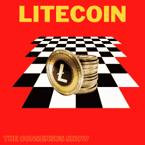

# 莱特币—完整概述

> 原文：<https://medium.com/coinmonks/litecoin-complete-overview-9f27ff21028d?source=collection_archive---------28----------------------->

欢迎来到共识秀，在这里我将介绍世界上最流行的加密货币，并为您提供公正的信息，帮助您达成自己的共识。这不是理财建议。

[For the best Crypto News in the world, visit TheCoinSphere.com](http://thecoinsphere.com/)

莱特币是一种分散的开源加密货币，创建于 2011 年。它是比特币核心客户端的一个分支，在代码上有一些不同，这使它能够拥有更快的交易时间和更高的交易效率