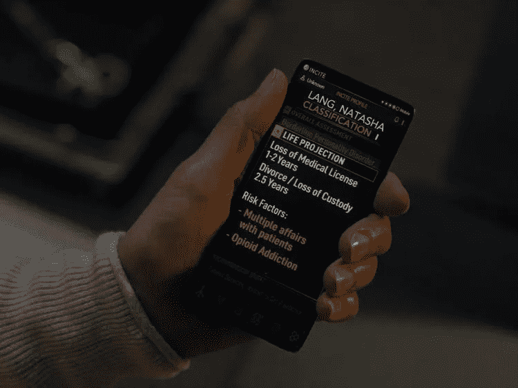
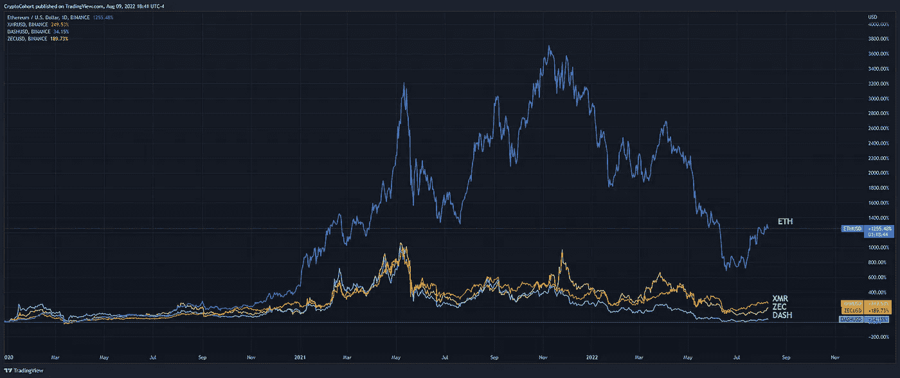
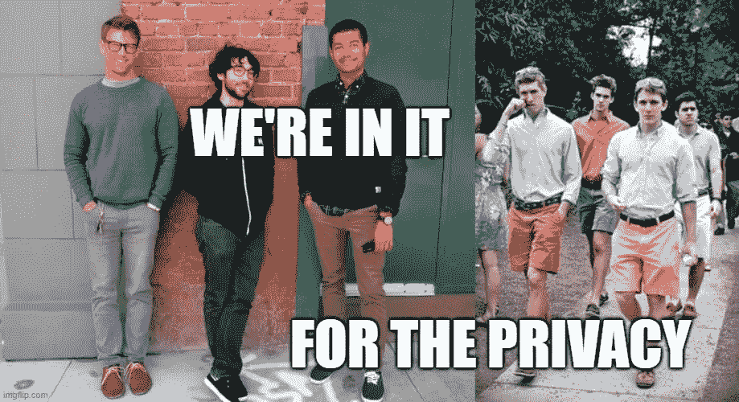
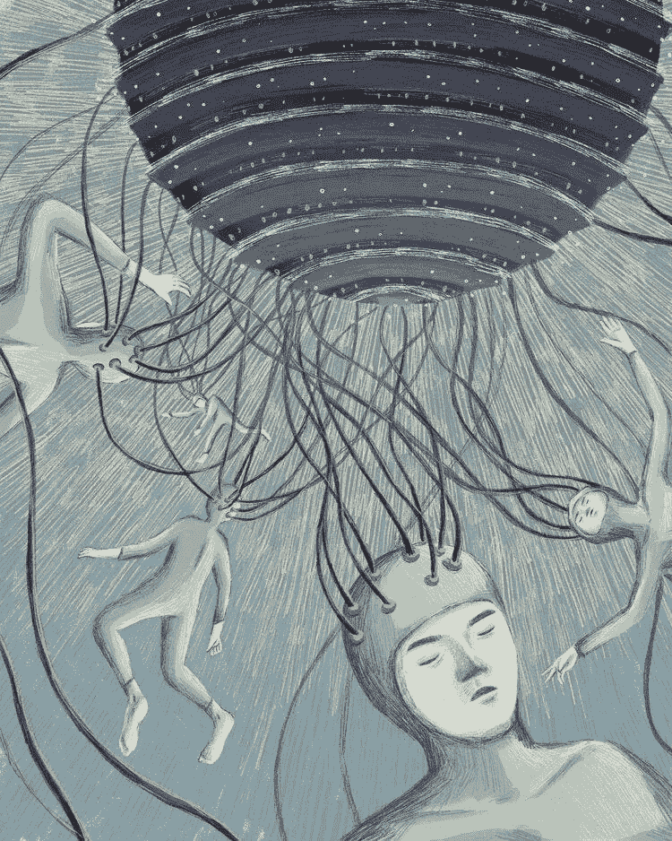

# 生活在一个分散的世界

> 原文：<https://medium.com/coinmonks/living-in-a-decentralized-world-bfd80e882c?source=collection_archive---------33----------------------->

crypto 能保持它的隐私精神吗？

Westworld Season 3 — an AI, called Incite, uses personal data to optimize life decisions for the common folks: where you should work, who you should marry, etc.

免责声明，NFA，所有这些法律的东西:本出版物及其附属机构上呈现的所有信息严格地仅用于教育目的。它不应被解释或视为财务、法律、投资或任何其他形式的建议。

嗨，伙计们，

今天的问题我又迟了一点。抱歉。但实际上，crypto 发展如此之快，以至于我经常发现自己在最后一刻改变了我想写的主题。我本来可以写关于链上指数或以太坊 PoW fork 的恶作剧，但后来美国财政部决定通过批准一段开源代码，为已经丰富的加密熊市添加一些香料。我对此有很多想法，所以让我们开始吧。

 [## 马可·马诺波沉思的实用主义

### 秘密，商业和生活的思考-与炒作的实质。点击阅读马可·马诺波的《沉思的实用主义》

pensivepragmatism.substack.com](https://pensivepragmatism.substack.com/) 

# 生活在一个分散的世界

2022 年 8 月 8 日，美国财政部[制裁](https://home.treasury.gov/news/press-releases/jy0916)“虚拟货币混合器 Tornado Cash”，据称自 2019 年成立以来，该公司已被用于清洗价值 70 多亿美元的加密资产。不出所料，这个决定第一次将一段自主开源代码而不是一个人或一个实体添加到 OFAC 清单的二阶效应是深远的。虽然以前的加密钱包地址已被添加到列表中，但它始终面向属于特定个人或实体的钱包，而不是服务或智能合同。

这个动作改变了游戏。

加密人士被激怒了，许多人表示，这是一个**的警钟，让该行业了解正在进行的 web 3.0 热潮中的*加密货币*** 的真正精神气质，这种热潮专注于技术和创业方面，而不是最初的**密码朋克意识形态，这种意识形态主张将强大的加密和隐私技术**作为社会和政治变革的一种手段。

此外，美国财政部的这一行动也意味着，OFAC 名单上列出的 USDC 地址需要被其发行人 Circle 冻结，否则该公司及其高管可能面临 30 年的监禁。

那么接下来会发生什么呢？——现在的对话大声疾呼，这是对加密空间的又一次警钟，要求**分散一切**。全部筹码。我们不能有一个集中的 stablecoin 发行者、一个集中的 RPC 提供者和一个集中的代码库。是的，不出所料，Infura、Alchemy 和 GitHub(归微软所有)，所有的[都阻止了对 Tornado Cash 的访问](https://twitter.com/TornadoCash/status/1557048526986780677)。事实上，精通技术的人仍然有办法与 Tornado 进行交互，因为这些实体只能阻止前端，但这仍然会阻止大多数人的访问。哦，这个密码在挪威的[北极金库](https://twitter.com/bantg/status/1556729494182023169)里保存了 1000 年。相当酷。

让事情变得更加复杂的是，在一个连你的顶级律师都不完全确定该做什么的环境中，有人从一个与龙卷风有关的地址向一堆以太坊钱包发送 0.1 ETH，实质上是“弄脏”这些钱包，并为与美国有关的个人和实体(以及世界 tbh)将这些钱包中的资金“变灰”。欧盟公民没有受到这项制裁的影响，但是当涉及到本杰明的时候，每个人*通常*最终都会追随山姆大叔。

以下是一些快速的要点:

*   一个真正的分散稳定的核心比以往任何时候都重要。
*   为了使加密完全不受审查，整个区块链和加密市场基础设施需要去中心化。
*   **热门话题**:如果技术还不足以让 crypto 完全不受审查，那么也许所有这些只会提高全球资本市场的效率，这没关系。
*   基于意识形态，加密空间将分化为(I)隐私分散的最大列表和(ii)通过令牌的 web 3.0。
*   在意识形态分歧的情况下，结果通常位于中间。

## 不同的人群

在过去的几年中，加密的“隐私”方面通常被忽略了。我记得 2017 年 Coinmarketcap 50 强代币排行榜。DASH、XMR 和其他几个被认为是顶级硬币，市场参与者支持隐私作为这一新生资产类别的核心特征之一。快进到 2022 年，不管你喜不喜欢，围绕加密的兴奋现在是由风险投资公司倡导的 web 3.0 文化驱动的，因为它提供了一种*潜在*新的方式来构建软件、构建组织、部署商业模式，并颠覆正在变得懒惰的大型科技公司(好吧，也许不是大型科技公司，只是大型社交媒体，我指的只是元)。

Source: TradingView — ETH vs Privacy Coin

过去几年，从大型科技公司和大型金融公司涌入 crypto 的人才并没有受到启发，因为他们想模糊他们交易的痕迹，这些人实际上是在帕洛阿尔托或老格林威治长大的，作为应届毕业生，他们的收入达到 6 位数。你认为他们在乎隐私吗？

虽然听起来很糟糕，但我们必须承认，隐私不是大多数人最关心的问题，至少没有达到 cypherpunks 或分散化 maxi 的目标。苹果宣扬隐私——这足够好吗？对于大多数人来说，答案大概是肯定的。

话虽如此，美国财政部也是在针对错误的人群。chain analysis[数据](https://blog.chainalysis.com/reports/tornado-cash-ofac-designation-sanctions/)显示，不到 11%的资本汇集在龙卷风现金来自开发。这类似于制裁汇丰或其他一些银行，因为它们意外地(据称)清洗了贩毒集团和罪犯的钱。事实上，每年大约有 3000 亿美元通过美国洗钱，仅在 2020 年，全球银行就不得不为洗钱违法行为支付 104 亿美元的罚款。这是一个典型的例子，政府追求他们可以夸耀的最容易摘到的果子，却没有真正实施有意义的改革来防止洗钱。

## 仁慈的独裁者

坦白说，我不知道什么是对的。当我看到制裁时，我想到的第一件事是，很明显，沿着这条路线将会发生一些事情——也许是因为我在日常工作中与传统金融机构密切合作，这使我从几英里外就看到了这一点。同时，我同情被这一行动激怒的人群。我自己从来都不是真正的赛博朋克，但我能理解他们来自哪里。

技术和加密领域的人经常赞美自由意志主义，并且通常更加反政府。对此我百感交集。我有幸在一个不结盟运动的国家长大，然后作为一个第三文化的孩子，让我接触了多种文化、不同的社会经济背景和各种政府机构。现在有太多的投资者变成了播客，他们宣扬政府糟糕的剧本，却不了解世界不同地区是如何运作的。**现实往往要复杂得多，而且处于中间状态。**

我相信，如果你的基本需求得到满足，你至少过着有点富裕的生活，你就不太可能闹事。在过去的几十年里，中国显著提高了其共同富裕的水平，这就是为什么它的公民不介意政府的控制。香港是一个极其昂贵的城市，20-30 个纽约人在一个 40 平方英尺(3.7 平方米)的地方过着靠薪水过活的生活，这就是为什么会发生暴乱。你不喜欢中国的例子？让我们用斯堪的纳维亚作为晴雨表吧。反正我已经扯得够多了。

关键是，crypto 中普遍存在的过度反政府情绪无助于解决问题，也不现实。一些政府控制**将会发生**，但是期待一个大政府控制你所接触的一切的完全反乌托邦式的未来很可能是“太在线”或消费太多亚历克斯·琼斯的后果。出去摸一些草。

如果所有的事情都付诸东流**敲敲木头** ，大多数加密交易将需要某种身份证明，从而政府控制所有的瓶颈，而数字资产用例只是为了**提高全球资本市场的效率**，那就没问题。如果技术还没有好到可以完全抗审查，那么最后一句话是我们活该。*再读一遍*。仅这一部分就将在汇款、令牌化证券、元宇宙等领域释放数万亿美元的价值。

我想要一个更加分散的未来吗？当然了。但我也相信人类最大的优点是适应性。我们可以在技术上努力，制定游说措施，上法庭等等。—但是在一天结束的时候，如果我们 ***必须*** 适应，那么我们应该对此持深思熟虑和务实的态度。

## 刺激

西部世界第四季正在进行中，我很兴奋。在第三季中，有一家名为“煽动”的数据公司将使用大数据和人工智能来绘制一个人的未来，包括职业轨迹，浪漫订婚，甚至死亡原因。简而言之，这在西方世界的反乌托邦未来中创造了反身性，在那里，个人的成功或失败变成了由煽动煽动的自我实现的预言。现在想象一个政府控制的区块链，拥有人工智能注入的 CBDC。那是一口。我不认为我需要写下这种组合可能导致的潜在的噩梦场景。所以，不管我说了什么，隐私仍然很重要，希望我们永远不会在这个世界上看到现实生活中的煽动(我在看着你，扎克)。

直到下一次，

马尔科·m。

*原载于 2022 年 8 月 9 日*[*【https://pensivepragmatism.substack.com】*](https://pensivepragmatism.substack.com/p/living-in-a-decentralized-world)*。*

 [## 马可·马诺波沉思的实用主义

### 秘密，商业和生活的思考-与炒作的实质。点击阅读马可·马诺波的《沉思的实用主义》

pensivepragmatism.substack.com](https://pensivepragmatism.substack.com/)