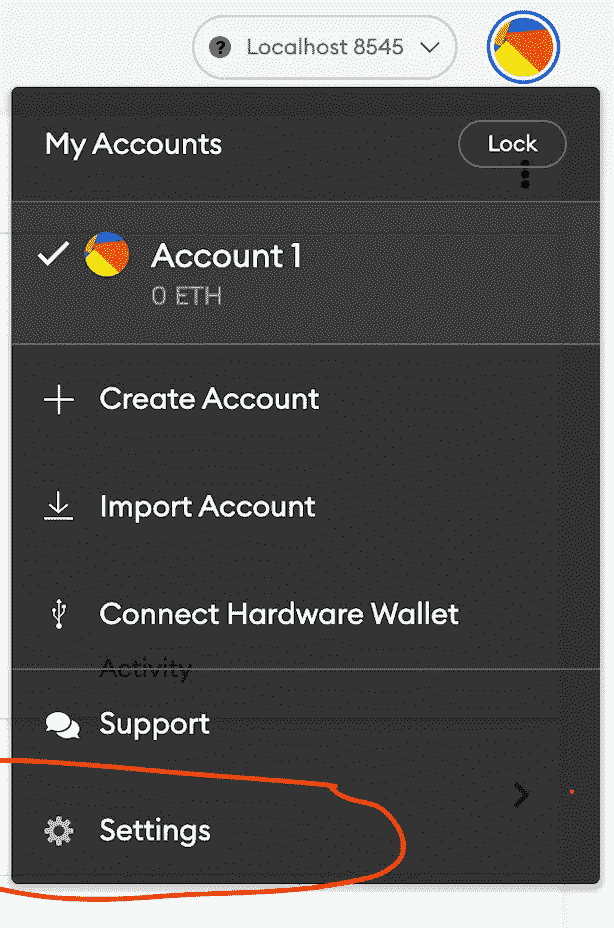
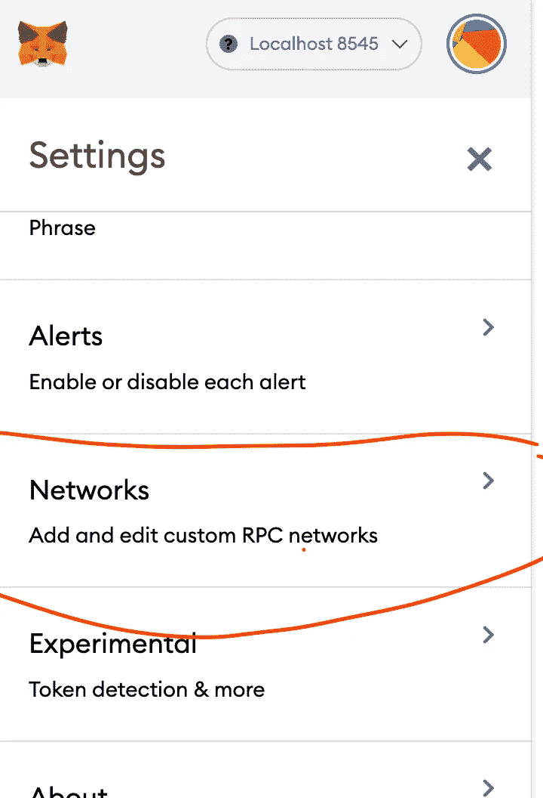
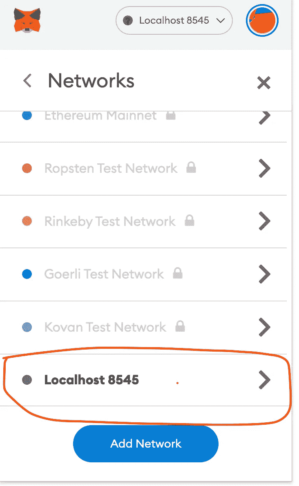
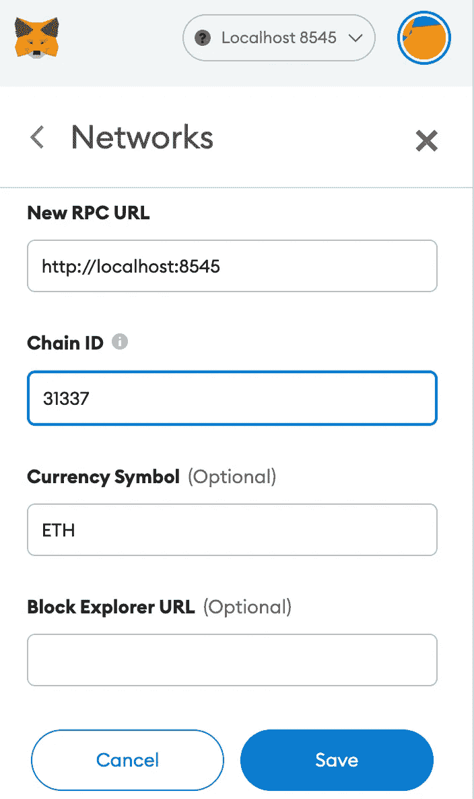
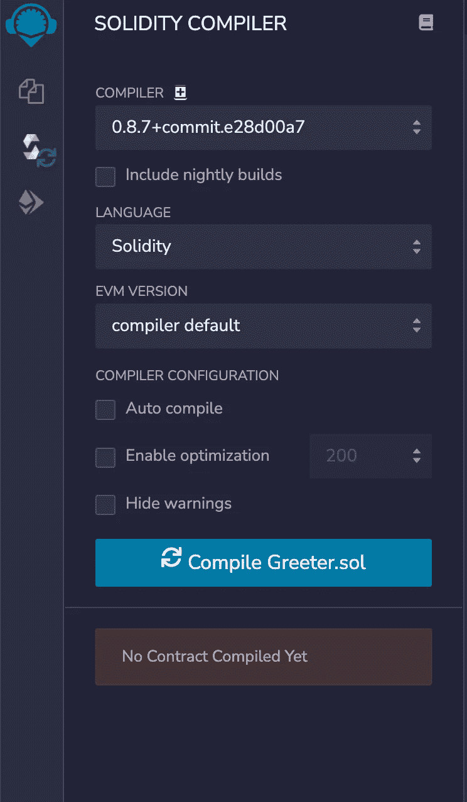
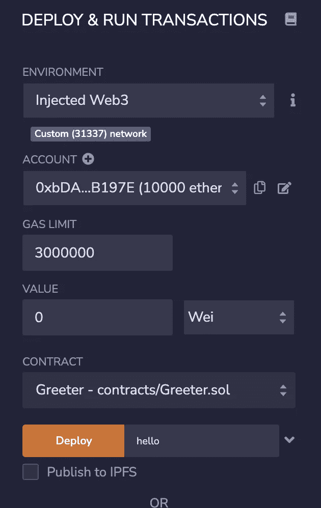

# CSC 的本地开发

> 原文：<https://medium.com/coinmonks/local-development-on-csc-647e03a05775?source=collection_archive---------58----------------------->

本教程将帮助您熟悉如何使用 Hardhat 启动本地区块链，将智能合约示例部署到本地区块链，以及使用 Metamask 和 Remix 与区块链进行交互。


coinex.org

# 为什么是区块链本地？

*   运行本地区块链非常有用，因为测试变得非常快速和高效。
*   只有你的机器在运行区块链，因此一致性很快，你不必等待其他节点同步或验证。
*   您还可以使用许多专门为本地测试构建的专门模块，如 [Hardhat console.log](https://hardhat.org/tutorial/debugging-with-hardhat-network.html) ，它可以帮助您在合同中添加打印功能。(learnweb3.io)

为了构建智能合同，我们将使用 [Hardhat](https://hardhat.org/) 。Hardhat 是一个以太坊开发环境和框架，设计用于 Solidity 中的全栈开发。简而言之，您可以编写您的智能契约，部署它们，运行测试，并调试您的代码。

打开终端并执行以下命令:

```
npm init --yes
npm install --save-dev hardhat
```

在安装 Hardhat run 的同一目录中:

```
npx hardhat
```

*   选择`Create a basic sample project`
*   对已经指定的`Hardhat Project root`按回车键
*   对于是否要添加一个`.gitignore`的问题，按回车键
*   按回车键进入`Do you want to install this sample project's dependencies with npm (@nomiclabs/hardhat-waffle ethereum-waffle chai @nomiclabs/hardhat-ethers ethers)?`

现在你有一个安全帽项目准备好了！

> 交易新手？尝试[加密交易机器人](/coinmonks/crypto-trading-bot-c2ffce8acb2a)或[复制交易](/coinmonks/top-10-crypto-copy-trading-platforms-for-beginners-d0c37c7d698c)

如果你不是在 mac 上，请做这个额外的步骤并且安装这些库:)

```
npm install --save-dev @nomiclabs/hardhat-waffle ethereum-waffle chai @nomiclabs/hardhat-ethers ethers
```

并按下`enter`询问所有问题。

基本的 hardhat 项目还附带了一个示例智能契约。我们将在我们的示例中使用这个智能契约。你应该在`contracts\Greeter.sol`看到这份合同。它应该是这样的:

```
//SPDX-License-Identifier: Unlicense
pragma solidity ^0.8.0;import "hardhat/console.sol";contract Greeter {
    string private greeting; constructor(string memory _greeting) {
        console.log("Deploying a Greeter with greeting:", _greeting);
        greeting = _greeting;
    } function greet() public view returns (string memory) {
        return greeting;
    } function setGreeting(string memory _greeting) public {
        console.log("Changing greeting from '%s' to '%s'", greeting, _greeting);
        greeting = _greeting;
    }
}
```

现在，要在指向您的目录的终端中实际运行您的本地区块链，请执行以下命令:

```
npx hardhat node
```

# 元掩码连接

*   要使用元掩码连接到此网络，请单击您的个人资料，然后单击设置



source:learnweb3.io

*   然后点击网络，接着点击`Localhost 8545`



*   将链 Id 更改为`31337`(这是您正在运行的本地区块链的链 ID)，然后单击`Save`



# 再搅拌

我们现在将我们的合同部署到本地区块链，并使用 Remix 与之交互

转到 remix.ethereum.org 的，在名为`Greeter.sol`的合同文件夹中创建一个新文件

*   将以下代码复制到其中:

```
//SPDX-License-Identifier: Unlicense
pragma solidity ^0.8.0;import "hardhat/console.sol";contract Greeter {
    string private greeting; constructor(string memory _greeting) {
        console.log("Deploying a Greeter with greeting:", _greeting);
        greeting = _greeting;
    } function greet() public view returns (string memory) {
        return greeting;
    } function setGreeting(string memory _greeting) public {
        console.log("Changing greeting from '%s' to '%s'", greeting, _greeting);
        greeting = _greeting;
    }
}
```

*   编译`Greeter.sol`



*   现在要部署，转到部署选项卡，在您的环境中选择`Injected Web3`，确保连接的帐户是您在上面导入的帐户，并且网络是您的元掩码上的`Localhost 8545`



恭喜你！

我们成功地建立了一个本地区块链用于开发和测试