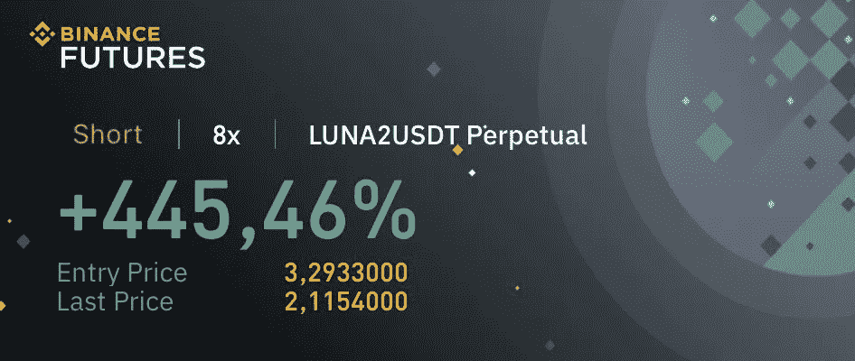
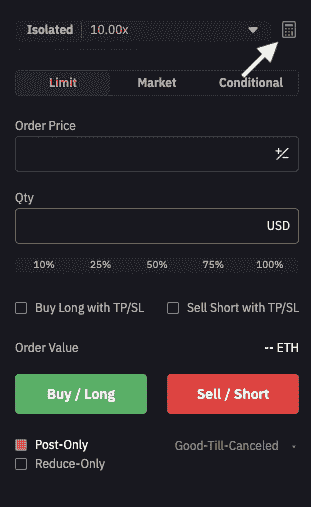
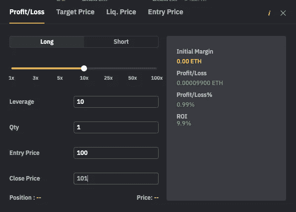

# 长篇大论和短篇小说(可怕的故事)，适合初学者

> 原文：<https://medium.com/coinmonks/long-and-short-terrible-story-for-beginners-d44ccda299b0?source=collection_archive---------11----------------------->

正是因为这样的截图，你会用 crypto 搜索渴望和做空，信不信由你，这就是为什么你会失去你买的第一个 BTC 和 ETH。

这个主题值得很多反思和帖子，我肯定会写的。但这将是有史以来最短的长篇故事。

第一，储蓄不是一个人致富的途径。没有米深有多深，你很快就会明白，你不能简单地购买瑞士联邦理工学院和 BTC 你需要退休。句号。

#2 渴望和做空可以显著提高你的密码增长率。句号。

#3 和你的损失。

#4 当使用这样的金融衍生产品时，你可以将加密价格变化的影响增加%:对于 10 倍的分类账，1%的变化会产生 10%的影响。

#5 **傻瓜的例子**:你持有 100 美元，在联邦储蓄银行有 10%的账户。价格上涨 1%。如果你退出，你有 110 美元。或者，你缺少 100 美元，有 10%的 ETH 分类账。价格上涨 1%。如果你退出，你有 90 美元。

在我看来，你根本不可能开始交易衍生品，并抵制住几乎赚到、实际上失去、处于从损失中恢复的边缘的醉人效果。把交易比作赌博是有原因的，这是神经生物学的原因。**我们的大脑无法理解“几乎”和“目前”的区别**。如果你投资一个多头或空头头寸，在几个小时、几天或几分钟内，你实际上是盈利的，但是价格变化了，你失去了你的投资，你几乎赚了，但是现在亏损了。但是，你的大脑只是保持着对潜在收益的欣快感的记忆，几乎忽略了你实际拥有的损失。而且，你还要再投资。而且你要投入更多(更多的钱，更高的账本)来恢复。你又要松了。并重复。再一次。

你在 instagram 上看到的截图只会向你展示有利可图的操作，巨大的收益，即使最终那些头寸没有被平仓，钱已经损失了。

事实是，作为一个进化过程，没有人能教你这个。就像告诉一个孩子火在燃烧，你必须试着用你自己的手去触摸火焰。

所以，我唯一的建议是:先模拟。例如，如果你在[按位](https://www.bybit.com/en-US/invite?ref=N8J3PD)交易，你可以用计算器模拟你想交易的值。

给自己一个时间框架:你的观点是 ETH 在 24 小时内达到那个值。检查一下。发生了吗？如果价格调整的方向相反，你会损失多少？万一你损失了 50%的投资，你能接受吗？你要平仓吗？还是继续留在这里，当它降到-60%，-70%的时候？当它达到-90%时，你是卖出还是增加投资，结束损失风险？如果你用表格和图表来支持，这就更有说服力了。你需要教育你的大脑，否则你会像远处有羚羊一样从灌木丛中跳出来的小狮子。

你确信自己是一个聪明的思想家，直到你的投资出现危险信号。先练。

按位推荐:[点击此处](https://www.bybit.com/en-US/invite?ref=N8J3PD)

Bybit 引荐:[点击这里](https://www.bybit.com/en-US/invite?ref=N8J3PD)

> 交易新手？试试[密码交易机器人](/coinmonks/crypto-trading-bot-c2ffce8acb2a)或[复制交易](/coinmonks/top-10-crypto-copy-trading-platforms-for-beginners-d0c37c7d698c)