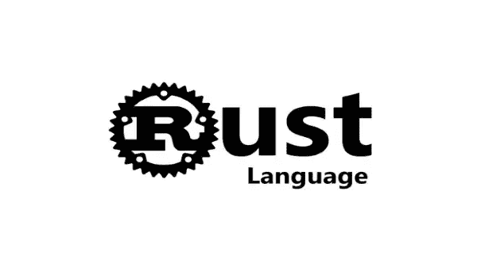

# 想成为一名专业的 Rust 开发者吗？

> 原文：<https://medium.com/coinmonks/looking-to-become-a-professional-rust-developer-8116bcab9168?source=collection_archive---------2----------------------->

~dwulf

Rust

我是自学的(即没有作为软件工程师的传统学习经验)。我把自己看成一个黑客，懂操作系统、云系统、网络，用 BASH 脚本做一些简单的自动化；过渡到成为一名合格的工程师，接受排序算法、数据编码/解码以及对所有这些的正式数学理解方面的正式培训。

为了确定过渡到专注于 Rust 的软件工程有多现实，以及任何有任何一般性建议或推荐(不仅仅是对我，而是任何人)希望专业地进入 Rust 的人，请让我知道。但我觉得最低限度的技能应该植根于基本原则。

## 计算机科学

计算机科学是了解铁锈的核心。如果你对计算机科学这门学科有扎实的理解，那就奠定了核心思想的基础。

计算机科学技能可以很容易地在网上学习，在 YouTube、Coursera 等网站上有很多材料。具体是 cs50。

Rust 可以用于许多不同的领域，从嵌入式到客户端 web 应用程序。由于 Rust 通常是一种系统/低级语言，我认为了解软件和硬件理论的基础总是好的，首要原则是:

***CPU 如何在汇编/机器码层面运行，包括寄存器、堆栈、SIMD 等。***

***CPU 缓存如何工作，如何结构化数据以高效利用。***

能够实现基本的数据结构，如数组向量、哈希映射、链表、二叉树、堆、队列、栈等。以及排序、二分搜索法、树/图遍历等算法。，并了解它们各自的性能/内存特征和权衡。

***堆分配器如何工作，并能够自己实现一个简单的堆分配器。***

***不同类型的自动内存管理技术，如引用计数、跟踪 GC 等。***

***线程和 CPU 内核之间的同步如何在原始(CPU)级别上工作，以及如何构建高级并发结构，如通道、任务、互斥、STM 等。除此之外。***

***异步是如何在基础层面上工作的。***

***网络协议如何像 TCP、UDP、HTTP 等。在基础层面上工作，例如实现你自己的 web 服务器。***

***AES、SHA、RSA 等加密算法。，它们何时适用以及它们提供的安全级别。***

***LZ、JPEG、MPEG 等数据压缩算法的基础知识。，每种方法的适用时间以及它们的利弊。***

***关于如何利用 GPU 进行计算和图形处理的基本知识，以及它适用于哪些用例。***

***操作系统概念的基础知识，如内核、驱动程序、进程、文件系统、共享库、共享内存等。***

虽然不是 Rust 特有的知识，但是这些基本原则适用于所有的软件开发，对于像 Rust 这样的低级语言来说更是如此。Rust 是学习这种东西的绝佳语言。

最重要的是，根据你将要从事的工作，你当然需要更专业的领域知识，但是很多知识都来自于工作经验。

从基本面来看，生锈将更容易管理，或者至少可以更好地量化。计算机科学是可以借鉴的核心。

## 结论

因此，前进就是再次返回，回到基础，回到对 Rust 代码库的开发和实现的认真关注。我觉得在学习 Rust 的过程中，用户会在计算知识的完整性上走一整圈。

即使在处理加密、节点、加密、merkle 尝试和常规算法时也是如此。重新聚焦于基础将有助于加强和巩固适当的和久经考验的软件实践。

我将继续检查更多的 Rust 并比较、对比和报告这两种语言之间的细微差别。

> 交易新手？尝试[加密交易机器人](/coinmonks/crypto-trading-bot-c2ffce8acb2a)或[复制交易](/coinmonks/top-10-crypto-copy-trading-platforms-for-beginners-d0c37c7d698c)