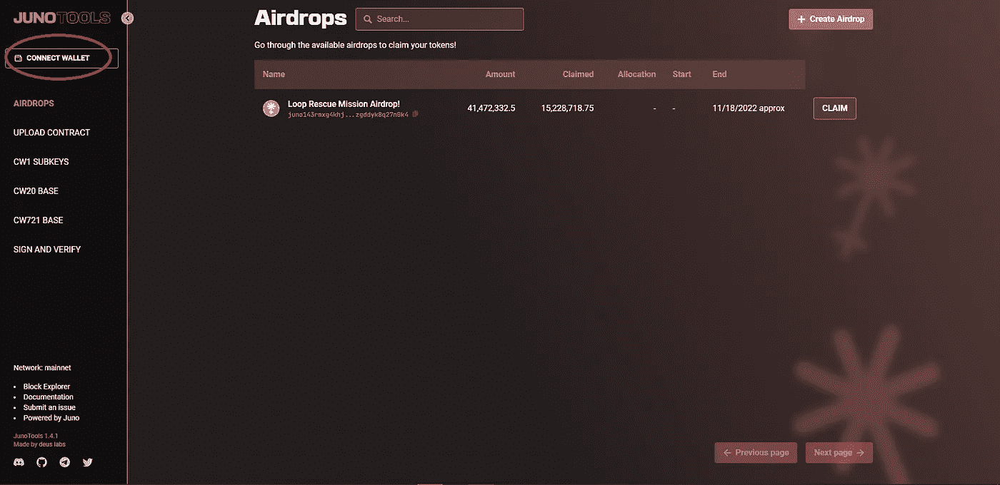
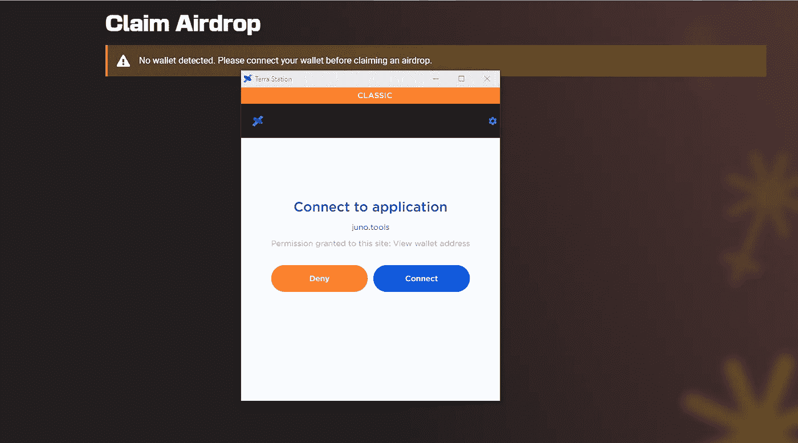
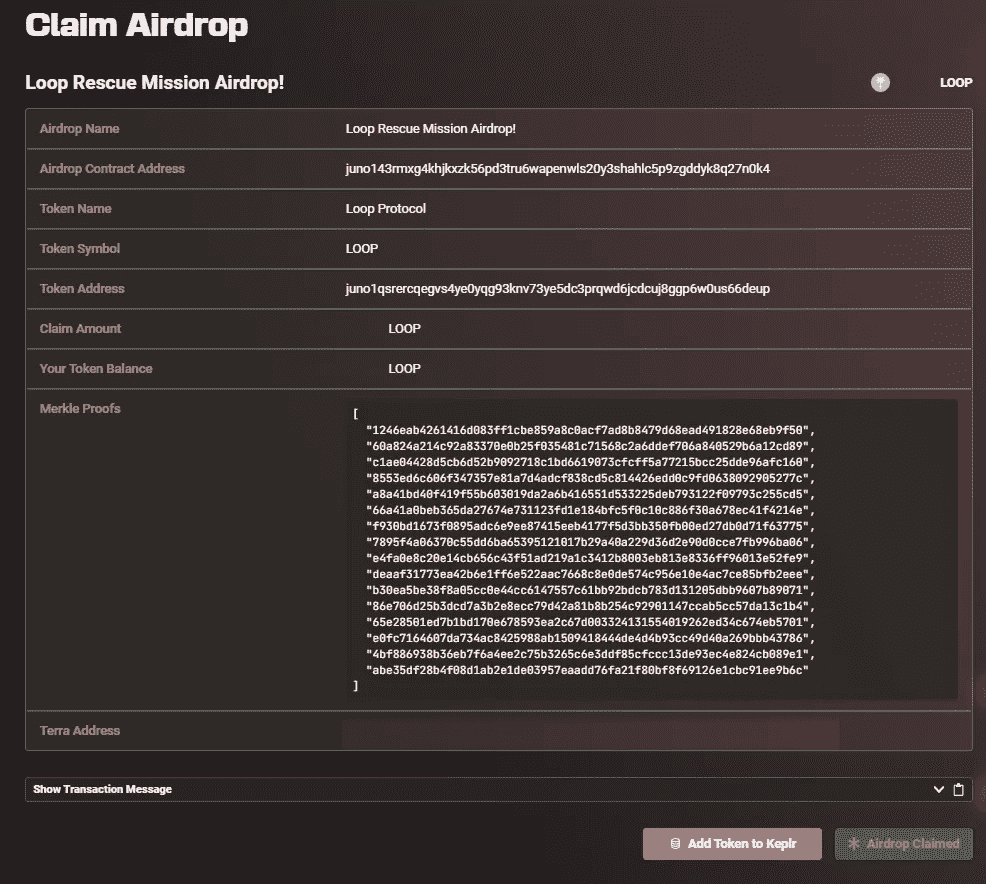
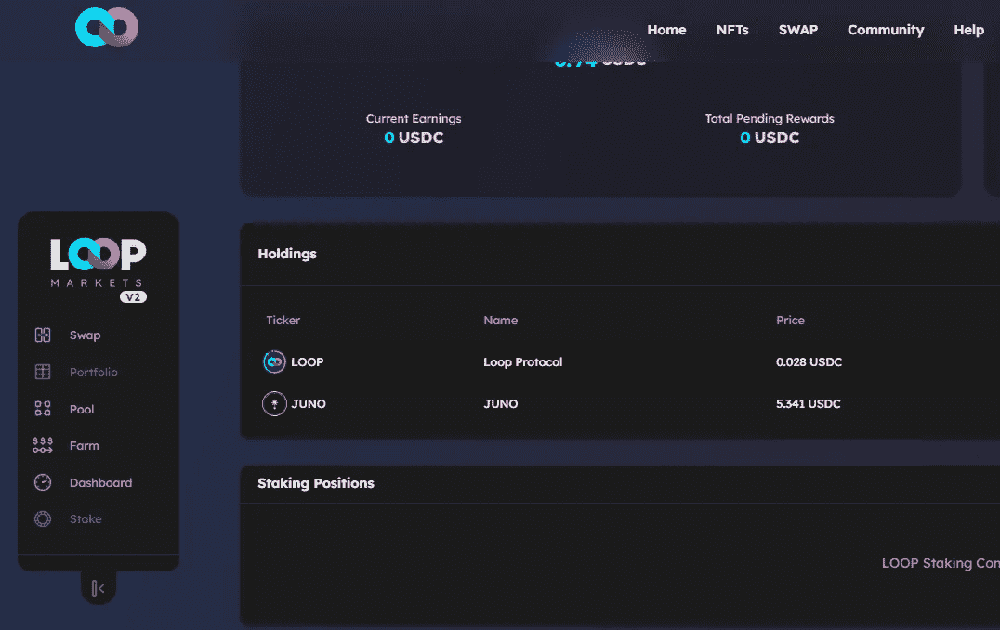
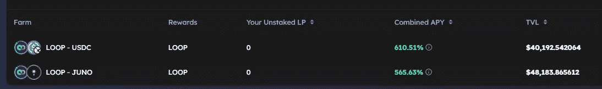

# Loop Finance 的 Juno airdrop 现已上线

> 原文：<https://medium.com/coinmonks/loop-finances-juno-airdrop-is-now-live-5e9256bbe0b5?source=collection_archive---------0----------------------->

[https://twitter.com/loop_finance/status/1561080866696269826/photo/1](https://twitter.com/loop_finance/status/1561080866696269826/photo/1)

嘿，伙计们，如果你在 twitter 上关注我，你会收到通知，截至上周五，Loop Finance 已经朝着迁移到 Juno 网络迈出了又一步，Loop“救援任务空投”现已上线。

如果你还没有收到你的空投，你不确定你是否有资格，你可以检查你的 terra classic 地址[这里](https://docs.google.com/spreadsheets/d/1MNpnoxm3QWsRVxlZCIQJA4efM4WPSBLPk1z2hZwNMVY/edit#gid=0)看看它是否列出。如果您看不到您的地址，并且如果您最初使用硬件钱包来保护您的 Terra 地址，您可以提交[此表格](https://docs.google.com/forms/d/e/1FAIpQLSc6fhhGyYoIsbnT4Bx9QFfVGradJbqgw6KRnj09U3noKb1wDg/viewform)以尝试获得资格。

假设您*符合*资格，您可以通过以下简单的步骤申请空投:

# **第一步:连接您的 Keplr 钱包**

访问[juno.tools/airdrops/](https://juno.tools/airdrops/)并连接您的 Keplr 钱包，以便您的地址可以访问 Juno 工具:

一旦通过验证，您只需点击屏幕右侧的“认领”按钮。

# 步骤 2:连接您的 Terra Station 钱包

点击认领按钮将提示您登录 Terra Station 钱包。为了让网络确认您的钱包合格，请确保您通过 Terra Station Classic 连接:

# 第 3 步:申请空投

连接您的两个钱包并验证您的油费后，您应该会得到一个确认，显示您的$LOOP 已被认领:

# **第四步:验证你的空投**

为了确保一切正常，请访问[https://juno.loop.markets/my](https://juno.loop.markets/my)，连接您的 Keplr 钱包，然后前往作品集部分查看您新空投的代币:

瞧，你已经完成了空投！

# 还要补充一些其他注意事项:

空投期将于 2022 年 11 月 18 日**结束**，因此请务必在此之前申领您的空投。在编写本报告时，在 41，472，332.5 个代币中，大约只有 15，247，983 个代币被申请。

**LOOP/USDC 和 LOOP/JUNO 池目前正在运行**，APY 池目前相当混乱:

正如大多数铸造池，我想随着这些越来越受欢迎，APY 的将不可避免地减少。

# 结论:

在 Terra Luna 的余波之后，我对 Loop Finance 团队留下了极其深刻的印象，因为很明显，他们一直在勤奋地继续建设。如果你想知道他们下一步会做什么，我强烈推荐你在 twitter 上关注他们:[https://twitter.com/loop_finance](https://twitter.com/loop_finance)，因为他们经常在那里发布很多 alpha 和更新。(一定要在我的推特账户上关注我，获取我所有的最新动态:【https://twitter.com/CryptosWith)

再次感谢您的阅读，如果您有任何其他问题或评论，请随时在下面留下。

免责声明:最后提醒一下，这不是财务建议，仅用于教育和娱乐目的。请一如既往地做自己的研究，找到最适合你的投资。干杯大家！

> 交易新手？试试[密码交易机器人](/coinmonks/crypto-trading-bot-c2ffce8acb2a)或[复制交易](/coinmonks/top-10-crypto-copy-trading-platforms-for-beginners-d0c37c7d698c)