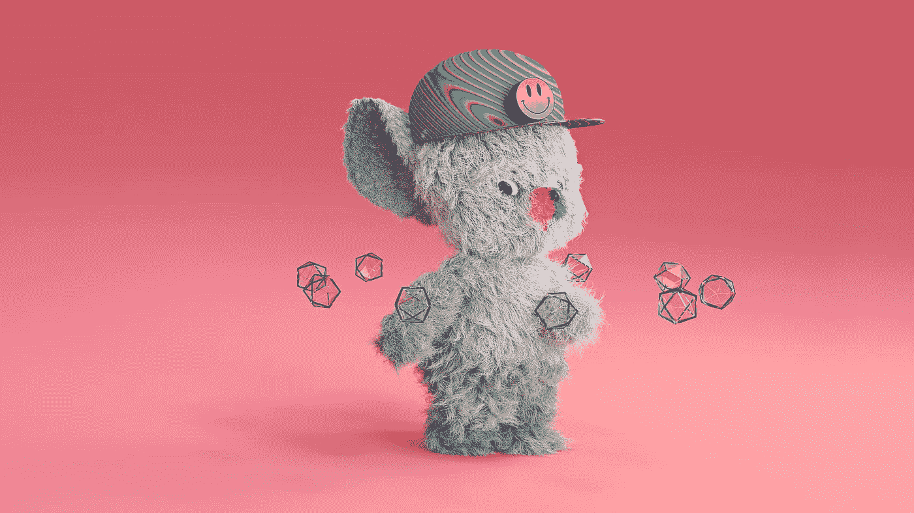

# 失落的俱乐部玩具:在区块链上跳舞亮相 Token2049

> 原文：<https://medium.com/coinmonks/lost-club-toys-dancing-on-the-blockchain-to-debut-at-token2049-13956d68461f?source=collection_archive---------34----------------------->

*新加坡，2022 年 9 月 28 日—* [Lost Club Toys](https://www.lostclubtoys.com/) ，第一个致力于电子音乐文化的 Web3 生活方式品牌，将于 2022 年 9 月 30 日在新加坡标志性的滨海湾金沙建筑顶部的 céLA VI 举行的[托克 EN2049](https://www.asia.token2049.com/) afterparty 上正式发布他们的 3D 头像 NFT 系列。

[AFTER2049](https://ra.co/events/1578263) 是亚洲顶级加密赛事 TOKEN2049 的官方闭幕派对，将与【2022 年新加坡一级方程式大奖赛的第一轮练习赛同时举办。这一独家活动将以令人振奋的夜间比赛为特色，这将是新加坡大奖赛周末最大的派对。

10 月 1 日和 2 日，玩具将从 MBS 的象牙塔下到富勒顿湾酒店，继续在[琥珀酒廊](https://amber-lounge.com/singapore/)的试玩，这是一个顶级的世界级派对，名人、F1 车手和贵宾将在这里体验新加坡大奖赛的快节奏魅力和高潮。Lost Club Toys 将拍卖五件独家琥珀厅系列 x Lost Club Toys NFTs，提供全球所有琥珀厅活动的终身入场券(底价 7500 美元)。

迷失俱乐部玩具视频:[https://vimeo.com/754623199](https://vimeo.com/754623199)

“我们的愿景是创建一个以新收入流为中心的在线社区，支持生态系统的关键要素(DJ、俱乐部、推广商、时装设计师和艺术家)，以促进舞曲音乐的快速全球增长，以及随之而来的包容和自由表达的价值观。”迷失俱乐部玩具公司的联合创始人丹尼尔·格罗夫说。

在 2049 年后和琥珀酒廊展出的将是他们的限量版迷失俱乐部玩具 NFTs。狂欢者将能够见到创始人，并与玩具合影，有机会预先预订令人垂涎的 NFT 之一，从而在 2023 年 3 月正式推出他们的 8888 genesis 系列。与已建立的创作者和俱乐部合作创建的创作者收藏也将在每个 10 个 NFT 的运行中发布，并为每个合作伙伴提供独特的奖励。

这家在新加坡、伦敦和柏林之间成立的 Web3 初创公司，正在利用区块链连接舞曲生态系统中的关键人物，让粉丝们能够以前所未有的方式接触到他们最喜爱的创作者、俱乐部和音乐节。

据最大的舞曲文化杂志[常驻顾问](https://ra.co/news/77204)称，电子音乐产业在 2021 年突破 60 亿美元，到 2030 年将增长三倍。尽管如此，该行业的绝大部分收入是通过门票和酒类销售在线下产生的。冠状病毒疫情揭示了它几乎完全依赖于在固定位置运行的物理空间。与此同时，舞曲继续在网上大规模流行，不受传统热点如伊比沙岛和柏林的限制。Lost Club Toys 正在建立一个以“数字”互动为中心的社区，利用线上和线下世界的优势来创造新的东西。

Lost Club Toys NFTs 的持有者将能够参观世界各地的合作伙伴俱乐部和节日，参加独家的真实和虚拟活动，并与他们最喜爱的创作者联系和合作。品牌合作伙伴关系、商品、电视和电影版权以及 Collab2Earn(他们自己版本的 crypto gaming 的 Play2Earn)都将成为 NFT 以外的额外收入来源。

Lost Club Toys 是 Studio 2033 Pty Ltd 的子公司，由艺术家兼设计师 Chris Jarrett、音乐家 Kosmo Kint 和电影制作人 Daniel Grove 创建，旨在围绕原创知识产权建立和维持创作者社区，利用区块链技术在透明度、去中心化和以创作者为中心的权利方面的优势。

Lost Club Toys 将于今年晚些时候在迈阿密和迪拜继续他们的 crypto conference 路演活动。

**关于迷失俱乐部玩具**

《迷失俱乐部玩具》是 2033 工作室的一个 NFT 项目，它结合了实体和数字产品来庆祝电子舞曲文化。迷失俱乐部玩具将 Web3 和对舞池的热爱联系起来，通过在线大师班、在线和现实世界活动的特权访问以及现实世界俱乐部访问，使艺术家能够与全球音乐爱好者社区建立新型关系。Lost Club Toys 的 8，888 件 NFT genesis 系列将于 2023 年 3 月推出。

**关于 2033 工作室**

Studio 2043 是一家总部位于新加坡的公司，由三位联合创始人于 2022 年创立:艺术家兼设计师克里斯·贾勒特、音乐家科斯莫·金特和电影制作人丹尼尔·格罗夫。该公司使用区块链技术创建了一个透明和分散的平台，围绕这个平台可以建立具有原创知识产权的创作者社区。

**迷失俱乐部玩具官方渠道**

网址:[www.lostclubtoys.com](http://www.lostclubtoys.com)

推特:[https://twitter.com/lostclubtoys](https://twitter.com/lostclubtoys)

insta gram:【https://www.instagram.com/lostclubtoys/?hl=en 

> 交易新手？试试[密码交易机器人](/coinmonks/crypto-trading-bot-c2ffce8acb2a)或[复制交易](/coinmonks/top-10-crypto-copy-trading-platforms-for-beginners-d0c37c7d698c)