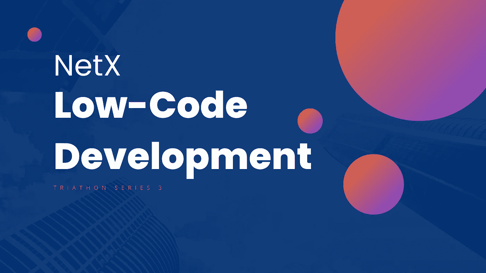
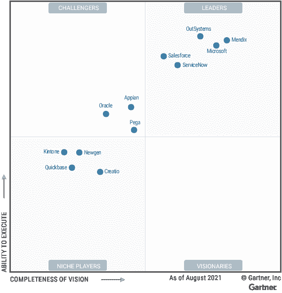

# 低代码开发

> 原文：<https://medium.com/coinmonks/low-code-development-6791b24f254?source=collection_archive---------5----------------------->

## 什么是低代码开发(LCD)？

我给你举个例子。施耐德电气使用了 OutSystems，这是一个低代码的快速应用开发(RAD)平台，并在 20 个月内成功发布了 60 个应用，仅在第一年就节省了 650 天的工作时间，从而将开发时间减半。

随着 IT 技术成为全球信息化浪潮中的支柱，软件开发却因其低效率而成为障碍，这与摩尔定律的发展背道而驰。低代码开发一旦实现低成本、高效率，必将吸引大企业和资本。AWS，谷歌，微软，甲骨文，西门子等。要么推出低代码开发平台(LCDP，也称为 LCA PS——低代码应用程序开发平台)，要么计划通过收购实现低代码。Outsystems 早在 2018 年就成为了行业独角兽，当时它从私募股权投资机构 KKR 和高盛筹集了 360 美元。几乎与此同时，西门子以 7 亿美元收购了荷兰公司 Mendix。根据权威 IT 研究和咨询公司 Gartner 发布的魔力象限报告，2021 年，OutSystems、Mendix、微软、Salesforce、ServiceNow 都被评为低代码开发领域的领先公司。

那么，什么是低代码开发呢？本文希望在三个方面有所启发:a .低代码开发的定义，b .低代码和无代码的区别，c .低代码应用的未来趋势。

低代码开发允许用最少的代码开发应用程序，只需用拖放界面进行可视化建模。不同层次的开发人员可以使用拖放组件和图形用户界面上的模型驱动逻辑来建立 web 和移动应用程序。LCDPs 为非技术开发人员提升代码编写，为专业开发人员检索开发过程中繁琐的底层框架和基础设施任务。运营和 IT 开发人员可以一起工作，在平台上创建、迭代和发布应用程序，但与传统方式相比，只需要很短的时间。

LCDPs 本质上是设计用来提高效率和降低开发成本的工具。Gartner 在魔力象限报告中对 LCAPs 有一段描述:LCAP 的特点是使用了由表达式语言和可能的脚本支持的模型驱动或可视化开发范例……它的特点是几个要素，如模型驱动、可视化开发、表达式语言和脚本语言，这也可以作为判断 LCAP 专业程度的标准。

早在 2012 年，Gartner 就提出了“公民开发者”的概念。微软这个在很多方面都践行低代码和无代码的公司，一直在倡导“人人都是开发者”的战略理念。如果你曾经注意过近两年的微软 Build 开发者大会，你会发现，它的 Power 平台已经有了很大的更新。2021 年，微软首次将 OpenAI 的大规模语言模型 GPT-3 集成到 Power Fx 中，Power Fx 是 Power Apps 使用的低代码编程语言。用普通语言输入的需求可以直接翻译成 Power Fx 代码，使得低代码工具可以被更广泛的受众使用。

## **低码和无码的区别**

低代码经常与无代码(或“零代码”)并存。如果 low code 能够通过拖拽的可视化建模来创建应用程序，其中用户输入的正常语言被自动转换为代码，那么没有代码是否意味着创建没有代码的应用程序？

但事实是,“无代码”这一表述更多是作为营销宣传而非技术术语被发明出来的。宣传旨在向操作用户保证，其中不需要编程专业知识。实际上，无代码是一个相当宽泛的概念，用来描述子领域的一些开发工具。最常见的是应用构建平台(如 App Builder 等。);也指工作流工具，如在线表单工具或 Lightstream(如 Airtable、AppSheet、Treelab 等。).这些工具是完全不同的类型。目前，一个“通用的”无代码开发平台并不存在，也可能永远不会出现，因为所有软件都是在由代码组成的逻辑上运行的。Gartner 和 Forrester 都为 LCDPs 制定了明确的标准，尽管它们尚未标准化，例如与常见场景(至少三层，UI，逻辑和数据)的兼容性以及对专业开发需求的满足。随着行业的发展，统一标准必将到来。随着市场结构的显现，焦点将转向具体的产品类型，而不是宽泛的无代码概念。

综上所述，无代码和低代码是完全不同的概念。无代码主要针对操作人员，操作人员可以不使用任何代码，包括低级代码。如果他们写不出 100 行代码，那么 10 行代码对他们来说也是无法完成的。领先的分析机构已经达成共识，LCDPs 主要是为专业开发人员创建的。无代码一般是指各种开发子领域应用的工具，低代码是指通用的开发工具。

## **低代码发展的未来趋势**

一些人欢呼低代码开发是下一代 IT 技术革命。Garner 2021 魔力象限报告提到，到 2025 年，企业开发的 70%的新应用程序将使用低代码或无代码技术，而 2020 年这一比例不到 25%。

如今，领先的低代码企业，如 Gartner 魔力象限报告中公布的 hpaPaaS 企业，可以分为领先的 SaaS 企业和通用平台企业。前者包括 Salesforce 和 ServiceNow，其长期发展目标是提高产品开发和定制开发的效率，构建平台生态。领先的通用平台企业包括 OutSystems、Mendix 等。，它构建适用于所有应用程序开发场景的平台工具。

LCDPs 可以通过多种方式部署，如私有化部署、私有云部署、公共云 ECS 部署、公共云 Docker 部署和 SaaS 模式。随着系统在各种应用场景中变得越来越复杂，企业可能需要更多的计算资源。因此，很难预测用户会在液晶显示器上开发什么样的应用。云部署可以在一秒钟内根据一个请求打开数十台服务器，这是本地部署难以实现的。同时，低代码开发可以使业务互联发生，因为未来的企业将通常在相同的生态环境中运行。SaaS 模式比私有化部署模式更安全。

一些专业程序员担心 LCDPs 可能不够强大，但事实恰恰相反。LCDPs 所做的仅仅是预先将重复制造的车轮组装成部件。您仍然可以通过配置和代码构建逻辑，或者根据需要通过 JavaScript 和 HTML5 修改前端。那么，在历史悠久的软件开发领域，低代码是否可能在很大程度上灌输生产力呢？还是等未来来告诉我们吧。

# 📚必读

[铁人三项系列赛-1](/coinmonks/the-blockchain-hackathon-is-on-3e57bc1ed366) | [铁人三项系列赛-2](/coinmonks/trust-machine-da9c49f57a3d)

***NetX，面向数字生活的可信可靠的智能自治系统链原生互联网(******Trias******)***

[***铁人三项***](https://www.triathon.space/#/)***|***[***Ethanim***](https://www.ethanim.network/)***|***[***Tusima***](https://www.tusima.network/#/)***| Behemotum | Octavius | leviam | Divina***

> 交易新手？尝试[加密交易机器人](/coinmonks/crypto-trading-bot-c2ffce8acb2a)或[复制交易](/coinmonks/top-10-crypto-copy-trading-platforms-for-beginners-d0c37c7d698c)