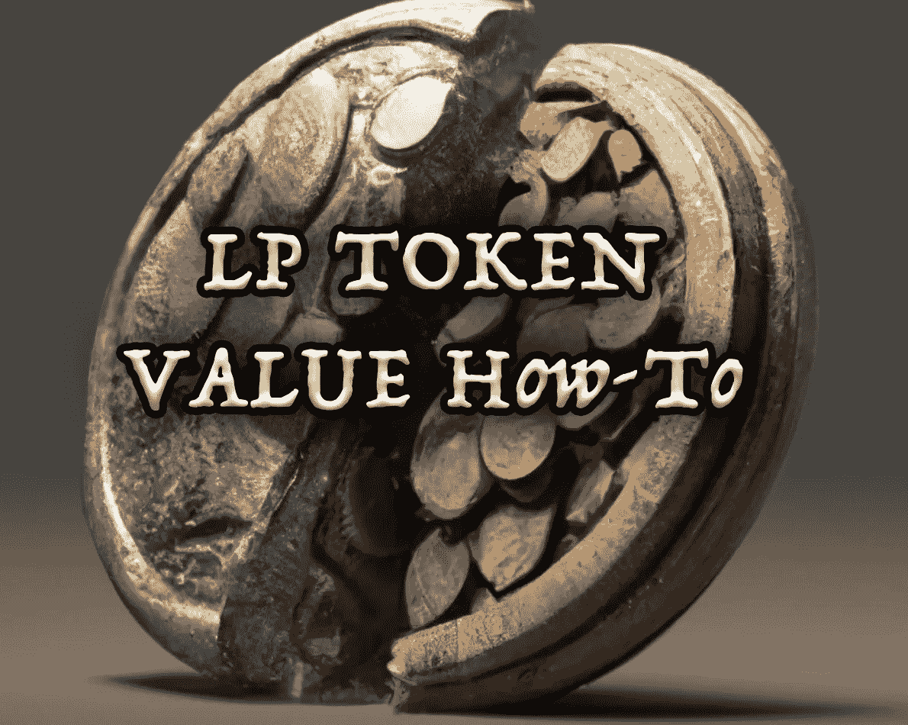

# LP 标记值:如何找到$$值

> 原文：<https://medium.com/coinmonks/lp-token-values-how-to-find-the-value-ae28477a2098?source=collection_archive---------11----------------------->

如果你从事农业生产，你无疑会问自己如何找到 LP 代币的价值。此外，如果你正在处理税务，你肯定需要这些信息，因为美国政府认为任何硬币或代币进出你的钱包都是应税行为。因此，您需要知道 LP 令牌的值。

