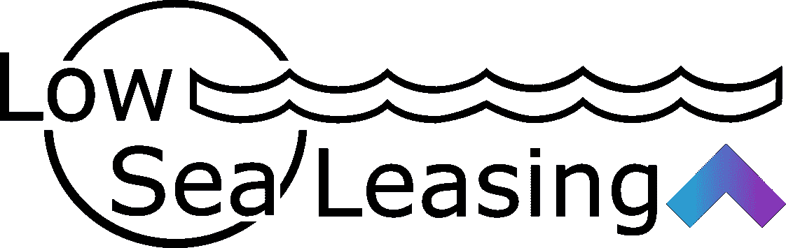
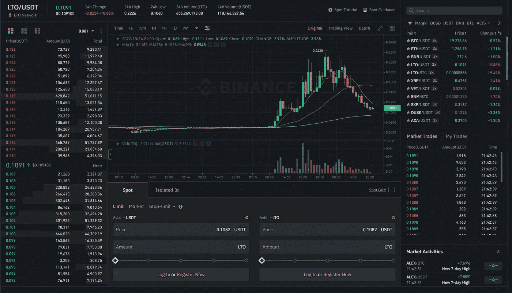
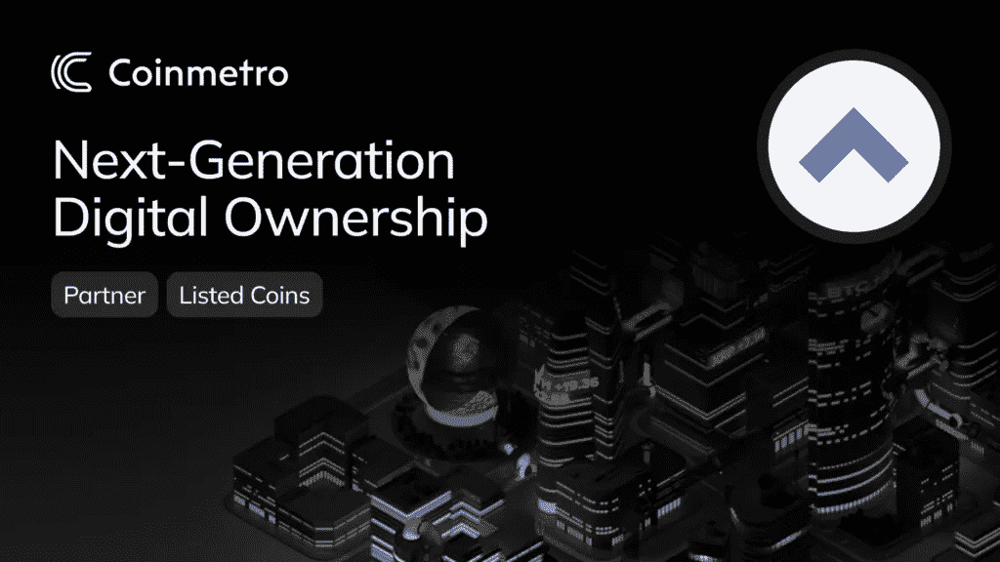
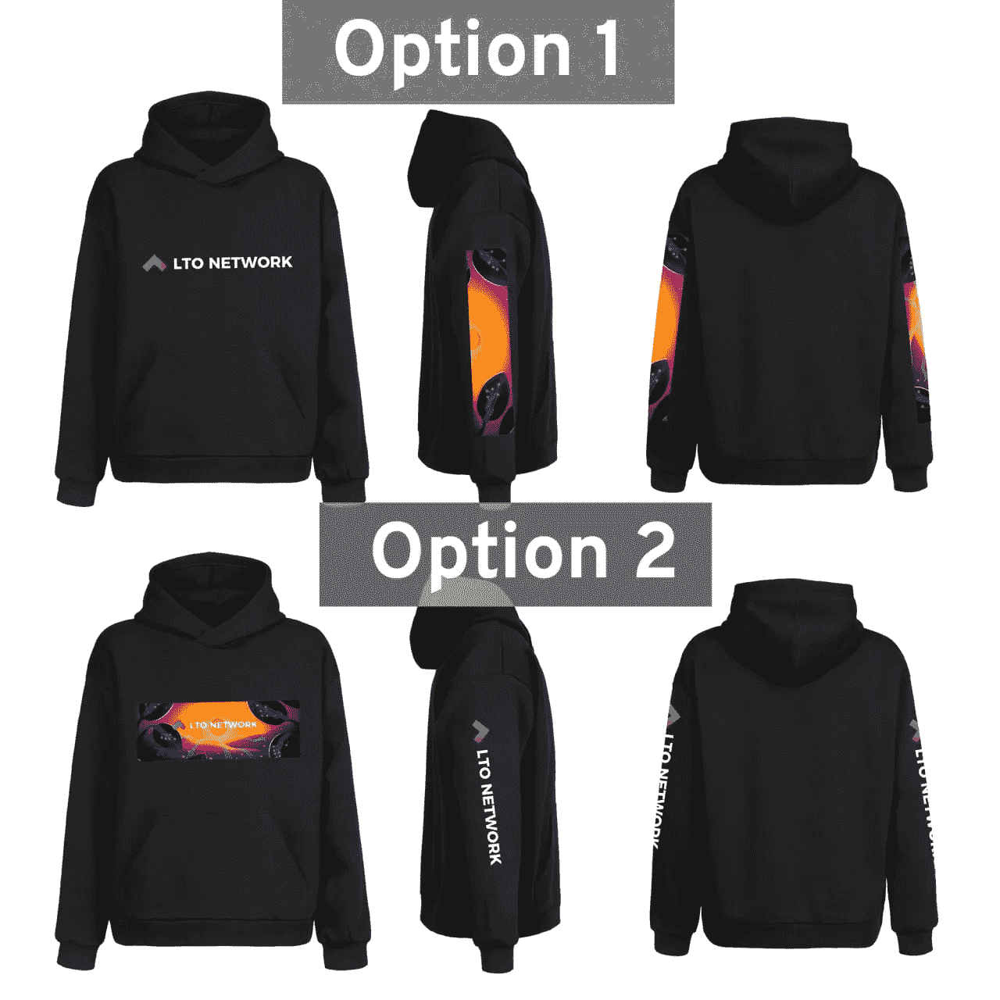

# LTO 网络 LowSea 租赁节点更新(2022 年 10 月 15 日)

> 原文：<https://medium.com/coinmonks/lto-network-lowsea-leasing-node-update-15th-of-october-2022-dec27e5e965d?source=collection_archive---------29----------------------->

这个周末真是太棒了。熊市中巨大的泵，容量巨大。这不是太奇怪，有一个回撤，但让我们希望一个更高的低点建立，我们可以享受更多的认可。如果说有什么不同的话，那就是如果我们在过去几个月里看到的镇压最终能结束，那就太好了。随着大量东西的出现和开发，我们打破 LTO/BTC 对 1200 sats 的障碍只是时间问题，最好在牛市期间做到这一点(或保持这一水平)。

现在，坐下来看看我们在过去两周内看到了什么……公平地说，这不是一个大新闻期，但我们确实得到了一些更新。🤟

首先，[ProFi 公共测试版](https://twitter.com/TheLTONetwork/status/1577271591859154944)即将就绪。它提到了一些关于 NFT 的东西，看看这些点是如何连接的会很有趣。🤔除此之外，testnet 上 Ownables alpha 的工作还在继续，并且几乎可以在 testnet 上公开共享/测试了。🙌😎我期待着玩玩它，看看一些技术在发挥作用。

在电报频道，有机会成为[钱包关闭阿尔法测试](https://twitter.com/TheLTONetwork/status/1575070353079947264)的一部分。社区中一些活跃的成员已经被选中，封闭的阿尔法应该很快就会出现，测试人员可以在那里分享他们的发现。视频中钱包的第一眼就显示了它干净的布局，我希望自己也能测试一下钱包。👀

我们还看到了 LTO 服务交易所之一的一些活动:Coinmetro。他们发布了一个“T4”合作伙伴博客“T5”，向他们的用户介绍 LTO 的进展。在不久的将来，他们那边会有更多的活动。

另一个最近在我们社区中公开亮相的交易所是 Coinmerce，一家荷兰交易所，它与 LTO 网络的 mainnet 进行了超高速整合。他们将很快介绍 too 斯泰格，这也是街头流传的说法。

除此之外，我们还看到了一些社区活动。这是推特上发布的[连帽衫民调](https://twitter.com/TheLTONetwork/status/1578006900968407042)。我绝对喜欢选项 1。🤩🔥

然后在 Ownables 不和频道上有一个 [Ownables 单词搜索](https://twitter.com/MyOwnables/status/1580497594006245376)来赢得这样一件连帽衫！

我们快速回顾的最后是 LTO 昨天抛出的 2022 年回顾。没有什么新的，但一个很好的重温正在发生的大事情。易于分享和伟大的所有新的人发现 LTO 在这个周末与巨大的泵在量被看到。

就是这样。愿这种增长持续下去，让它成为最好的熊市和牛市。

> LTO 是区块链的一个证明，总供应量高达 5 亿 LTO 和一个伟大的 APY。该项目由真实采用驱动，关注身份、隐私和所有权。加入 LTO [**LowSea 租赁**](https://t.me/joinchat/ALw70hNg64IIUx2vd3qU8g) 节点电报组，成为 LTO 网络在加密领域取得进步的一部分。
> 
> 在 LTO 主网的 [**LowSea Leasing**](https://t.me/joinchat/ALw70hNg64IIUx2vd3qU8g) 节点下注您的硬币。只需遵循这些简单的步骤:[https://crypto narf . medium . com/welcome-to-low sea-leasing-9161 FB 28 a 19 a](https://cryptonarf.medium.com/welcome-to-lowsea-leasing-9161fb28a19a)
> 
> LTO Mainnet 上支持[账本](https://docs.ltonetwork.com/wallets/wallets/howto-install-lto-app-on-ledger)的赌注！

> 交易新手？尝试[加密交易机器人](/coinmonks/crypto-trading-bot-c2ffce8acb2a)或[复制交易](/coinmonks/top-10-crypto-copy-trading-platforms-for-beginners-d0c37c7d698c)