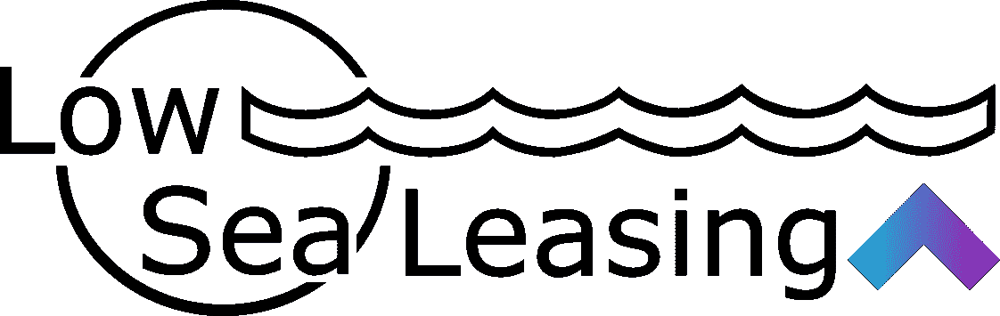

# LTO 网络——低海平面租赁节点更新(2022 年 9 月 15 日)

> 原文：<https://medium.com/coinmonks/lto-network-lowsea-leasing-node-update-15th-of-september-2022-a81bc1160290?source=collection_archive---------30----------------------->

我们回来了！经过一个夏天的沉睡，是时候看看 LTO 这个月会带来什么了。随着今天 ETH 的合并和 BTC 由于宏观经济的破坏，全球通货膨胀和能源成本在欧洲飙升到疯狂的水平，很高兴看到 LTO 网络保持建设不受干扰。所以，让我们深入研究一下。

在八月和九月，LTO 网络主要集中在自有资产结构的建设模式。本周，新的 TITANIUM 更新(Ownables 是其中的一部分)已经被推送到 testnet。然而，Ownables 并不是此次更新的唯一部分。对 LTO 网络知识图表的索引器进行了改进，扩展了它的可能性。

“LTO 索引器将处理数据和关联交易，并将信息存储在 Redis 图中。这使得 LTO 比其他分散知识图更有优势，因为项目可以直接用 Cypher 查询 Redis，而不必实现区块链特有的库。”

还增加了非常适合供应链管理的功能。允许各方通过“声明”更容易地加入供应链，并降低参与门槛。

在这里阅读全部内容:[https://blog.ltonetwork.com/titanium-testnet-activated/](https://blog.ltonetwork.com/titanium-testnet-activated/)

这是另一个伟大的更新，将为内容创作者探索真正完全拥有的数字资产开辟道路。

我预计，在接下来的几个月里，我们将会看到更多关于 Ownables 的新闻。但首先，你可以在这里关注 https://twitter.com/MyOwnables 官方推特:
和 https://discord.gg/vgTMywtU 官方推特:

在采用方面，我们看到了由 Sphereon 提供的关于赌场会议的更新:[https://blog . l network . com/recap-of-ice-London-and-ECA-summer-symposium-2/](https://blog.ltonetwork.com/recap-of-ice-london-and-eca-summer-symposium-2/)

我们看到 Triall 也使用 LTO 区块链，他宣布了一个新的大型客户端，将开始使用他们基于区块链的解决方案:[https://Twitter . com/TheLTONetwork/status/156535538147917825](https://twitter.com/TheLTONetwork/status/1565335538147917825)

LTO 网在 ChainlinkToday 上的专题:[https://chain link today . com/LTO-networks-proofi-delivers-defi-identity-verification-solution-via-chain link/](https://chainlinktoday.com/lto-networks-proofi-delivers-defi-identity-verification-solution-via-chainlink/)

早在八月初，我们就看到 Florence Finance 宣布在其借贷平台中实施 Proofi，该平台将加密空间与真实世界的借贷联系起来:【https://blog.ltonetwork.com/florence-finance-proofi/

总而言之，在夏季的几个月里取得了一些出色的进展，我期待着 2022 年的最后一个季度。现在…如果这个世界能恢复理智，停止搞砸一切就好了！我们可以回去种植和寻找绿色。

愿成长继续！

> 寻找一个伟大的加密投资？
> 
> LTO 是区块链的一个证明，总供应量高达 5 亿 LTO 和一个伟大的 APY。该项目由真实采用驱动，关注身份、隐私和所有权。加入 [**LowSea 租赁**](https://t.me/joinchat/ALw70hNg64IIUx2vd3qU8g) ，成为 LTO 网络在密码世界中取得进步的一部分。
> 
> 来 LTO Mainnet 的 [**LowSea Leasing**](https://t.me/joinchat/ALw70hNg64IIUx2vd3qU8g) 节点下注吧。只需遵循这些简单的步骤:[https://crypto narf . medium . com/welcome-to-low sea-leasing-9161 FB 28 a 19 a](https://cryptonarf.medium.com/welcome-to-lowsea-leasing-9161fb28a19a)
> 
> LTO Mainnet 上支持[账本](https://docs.ltonetwork.com/wallets/wallets/howto-install-lto-app-on-ledger)赌注！

> 交易新手？尝试[加密交易机器人](/coinmonks/crypto-trading-bot-c2ffce8acb2a)或[复制交易](/coinmonks/top-10-crypto-copy-trading-platforms-for-beginners-d0c37c7d698c)