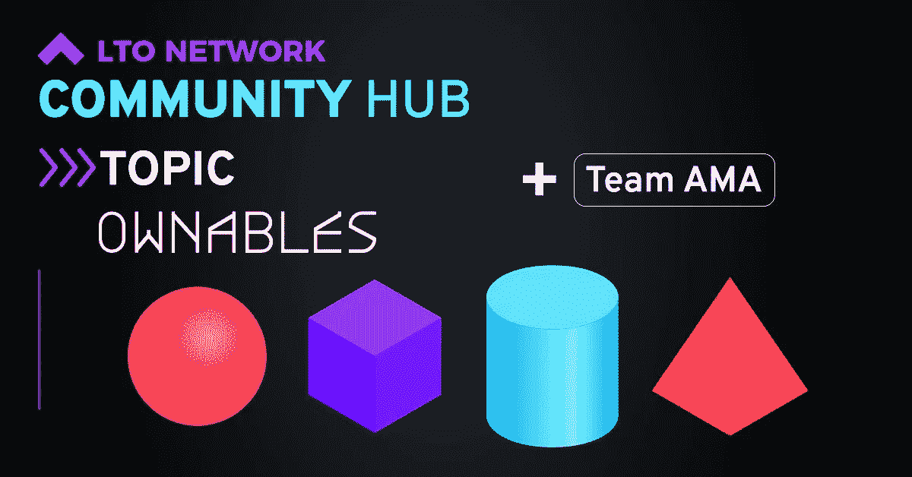

# LTO 网络——low sea 租赁节点更新(2022 年 10 月 1 日)

> 原文：<https://medium.com/coinmonks/lto-network-lowsea-leasing-node-update-1st-of-october-2022-a2ca3708bb4a?source=collection_archive---------37----------------------->

最近是疯狂的几周，因此这次更新有点晚。让我们跳过所有宏观经济的破坏，直接进入 LTO 的热点问题。

LTO 网络一直在几个项目上努力工作。[证明](https://www.proofi.com/)、[自有](https://blog.ltonetwork.com/litepaper/)和[共有](https://unhabitat.org/news/02-dec-2020/un-habitat-oict-and-lto-network-release-first-open-source-urban-land-registry)。Proofi 即将推出公开版 1.0，我希望很快能看到更多关于它的具体消息。戈兰……嗯，和往常一样，这仍然是一个谜，但我仍然保持乐观，即使在一个着火的世界里，政治决策是极其缓慢的。

然后是 Ownables。在过去的几周里，我们已经看到了 LTO 这棵树上的新枝的第一步。首先，官方 [Ownables discord 频道](https://discord.gg/gVDjgc6Bvf)已经创建。

内容创作者和 NFT 收集者在 Discord 平台上非常活跃，因此这似乎是为社区的新部分播下种子的正确地方。Ownables 也将从 LTO 网络中分离出来，允许采用不同的营销方式，而 LTO mainnet 可以更专注于核心开发和建设。

由于 LTO 网络的主要社区主要活跃在 Telegram、Twitter 和(某种程度上)Reddit 上，因此已经决定关闭最初的 LTO 网络不和谐服务器。几乎没怎么用过。

为了启动 Ownables Discord 社区的一些活动，第一次 LTO 网络 Ownables 社区枢纽 AMA 举行。在此期间出现了一些很棒的问题和答案，所以如果你有机会的话，我建议你通读一下。如果你想阅读关于不和的[完整聊天](https://discord.com/channels/974562233273180231/974562233273180237/1021767703477882910)你可以从这里开始:

否则，你可以在 LTO 网络博客上通读 AMA 的摘要。

人们一直在努力使不同格式的信息库更加完整。关于如何购买和/或如何入股 LTO 的视频已经发布:

购买:[https://www.youtube.com/watch?v=zhdFIyx6S8c](https://www.youtube.com/watch?v=zhdFIyx6S8c)

股份:[https://www.youtube.com/watch?v=yKpQBa1oP98](https://www.youtube.com/watch?v=yKpQBa1oP98)

我们也看到了新的 LTO 钱包的第一次窥探，现在命名为[通用钱包](https://blog.ltonetwork.com/the-lto-universal-wallet/)。一个封闭的阿尔法即将推出，以帮助测试公开阿尔法。我们可以从宣传片视频中截取的截图显示了几个有趣的事情(以下几点有些猜测):

*   在钱包内就可以下注/租赁
*   有一个解除绑定的显示器，所以你知道如果你停止租赁，你要等多久
*   有一个二维码按钮
*   在底部，我们还可以看到“凭证”和“可拥有的东西”，我们知道它们将来会进入钱包。

Screenshot of LTO Universal Wallet promo video

从我所看到的来看，设计看起来干净而时尚，我期待着在公开的 Alpha 测试中亲自测试它！

如上所述，对于正在发生的事情，戈兰仍然是一个谜，但是在过去的两周里，我们确实在 Twitter 上看到了一个关于它的快速[更新提示。](https://twitter.com/TheLTONetwork/status/1575432649035874304)

我想到的一个词是…什么时候？！哈哈，我想我只能像其他人一样等待了。

就是这样！愿这种增长持续下去，下次付款时再见！

> LTO 是区块链的一个证明，总供应量高达 5 亿 LTO 和一个伟大的 APY。该项目由真实采用驱动，关注身份、隐私和所有权。加入 LTO[**low sea Leasing**](https://t.me/joinchat/ALw70hNg64IIUx2vd3qU8g)node Telegram group，成为 LTO 网络在 cryptoverse 中取得进步的一部分。
> 
> 在 LTO 主网的 [**LowSea Leasing**](https://t.me/joinchat/ALw70hNg64IIUx2vd3qU8g) 节点下注您的硬币。只需遵循这些简单的步骤:[https://crypto narf . medium . com/welcome-to-low sea-leasing-9161 FB 28 a 19 a](https://cryptonarf.medium.com/welcome-to-lowsea-leasing-9161fb28a19a)
> 
> LTO Mainnet 上支持[账本](https://docs.ltonetwork.com/wallets/wallets/howto-install-lto-app-on-ledger)赌注！

> 交易新手？尝试[加密交易机器人](/coinmonks/crypto-trading-bot-c2ffce8acb2a)或[复制交易](/coinmonks/top-10-crypto-copy-trading-platforms-for-beginners-d0c37c7d698c)