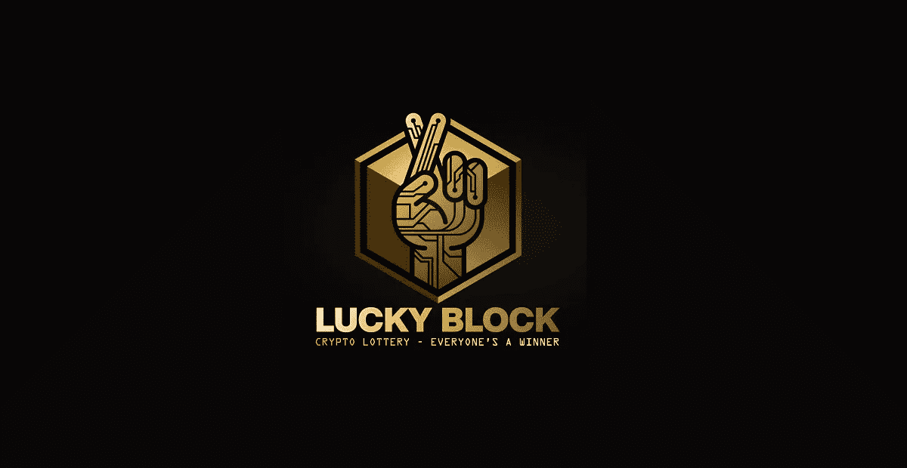

# 幸运块密码

> 原文：<https://medium.com/coinmonks/lucky-block-crypto-adc8689902e7?source=collection_archive---------28----------------------->

lucky Block(lb Block)是一个基于以太坊的彩票平台，通过玩到赚(P2E)游戏、不可替代代币(NFT)的红利以及独特的激励和抽奖提供被动收入。

通过提高安全性、透明度和弹性，该平台旨在降低加密彩票游戏的财务和运营风险。Lucky Block 的目标是进一步提高游戏的透明度和公平性，创建一个全球彩票系统，让每个玩家都能享受更高的中奖几率，同时为代币持有者提供可靠的投资策略，并回报社区。截至目前，该团队正在努力让他们的令牌在其他加密货币交易所上市，官方网站保存这些信息以及使用可信钱包的说明。

官方网站确实提供了指导普通用户如何购买 LBLOCK 令牌的说明。随着情况的好转，考虑到这个项目不是欺诈性的，幸运块(LBLOCK)令牌的乐观预测使其最低价格接近 0.015 美元。看看幸运块(LBLOCK)的价格轨迹，很明显，在过去的几天里，该令牌一直以该价格持续升值。

从长远来看，引入将有望帮助推动 Lucky Block 的用户群，这意味着 Lucky Block 的 2023 年指导价格预测估计 LBLOCK 可能达到约 0.01000 美元。2022 年幸运板块价格预测 2022 年 8 月，最低的 BSC 代币价值为 0.000037 美元，今天的价格约为 0.000044 美元至 0.0950 美元，就在 V2 板块在 Gate.io 上市之前。V1 代币的价格可能会随其价格反弹，更多关于以太坊桥和 V2 幸运板块的信息，请点击此处。

一旦您拥有了 BNB，您就可以将您的股份转换为 LBLOCK，此时您可以将您的新令牌移动到支持 BSC 的加密交换钱包中，以确保它们的安全。匿名钱包是最大的 V2 幸运块(LBLOCK)令牌持有者，拥有近 24.5 亿个令牌，占令牌供应总量的 36.75%。举行全球抽奖时，70%的头奖奖励给个人获奖者，10%捐赠给慈善机构，10%用于营销，10%在所有 LBLOCK 代币持有人之间按所有权比例分配。

“玩到赚”平台在如今的加密货币市场上非常受欢迎，它们在保持 NFT 利基市场的活力方面做了很多工作。“玩到赚”平台为重振 NFT 市场做出了巨大贡献，它们也激发了人们对该领域以外实体的兴趣。

更多信息:-

游览—[https://bigbraincrypto.blogspot.com/](https://bigbraincrypto.blogspot.com/)

> *交易新手？试试* [*密码交易机器人*](/coinmonks/crypto-trading-bot-c2ffce8acb2a) *或* [*复制交易*](/coinmonks/top-10-crypto-copy-trading-platforms-for-beginners-d0c37c7d698c)
> 
> *分散密码持有量，了解* [*币安替代品*](https://coincodecap.com/binance-alternatives)
> 
> *加入 Coinmonks* [*电报频道*](https://t.me/coincodecap) *和* [*Youtube 频道*](https://www.youtube.com/c/coinmonks/videos) *获取每日* [*加密新闻*](http://coincodecap.com/)

# 另外，阅读

*   [复制交易](/coinmonks/top-10-crypto-copy-trading-platforms-for-beginners-d0c37c7d698c) | [加密税务软件](/coinmonks/crypto-tax-software-ed4b4810e338)
*   [网格交易](https://coincodecap.com/grid-trading) | [加密硬件钱包](/coinmonks/the-best-cryptocurrency-hardware-wallets-of-2020-e28b1c124069)
*   [密码电报信号](/coinmonks/top-3-telegram-channels-for-crypto-traders-in-2021-8385f4411ff4) | [密码交易机器人](/coinmonks/crypto-trading-bot-c2ffce8acb2a)
*   [最佳加密交易所](/coinmonks/crypto-exchange-dd2f9d6f3769) | [印度最佳加密交易所](/coinmonks/bitcoin-exchange-in-india-7f1fe79715c9)
*   [面向开发者的最佳加密 API](/coinmonks/best-crypto-apis-for-developers-5efe3a597a9f)
*   最佳[密码借贷平台](/coinmonks/top-5-crypto-lending-platforms-in-2020-that-you-need-to-know-a1b675cec3fa)
*   [免费加密信号](/coinmonks/free-crypto-signals-48b25e61a8da) | [加密交易机器人](/coinmonks/crypto-trading-bot-c2ffce8acb2a)
*   杠杆代币的终极指南