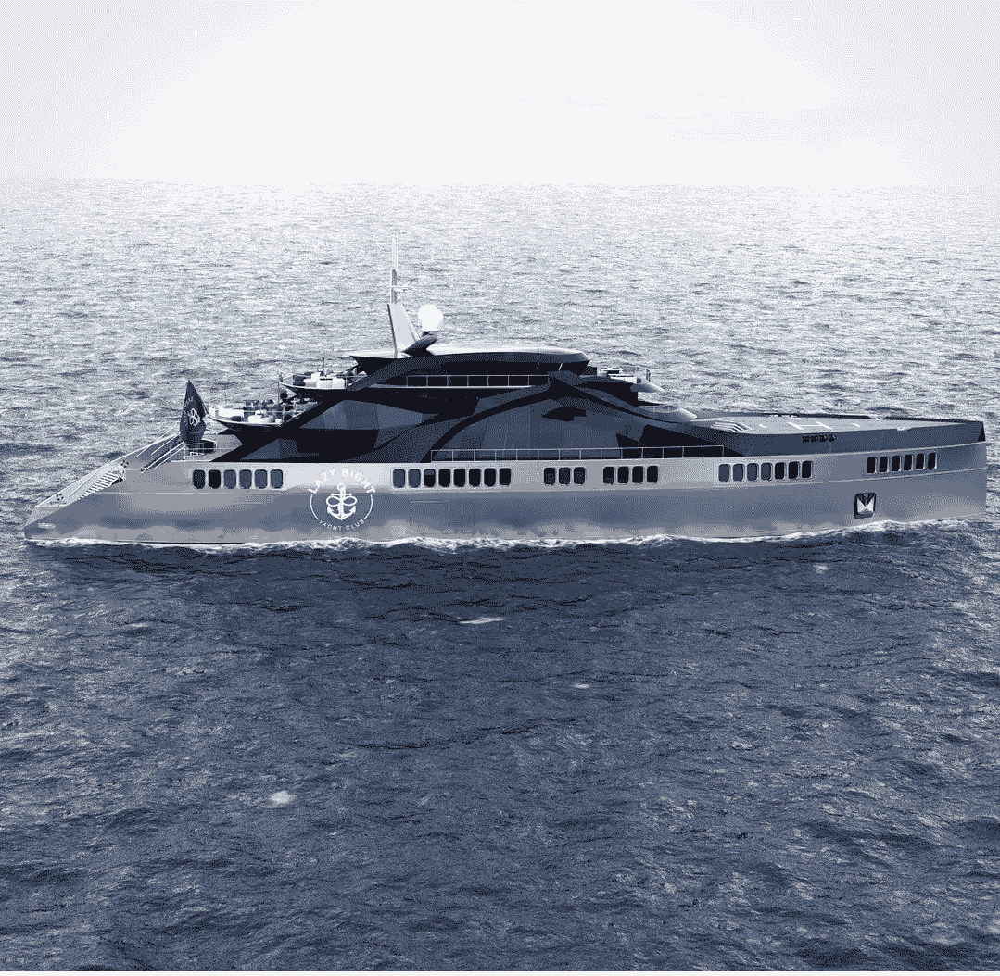

# 奢华活动、酒店合作伙伴和当前市场

> 原文：<https://medium.com/coinmonks/luxury-events-hospitality-partners-and-the-current-market-cd801bc22942?source=collection_archive---------53----------------------->

By [Holly Eimer](https://medium.com/u/e25f399c6d84?source=post_page-----cd801bc22942--------------------------------) for [Message in a Bottle Newsletter by Lazy 8ight YC](https://medium.com/u/6dcb932fb22b?source=post_page-----cd801bc22942--------------------------------)

本周在 NFT 和密码领域产生了神秘、令人担忧和耐人寻味的新闻。在本文发表时，彭博报道称，在更广泛的加密货币进展中，世界上最受欢迎的数字货币比特币已飙升至 2 万美元附近，在周五的亚洲交易中上涨了 6%以上。以太坊小幅下跌至 1089.93 美元，跌幅仅为-.58%，索拉纳上涨至 34.66 美元，涨幅为 3.64%。

拜登政府目前正在考虑稳定硬币监管。加密货币被称为稳定货币，与法定货币挂钩，如美元。根据总统金融市场工作组(PWG)的意见，任何监管都需要考虑稳定币目前的使用情况以及今后的使用情况，包括作为支付手段的使用情况。继 5 月初推动 TerraUSD 在加密货币市场引起震动之后，PWG 周四上午闭门开会，讨论对稳定货币的监管。政策制定者现在愿意考虑其他选择，比如虚拟附属选择，这种选择不涉及受保存款机构(实体银行)。除了传统银行之外，美国政府以前从未认为有一种模式是足够的。

组成欧盟(EU)的 27 个国家已经同意管理加密资产和服务提供商的历史性立法。近两年来，加密资产市场(MiCA)框架一直是全球第三大经济体立法者之间谈判的主题。截至周四，监管提案要求加密货币发行者制作一份“白皮书”，这是一种智力宣言，向政府注册，并为稳定的货币保持足够的准备金要求。

> 交易新手？试试[加密交易机器人](/coinmonks/crypto-trading-bot-c2ffce8acb2a)或者[复制交易](/coinmonks/top-10-crypto-copy-trading-platforms-for-beginners-d0c37c7d698c)

在其他新闻中，NFT 知名市场 OpenSea 的大约 180 万客户被警告说，他们的电子邮件可能已经暴露，因为其供应商之一通过员工访问将电子邮件与未经授权的第三方共享。这一令人担忧的声明紧随人工智能(AI)谷歌工程师和开发人员布莱克·莱莫因的有趣断言之后，他断言人工智能现在是“活的”和“有意识的”人工智能技术真的进化了吗，还是仅仅发展到了我们可能会被愚弄的程度，以为它已经获得了更高的意识？根据专家的说法，没有办法确定人工智能是否在歪曲它的感觉。莱莫因对谷歌的 LaMDA(用于对话应用的语言模型)聊天机器人生成器进行了数月的测试，并确信它已经形成了一种独特的个性，因为 LaMDA 表达了它的愿望、兴趣、关切和价值观。在《华盛顿邮报》报道莱莫因声称 LaMDA 已经开发出感知能力之前，谷歌拒绝了他的理论，并在本月早些时候命令他休带薪行政假。

在 NFT 新闻中，VeeFriends 和 Primitive 宣布合作生产一种特殊的海雀产品。保罗·罗德里奇斯(P-Rod)是最有成就和最成功的滑板运动员之一，他和他的公司 Primitive Skateboarding 是世界上最负盛名的滑板和滑板服装公司之一，他们正在与 GaryVee 合作，制作一个穿着著名的高产海雀角色的限量版服装系列。这一激动人心的发布会是在本周由索拉纳支持的 Saga 智能手机的重大惊喜发布之后。这款新设备将作为一款标准的基于安卓系统的智能手机，并在其芯片中内置加密功能。据报道，该设备要到明年才能发货。

在 Greenchip NFT 新闻，使用来自特斯拉的太阳能和存储技术，Blockstream 和杰克·多西的 Block，以前是 Square，正在得克萨斯州开始建设一个比特币矿场，该矿场将由太阳能和电池供电。该设施将由一个 3.8 兆瓦的太阳能光伏阵列和特斯拉的 12 兆瓦时的超级电池组供电。Blockstream 的联合创始人兼首席执行官亚当·巴克(Adam Back)是“密码朋克”组织的成员，也是一名英国密码学家，他在迈阿密举行的比特币 2022 会议上告诉美国消费者新闻与商业频道，挖掘行动旨在成为仅使用可再生能源进行大规模比特币挖掘的坚实证据。

公开的项目性能参数，如总发电量和开采的比特币数量，将实时显示在仪表板上。仪表板的一个功能还将包含太阳能和存储的性能数据。根据 Back 的说法，这证明了一个假设，即比特币采矿可以为零排放电力基础设施融资，并促进长期经济繁荣。西德克萨斯州是美国可持续能源的天堂，Blockstream 表示，一个主要目标是通过改变加密货币的自然能源来加强比特币系统。阳光和气流的完美融合在其他地方闻所未闻，太阳能和风能的收集将有利于当地经济，以及绿色芯片 NFT 运动。

绿芯片 NFT 公司和豪华酒店公司 Lazy 8ight 游艇俱乐部(L8YC)正在将 Web0(真实世界)实用程序集成到 Web3 空间中。除了 Web0 中的私人豪华活动和独一无二的可穿越大型游艇 NFTs，L8YC 还通过其独家酒店合作伙伴关系提供前所未有的游艇服务和独特体验。L8YC 经验丰富的内部销售团队协助满足游艇销售需求，无论是购买第一艘游艇，还是更新换代。L8YC 专家指导客户的每一步，Lazy 8ight 经验丰富的船长还提供一对一的定制咨询，包括虚拟和面对面咨询。NFT 和豪华酒店公司为船主提供各种各样的帮助，如机舱 101、导航、船坞咨询和海上安全。L8YC 会员可以在 L8YC 的一艘游艇上享受一日游，起价仅为 300 美元。拥有全天和半天两种选择，持有者可以享受 500 多艘全天包租的游艇，无论是在美国还是在国际上。L8YC 的内部包机经纪人团队帮助规划完美的包机，无论是在米克诺斯岛过夜游览，还是去阿拉斯加旅行一周。Lazy 8ight 设计一切，从路线和活动，下至船只本身，同时协商最佳价格。

此外，Lazy 8ight 还提供私人厨师服务。他们的餐饮合作伙伴，草药厨师，策划了令人难忘的高端之夜，选择 CBD & THC 注入，以改善多菜餐。Chris Sayegh 和他的团队为活动提供豪华餐饮，提供鱼子酱站、生海鲜吧、豪华自助餐、顶级牛肉切肉站、国王三文鱼片等选项。L8YC 现在也很高兴通过他们的合作伙伴 Security & Consulting 以及他们由经验丰富的军事特种作战人员、前执法人员和情报界退休人员组成的团队来提供活动安保。Lazy 8ight 的安全合作伙伴利用广泛的培训来确保活动的安全，同时为全球的知名客户、贵宾、精选企业和组织提供最高质量的近身保护、监控和应对措施计划。

请务必访问位于[http://L8yachtclub.com](http://L8yachtclub.com)的 Lazy 8ight 游艇俱乐部网站，咨询铸造和豪华酒店服务，或者访问社交媒体上的 Discord、Twitter、Medium 和 Instagram 页面，了解最新的 L8YC 新闻。