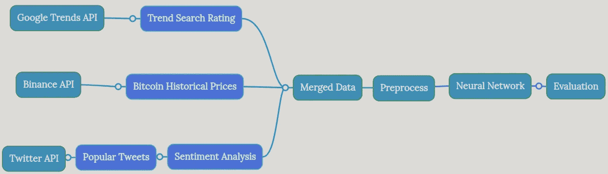
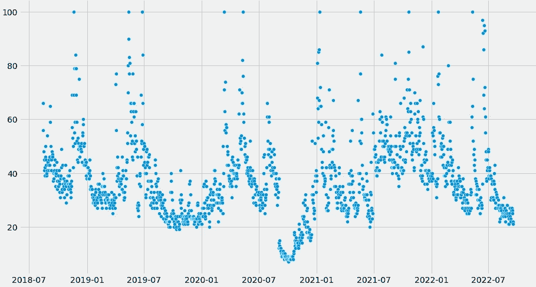
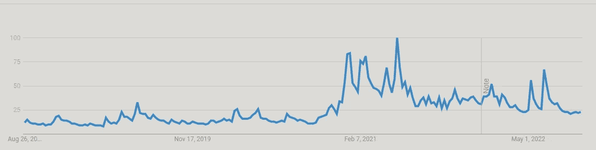
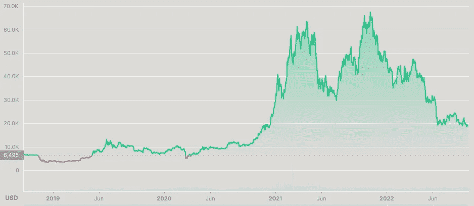
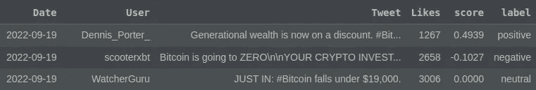
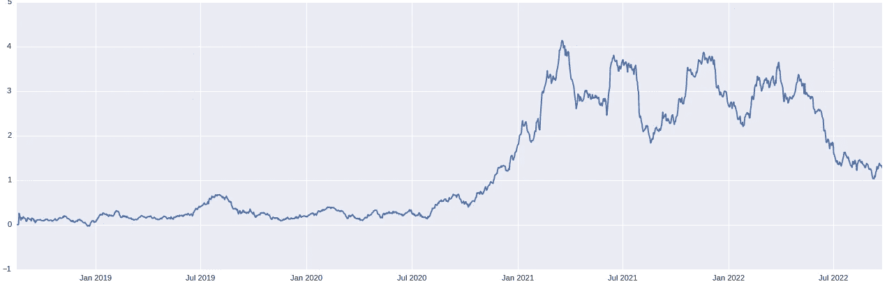
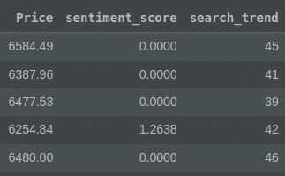
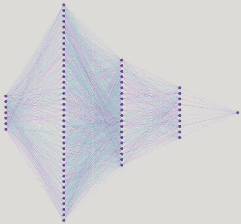
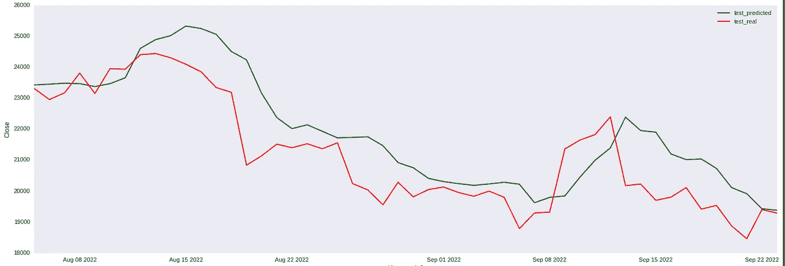
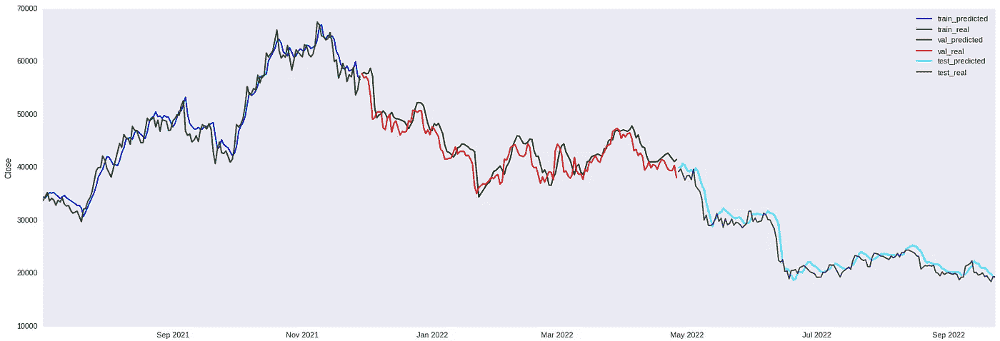

# 机器学习说比特币价格会…

> 原文：<https://medium.com/coinmonks/machine-learning-says-bitcoin-price-is-going-to-8391ec8f93c8?source=collection_archive---------0----------------------->

# 介绍

Picture from [phys.org](https://phys.org/)

比特币一直是热门话题。看起来它会像那样保持很长时间。比特币最大的谜团绝对是它的价格。是要涨还是不涨？

很有可能，会……至少，我是这么认为的。但是其他人呢？大多数人是怎么想的？更有趣的是，机器在想什么？我将在本文中结合两方面的观点来回答这些问题。

根据基础经济学，比特币等可交易资产的价格受市场预期和需求的影响很大。只有当买方认为某样东西可以卖得更高时，他/她才会买。考虑到这一点，了解人们对一件商品的普遍看法，以做出相关的价格预测就变得至关重要了。

然而，如果认为仅仅通过需求或预期就可以做出准确的价格预测，那就太天真了。为了达到可接受的准确率，我们需要复杂的工具来发现价格模式和分析市场。幸运的是，机器学习算法可以为我们做到这一点。

# 工程计划

我计划收集代表对互联网的兴趣水平和关于比特币的大致想法的数据来进行预测。然后，我将利用一个主要用于时间序列预测的模型，LSTM 神经网络。一步一步来，我会；

*   收集和处理来自不同来源的数据
*   将所有内容合并到一个数据框中
*   将数据输入机器学习模型
*   评估预测
*   创建价格预测应用程序

Steps to follow

如果我在本文中尝试的话，解释编码中的细节会花费很长时间。因此，如果有兴趣，可以在这里 查看带解释的代码 [**。**](https://github.com/YusufGulcan/LSTM_Neural_Network_Bitcoin)

## 收集数据

经济学认为，对一项资产的需求通常与积极的预期正相关。但是我如何衡量期望呢？

社交媒体…我可以清楚地看到人们对社交媒体上的一个术语的看法。因此，我从**推特**收集了推文，从**谷歌**收集了搜索趋势，以衡量人们对比特币的预期。

这个项目的核心是价格数据。我从**币安 API** 收集价格、交易量和波动性的数据。该 API 在期望的时间间隔内(例如，每天、1 小时、4 小时等)提供连续的实时数据。)指定的时间段。(例如，四个月的数据)

从 API 收集数据为项目提供了一个动态的结构，因此只要基本的假设保持不变，就可以用适当的管道更新结果。

## 谷歌搜索趋势

Daily Google Search Trends

Bitcoin Search Rates — Google Trends

谷歌趋势图反映了特定时间间隔和地点对比特币的兴趣水平。我收集了过去 4 年世界各地的数据。

Bitcoin Price Chart — Coinmarketcap

当检查图表的峰值时，利息和价格之间似乎存在相关性。如果认为搜索评级只会随着价格的上涨而上升，那就错了。当价格大幅下跌时，搜索评分可能会飙升，因为人们对发生的事情感到好奇。

使用 python 上的 pytrends 库收集数据。下面是我通过 pytrends 收集数据的一小部分代码。代码在 [**GitHub**](https://github.com/YusufGulcan/LSTM_Neural_Network_Bitcoin) 上有。

## 推特情感分析

比特币需求的另一个指标是大多数人对比特币的看法。如果预期是积极的，可以假设价格会上涨，除了典型的市场操纵。

为了衡量人们对比特币的看法，我收集了过去 4 年里所有赞数超过 1000 的英文推文。我按照相似的数字过滤了推文，因为 Twitter 上有数百万条垃圾推文。收集垃圾推文将花费大量的时间，并损害数据的质量。

Tweets with more than 1000 likes

在收集了这些推文之后，我使用一种叫做 VADER 的 NLP 算法，从积极和消极两个方面来衡量每条推文的情绪。VADER 返回一个介于 1 和-1 之间的数值。这个范围代表了推文正面或负面的强度。数值是机器学习算法的最佳输入类型。

Sentiment Scores of Tweets

我把数据按天分组，并把当天每条分享的推文的分数加起来。通过这种方式，我得到了一个代表每天对比特币总体情绪的聚合数值。

Sentiment Score per Day

当绘制原始数据时，图表是尖锐而混乱的。我用图表的 50 天平均值来平滑输出。平均这些值揭示了价格和情绪得分图表之间的相似性。这是情绪得分的 50 期移动平均图。

Sentiment Score 50-Period Moving Average

## 比特币历史价格

下一步是收集比特币历史价格数据。还有很多其他选择，我发现币安 API 很容易使用。这是我用来获取比特币历史价格的代码块。同样，我收集了 4 年的每日数据。

## 合并数据框

我已经为我想要工作的时间范围软编码了“开始日期”和“结束日期”。我从不同来源收集的数据都在同一范围内。

“开始日期”=当前日期— 1500 天

'结束日期' =当前日期

由于每个数据帧的时间间隔相同，因此将所有数据帧合并到一个数据帧中相对容易。合并之后，我创建了一个管道，它创建了一个大小为 n*k 的数据矩阵，“k”表示特征的数量，“n”表示我想要从中获取数据的前几天的数量。

Data Frame

这些特征是**比特币价格、Twitter 情绪得分和谷歌搜索趋势评级**，这意味着对于该数据框架，k 始终为 3。例如，如果矩阵大小为 14*3，则模型从过去 14 天获取数据，并使用这 52 条数据来进行明天的价格预测。

整个数据帧包括 **1500** 行；测试和验证数据帧每个都有 **150** 行。

**列车数据** = 1200 天

**验证数据** = 150 天

测试数据**= 150 天**

## 建模

长短期记忆( **LSTM** )神经网络可以说是对时间序列数据进行预测的最佳神经网络类型。这一层可以忘记数据中不必要的旧部分。然而，它仍然记得过去发生的事情和频繁重复的模式。这样，避免了与新数据不兼容的旧数据的严格结构。

Layers and Nodes of the Model

在快速解释了神经网络如何工作之后，我把代码留在这里，

## 评估预测

下图比较了预测值和实际值。图表显示了 50 天的价格走势。

Comparison of Predictions and Real Values

给出最小误差的矩阵大小是 7 * 3。对于每一个预测，该模型都采用前 7 天的数据，结合这些天的所有三个特征，并估计第二天的价格。

Predictions and Actual Values

当**所有特征(【趋势】、【情绪】、【价格】)**都包含在内时，测试数据的得分；

均方差: **1662883.374**

均方根误差: **1289.528**

平均绝对误差: **963.547**

平均绝对百分比误差: **0.03782**

R2 得分: **0.94821**

这些是单独使用**价格数据运行模型的结果**；

均方差: **1103179.244**

均方根误差: **1050.323435787**

平均绝对误差:**9247843546**

平均绝对百分比误差: **0.0317484**

R2 得分: **0.96432**

在尝试了几十种不同的参数组合后，我设法通过仅在价格数据上运行模型来获得最佳分数。情感分析和谷歌趋势对模型没有贡献。

# 结论

这是一个如何结合使用不同的神经网络算法的迷你和简单的演示。我用 NLP 算法进行情感分析，用时间序列预测算法进行价格预测。

虽然情感分析并没有真正贡献数据，但这篇文章对类似的作品是有帮助的。向技术分析师咨询价格作用机制，获取领域知识可能有助于功能创建。详细调整参数也可以略微提高性能。

**读者的建议；**

*   加入经济指标，如美联储利率，通货膨胀率，货币供应率
*   市场鲸积累数据
*   花费产出利润比率(SOPR)
*   其他链上数据
*   采矿成本

> **免责声明:我不建议根据这个模型的结果进行交易。该模型不是为交易而创建的，也不是为交易而测试的。**

> 交易新手？试试[密码交易机器人](/coinmonks/crypto-trading-bot-c2ffce8acb2a)或[复制交易](/coinmonks/top-10-crypto-copy-trading-platforms-for-beginners-d0c37c7d698c)