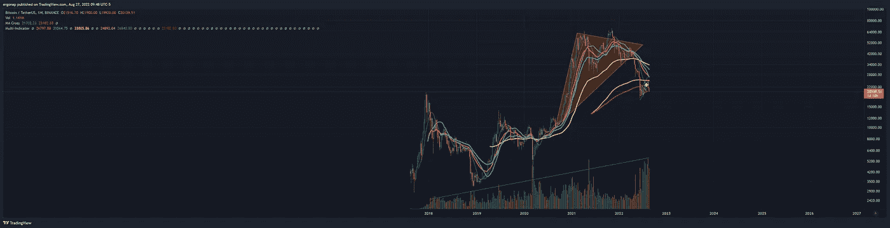
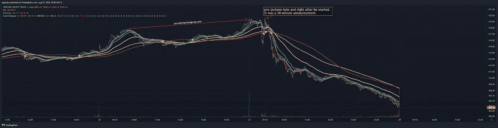
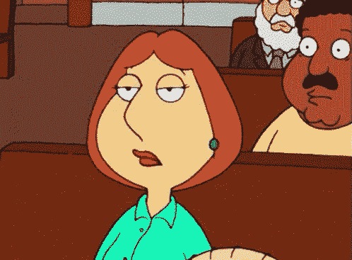

# 宏观看跌——比我预期的还要糟糕

> 原文：<https://medium.com/coinmonks/macro-bearish-its-worse-than-i-expected-5fd3c797ac0f?source=collection_archive---------11----------------------->

加密货币市场/比特币分析 8/27

事实证明，事情比我想象的还要糟糕。我只需要缩小到足以看到它。我认为其中之一是比特币 5 年宏观牛市趋势的结束。是的，每个人都说加密速度很快，嗯…你猜怎么着。惊喜！宏观趋势在等你。哦，GOX 山发布会是明天。

see that volume trend? [https://www.tradingview.com/x/e4SCMGkG/](https://www.tradingview.com/x/e4SCMGkG/)

这基本上意味着我们尚未从 2018 年开始调整，这符合一个潜在的论点，即我们将看到 2018 年以下的低点。是的，一些人提到的 4k 以下，它可能会到来。随着 BTC 徘徊在 20k 左右准备下跌，以及迫在眉睫的全球市场变得非常悲观(美元以外的每一种货币都在看着你——特别是卢布，因为它将崩溃)。卢布已经迫使自己保持浮动，但基本上是这样的:

This is how russia handled the Ruble collapse. I’m sure this will last, clearly! The bubble keeps getting bigger but no that’s just growth of success!

提醒:如果 crypto 崩溃，那么俄罗斯在制裁下向美元洗钱的工具也会崩溃。因此，在特定情况下，美国有充分的理由推动制裁，比如龙卷风现金支持恐怖主义和朝鲜的洗钱活动，以及现在的俄罗斯。

I can’t wait to hear people try to justify tornadocash yet again. “It’s just code” and “free speech”. Apparently people want free speech to send money to Russia, despite sanctions.

是啊，这就是人们想要拥抱的行业？不是自由，不是自由意志主义，而是全球经济恐怖主义？尽管人们有无限的贪婪能力，我实际上并不认为所说的贪婪与经济恐怖主义真正相容，因为它实际上削减了人们自身贪婪的利润。

请注意，间谍周五表现最糟糕，在鲍威尔杰克逊霍尔发布*消息后，快速做空，然后反弹至死亡。伙计们，直接进洞。🤣*

**

*Basically, it went like this. [https://www.tradingview.com/x/eJMdF87z/](https://www.tradingview.com/x/eJMdF87z/)*

**

*koolaid man is the bear trader *and me, who was waiting for this moment, vs retail populace being everyone else*

*从根本上说:美国经济实际上正在从特朗普的[金融恐怖主义](https://en.wikipedia.org/wiki/Economic_policy_of_the_Donald_Trump_administration)(他给了我们十年糟糕的金融政策，其结果尚未完全显现出来)中复苏，理论上有点儿不错，而世界其他地方都完蛋了。我们还没有看到应对通胀的真正措施，有趣的是，突然应对通胀对市场来说是熊市，但现在我们看到了。基本上:只有当东西对消费者来说更贵时才是好的，只有当我们开始采取措施让消费者过自己的生活时才是坏的。明白了。*

*因此，与此同时，当市场拍打人们的坚果时，记住:价格是随机的，所以要随波逐流。它将去任何它必须去的地方，但现在，这显然是下降的。记住如果间谍倒下了，BTC 也会倒下。但是如果间谍上升，BTC 不一定上升。所以…..这在一定程度上证实了人们退出的论点。*

> *交易新手？试试[加密交易机器人](/coinmonks/crypto-trading-bot-c2ffce8acb2a)或者[复制交易](/coinmonks/top-10-crypto-copy-trading-platforms-for-beginners-d0c37c7d698c)*