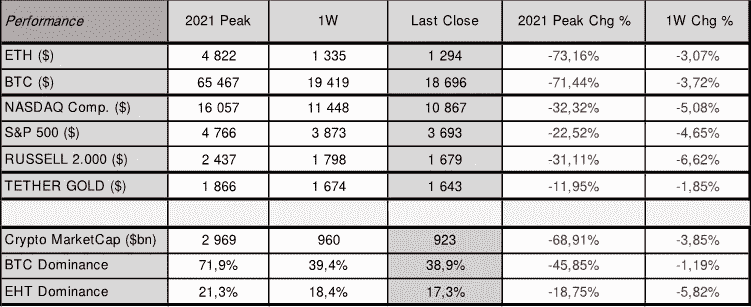
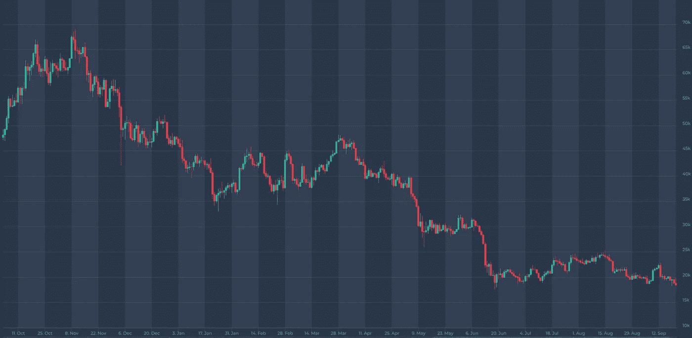
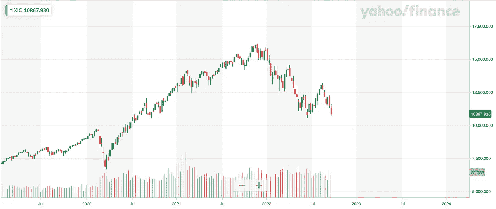
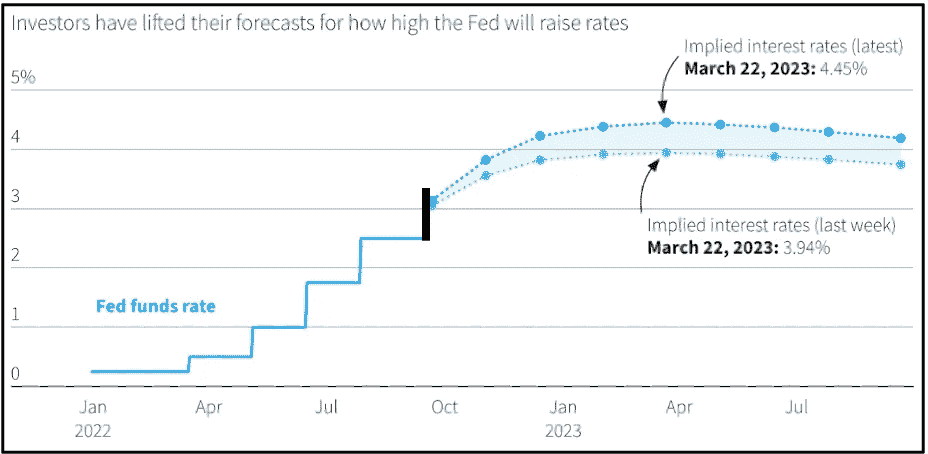

# 对加密市场的宏观影响！

> 原文：<https://medium.com/coinmonks/macro-impact-on-crypto-markets-a3b25c849ebe?source=collection_archive---------51----------------------->

Source: altfins

上周，加密和美国股票市场均再度下跌。与前一周相比，比特币下跌超过 3%，周日收于 18.696。ETH 本周收盘下跌约 3%。美国股市再次下跌约 5%，纳斯达克收于 10.867 点，标准普尔上周五收于 3.693 点。价格的进一步回调主要是由美联储 2022 年 9 月 21 日(周三)举行的货币会议的结果及其比预期更激进的利率预测推动的。

**不出所料，美联储再次加息 0.75%，并宣布进一步收紧政策。**因此，联邦基金利率的目标区间目前为 3.00-3.25%。美联储还表示，将继续缩减资产负债表的规模。美联储董事会成员对目标区间中点的预测中值是，2022 年底为 4.4%，2023 年底为 4.6%，大大高于该行 6 月份的预测，也高于经济学家的预期。我们预计通胀将在 2022 年 11 月 1 日至 2 日的下一次美联储会议之前放缓，届时委员会将开始放缓紧缩步伐，增加 50 个基点，然后在 2023 年达到约 4.50%的峰值水平。

8 月份的消费者价格指数为 8.3%，低于 2022 年 7 月份的 8.5%(见下图)。尽管汽油价格下跌，整体通胀率仍较上月上升 0.1%。核心通胀率环比上升 0.6%，折合成年率增长 6.3%，高于前一时期的 5.9%。9 月份的通胀读数将于 2022 年 10 月 13 日公布-克利夫兰美联储通胀临近预测预测 CPI 将从一个月前的 8.3%降至 8.19%，核心 CPI 将进一步上升至 6.64%。然而，美国 CPI 这些趋势的强度仍有待观察。

# 比特币价格

Source: [altFINS.com](https://platform.altfins.com/screener)

# 纳斯达克

Source: [Yahoo Finance](https://finance.yahoo.com/)

# 美国消费物价指数

# 美国基金利率

Source: Refinitiv | Reuters, Sep. 14, 2022 | by Vincent Flasseur

总体而言，与一个月前指数为 28/100 相比，加密市场情绪(通过加密恐惧和贪婪指数衡量)继续保持在 **21/100，表明极度恐惧**。加密市场总市值下降了近 4%，仍低于 1 万亿美元大关。与前一周相比，ETH 的主导地位下降了 5.8%，而比特币仅下降了 1.2%。

**看点:**欧洲央行下一次货币政策会议:2022 年 10 月 27 日；美联储:2022 年 11 月 01 日–02 日；下一次美国 2022 年 9 月 CPI 发布定于 2022 年 10 月 13 日。下一次美国 GDP 更新将于 2022 年 9 月 29 日发布，随后是 10 月 27 日。2022.

> 交易新手？尝试[加密交易机器人](/coinmonks/crypto-trading-bot-c2ffce8acb2a)或[复制交易](/coinmonks/top-10-crypto-copy-trading-platforms-for-beginners-d0c37c7d698c)