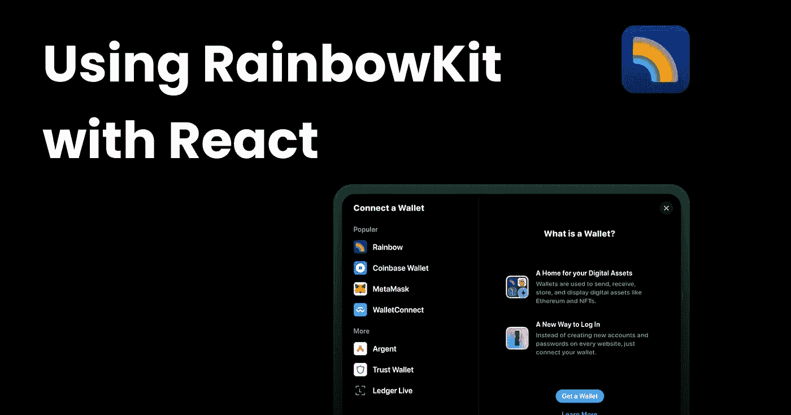
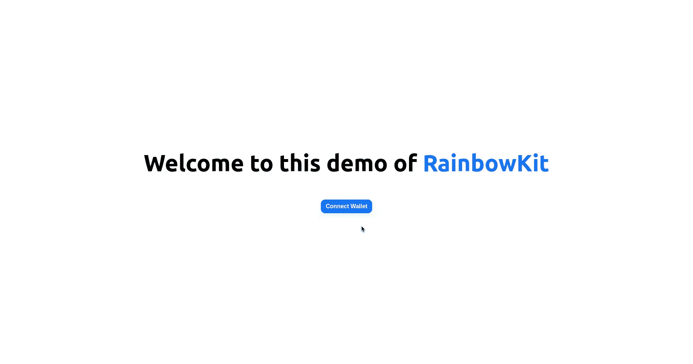
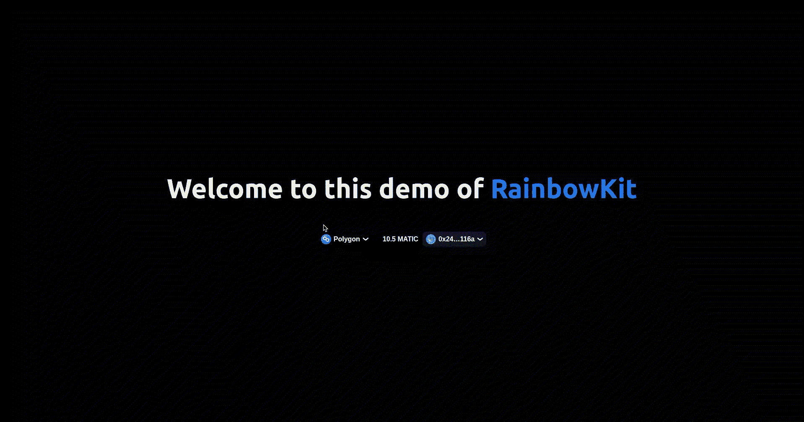
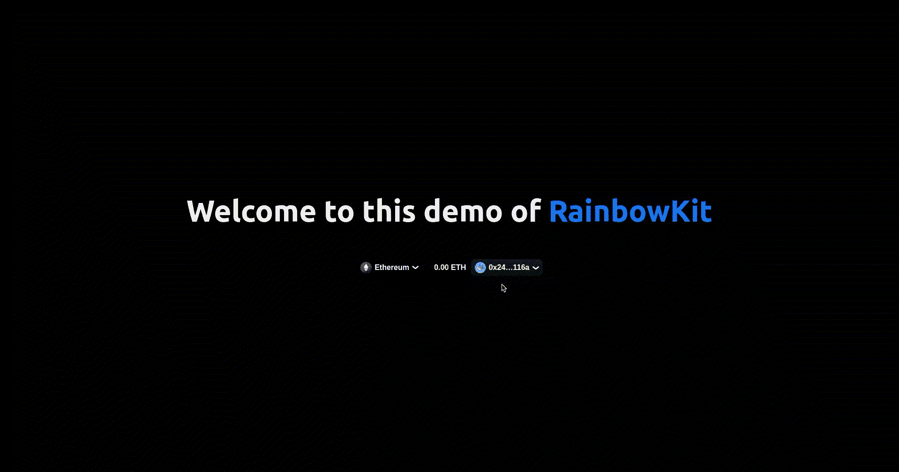
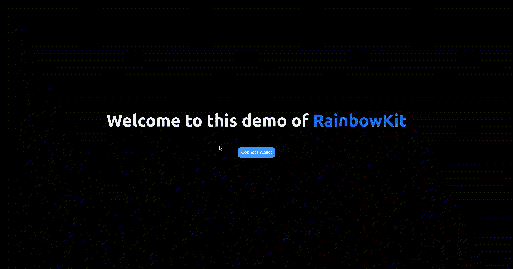

# 用 RainbowKit 制作一个漂亮的连接钱包按钮& React

> 原文：<https://medium.com/coinmonks/make-a-beautiful-connect-wallet-button-with-rainbowkit-react-b91b48928907?source=collection_archive---------4----------------------->



Web3 中的身份验证非常简单，但是支持所有的钱包和制作一个好的用户界面是非常痛苦和耗时的。幸运的是，有许多库也使得这变得非常容易。今天我们将看看如何在 React 应用中添加 [RainbowKit](https://www.rainbowkit.com/) 。

# 什么是 RainbowKit？

RainbowKit 是一个 React 库，它为我们提供了用几行代码构建 Connect Wallet UI 的组件。它支持许多钱包，包括 Metamask、Rainbow、比特币基地钱包、WalletConnect 等等。它也是非常可定制的，并带有一个惊人的内置主题。

RainbowKit 使用了 [Ethers.js](https://github.com/ethers-io/ethers.js) 和 [Wagmi](https://github.com/tmm/wagmi) ，这两个库在这个领域都很受欢迎。

而且，它是由美丽的[彩虹钱包](https://rainbow.me/)背后的同一个团队开发的

# 创建新的 Next.js 应用程序

运行以下命令创建一个新的 Next.js 应用程序(注意，您也可以在常规的 React 应用程序上使用它):

现在，进入项目目录，在您喜欢的代码编辑器中打开它。

# 将 RainbowKit 添加到 React 应用程序

运行以下命令安装 RainbowKit 及其对等依赖项:

现在将以下代码添加到`pages/_app.js`:

首先，我们导入 RainbowKit 样式、`RainbowKitPovider`和其他函数来配置我们的链，以及`WagmiProvider`。

接下来，我们配置想要支持的链。在这个例子中，我已经添加了以太坊主网、Polygon 主网、Goerli 和 Rinkeby(都是以太坊测试网络)，以及 Polygon Mumbai 测试网。为了我们的 API 提供者的演示，我们使用了公共的后备 RPC URLs。RainbowKit 还允许我们为 API 提供者指定自己的 JSON RPC URLs 或 Alchemy 或 Infura URLs。你可以在这里看到 [API 提供者文档](https://www.rainbowkit.com/docs/api-providers)。

接下来，我们创建我们的`wagmiClient`，传入`autoConnect`，并将其设置为`true`。我们的应用程序将以这种方式自动重新连接到最后使用的连接器。

最后，我们用`WagmiProvider`和`RainbowKitProvider`包装我们的应用程序。

接下来，让我们将连接钱包按钮添加到我们的应用程序中。用以下代码替换`pages/index.js`中的代码:

现在运行`npm run dev`或`yarn dev`并在你的浏览器中打开 [localhost:3000](http://localhost:3000/) ，你应该会看到这个:



# 使其成为黑暗模式🌑

是时候确保我们的眼睛不再灼伤了。

前往`pages/_app.js`，从 RainbowKit 导入`midnightTheme`功能。(或者，你也可以导入`darkTheme`功能，一个调光版的午夜):

我们还必须将我们的主题传递给`RainbowKitProvider`:

```
<RainbowKitProvider chains={chains} theme={midnightTheme()}>
```

RainbowKit 支持更高级的主题化，你可以在这里看到 [RainbowKit 主题化文档](https://www.rainbowkit.com/docs/theming)了解更多信息。

此外，将这段代码添加到`styles/globals.css`中，使我们的应用程序也处于黑暗模式:

```
body {
 background-color: #010101;
 color: #f0f0f0;
}
```

现在我们的应用程序应该是这样的


# 彩虹之旅

通过钱包认证后，我们的连接按钮会自动切换到网络切换器，同时显示我们的余额和钱包地址。切换网络非常简单，只需单击网络切换器，然后选择我们想要切换到的网络:



点击我们的钱包地址，我们会看到一个模式，可以选择复制我们的地址或断开我们的钱包:



# 酷模式😎

让我们的应用程序更酷一点:)只需将`coolMode`道具添加到`RainbowKitProvider`中:

```
<RainbowKitProvider chains={chains} theme={midnightTheme()} coolMode>
```

现在，如果我们单击连接模式中的任何选项，我们将会看到一些令人惊叹的五彩纸屑🎊



# 结论

这是 RainbowKit 可以做的基本演示，但它可以做更多的事情，如显示最近的交易。了解更多信息的最佳途径是 [RainbowKit docs](https://www.rainbowkit.com/) 。

# 重要链接

*   [源代码](https://github.com/kumancev/rainbowkit-demo)
*   [RainbowKit](https://www.rainbowkit.com/)
*   [RainbowKit GitHub](https://github.com/rainbow-me/rainbowkit)

> 交易新手？试试[加密交易机器人](/coinmonks/crypto-trading-bot-c2ffce8acb2a)或[复制交易](/coinmonks/top-10-crypto-copy-trading-platforms-for-beginners-d0c37c7d698c)