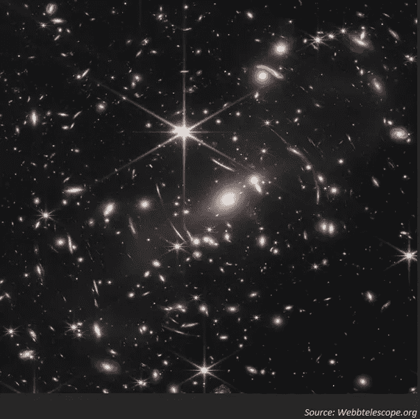
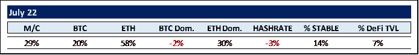
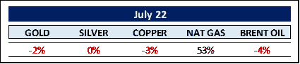
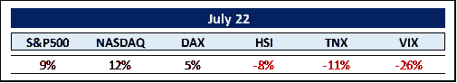
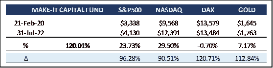

# Make-It 资本版#24

> 原文：<https://medium.com/coinmonks/make-it-capital-edition-24-3bca99904d06?source=collection_archive---------21----------------------->

我们在 2022 年 7 月看到的世界

加密货币的世界

几天前，市场预计美联储将加息 75 个基点，引发中短期的秘密反弹。总市值(M/C)在 7 月份增长了 29%，即 2476 亿美元

比特币(btc)本月上涨 20%，被以太坊(ETH)下午上涨 58%所掩盖。毫不奇怪，比特币失去了市场主导地位(-2%至 41%)，而 ETH 在 7 月份加速上涨，达到 18.8%。

通过现在定于 9 月 19 日的合并，投资者似乎对 ETH 转向 ESG 友好的股权证明更有信心。正如 Vitali Buterin 本月假设的那样，即使在成功实施合并后，ETH 也只能发挥其 55%的能力。然而，合并将导致一个非常稳定的 5%的收益率。加上 EIP-1559 的升级，基本上使 ETH 成为一种通缩资产，ETH 的收益率很可能相当于 Web3 的国债收益率。Vitaly 宣布了 ETH 即将推出的路线图，进一步刺激了投资者的兴趣:

要达到 100%，还需要实施四个阶段。使用零知识证明和分片的激增(将每秒事务(TPS)从 15 增加到 100，000)、边缘(促进成为 ETH 验证者的过程，从而增加 ETH 的去中心化)、清除(从区块链联邦理工学院删除不再需要的旧数据)和挥霍(量子电阻的升级以及“所有其他有趣的东西”)。)没有提供时间表。

本月，我们引入了两个新的指标，我们认为这两个指标对于衡量市场的整体健康状况和未来趋势非常有价值。一个是十个最突出的稳定硬币与 M/C (%稳定)的关系，另一个是分散金融应用程序(DeFi)锁定的总价值(TVL)与 M/C (% DeFi TVL)的比率。(由于 DeFi 比率的输入源显示出较大的差异，我们选取了 5 个最显著的馈线站点的中间值。)

%稳定:虽然市场不得不吞下(精心策划？)Terra / Luna / UST 的崩溃，稳定硬币与 M/C 的比率仍然从 2022 年初的 7%翻了一番，达到 7 月份的 14%。按名义价值计算，稳定资本在这一年减少了约 80 亿美元。他们只是比加密货币损失少得多(下降了 1 万亿美元)。今年 stablecoin 市场的明显输家是大公司 Tether (USDT)，损失了约 120 亿美元，即 15%。明显的赢家是 Circle 的 USDC(125 亿美元或 29%)和 Paxos 的 BUSD(32 亿美元或 21%)。然而，Tether 仍然是最大的稳定收入来源，领先 USDC 21%。

% DeFi TVL:中值 DeFi TVL 与总体市场同步下降，从 1510 亿美元降至 820 亿美元:这意味着名义上下降了约 46%,而 M/C 的百分比保持在约 7%。

至少可以说，在复杂的市场环境中，尤其是%的稳定表明投资者转向了更安全的市场。我们可能期望看到 M/C 的 DeFi 协议有更高的百分比增长。然而，投资者可能被一些集中金融(CeFi)崩溃吓到了。更多信息请见下文。

另一方面，本月早些时候另一次加密下跌的主要原因之一是埃隆·马斯克宣布出售特斯拉 75%的比特币股份。他在 2021 年 2 月 8 日左右购买了价值 15 亿美元的比特币。由于这个消息是在 2 月 8 日传播的，让我们假设他在 2 月 7 日以每 btc 大约 39k 美元的价格买入。这意味着他最初持有约 38，500 btc。如果他以 9 . 36 亿美元的价格出售 75%的股份，他就损失了 1 . 75 亿美元。那么，他卖出的理由是什么？他认为现金流问题源于中国与 Covid 相关的供应链中断。因此，一旦这些问题得到解决，再加上大部分比特币是以环保方式开采的，他很可能会在不久的将来再次成为买家。

商品世界

弗拉基米尔普京的身体和心理战争机器继续推动能源市场。根据美国期货，天然气今年上涨了 122%,尽管最近疲软，石油目前上涨了 39%。

尽管如此，在乌克兰冲突导致天然气和石油严重短缺的情况下，欧洲最具影响力的经济体德国决定继续实施今年关闭剩余三座核裂变工厂的计划。尤其是德国，过去和现在都依赖廉价的俄罗斯天然气，其总供应量的 55%来自俄罗斯。现在，为了弥补这一缺口，德国政客打算转向所有能源中最肮脏的一种:煤炭。

此外，他们仍然避免进口任何通过水力压裂法生产的天然气。更有甚者，似乎没有人知道这一点，但德国下萨克森州有丰富的页岩气——足以弥补俄罗斯的所有不足。为了达到这个目标，人们必须应用水力压裂技术。你猜对了，德国由于环境问题没有开发这些…让我们支持煤炭吧。嗯。

尽管出于不同的原因，黄金、白银和铜都无法利用日益加剧的恐惧。黄金是一种无收益资产(如果你不通过黄金支持的加密持有)，在全球收益率飙升的环境中无法竞争。再加上美元的走强，黄金价格将创下 52 周新低。尽管如此，黄金通常起到对冲通胀的作用，迄今为止未能起到这种作用的黄金可能不会持续太久。自 2019 年以来，黄金从未如此遭人憎恨。交易员承诺(COT)报告显示，黄金价格目前非常悲观。随着 COT 突显投机者(即华尔街聪明资金的对立面)正在做什么，它提供了一个强大的反向指标。我们不会对 12 个月后金价大幅上涨感到惊讶。

我们的煤矿金丝雀，铜博士，今年下跌了 20%左右，表明对全球经济增长的极度悲观情绪。这是一个非常惊人的变化，因为铜通常以每年 2.6%的速度增长(自 1988 年以来)。然而，我们可能会看到一些进一步的损失，与类似的极端历史铜市熊市相比，价格在触及相应熊市最低点后的 12 个月内平均上涨了 51%。

今年以来，大宗商品市场其他有趣的走势包括铀价上涨 53%，钛价上涨 109%，锂价上涨 423%，黄油价格上涨 83%，美国鸡蛋价格上涨惊人的 244%。话又说回来，我们也可以记录重大价格下跌，例如铁矿石价格下跌 38%，钢铁价格下跌 55%。嗯，正如雷内·迪卡特斯所说:“常识是世界上最广泛共享的商品，因为每个人都相信自己很有常识。”

其余的…

就市场回报而言，今年头 6 个月是 50 多年来最糟糕的开局。从每个角度来看，那是理查德·尼克松当选的一年，我们仍然实行金本位制。当前的市场状况显然非同寻常。通常，在这种需求旺盛的时期，随着投资者涌向他们认为安全的地方，债券是大赢家。然而，这一次并非如此。事实上，这是历史上第一次股票和债券的跌幅都超过 10%。

上世纪 80 年代初，时任美联储主席沃尔克连续 14 个月将利率保持在两位数，即所谓的“沃尔克冲击”。这不是现任主席杰罗姆·鲍威尔的选择。联邦基金利率(美联储唯一能直接控制的利率)目前为 2.50%。这看起来并不算高，但是，这些利率水平已经将每年的利息支出增加到总军事预算或总医疗费用的 1.5 倍。相比之下，在 20 世纪 70 年代，美国政府的债务占国内生产总值(GDP)的 31%，年度预算赤字占 GDP 的 2%。如今，这两个比率分别为 122%和 7%。没有多少回旋的余地了。利息支付已经占到总税收收入的 12%以上。我们这里不是在谈论债务偿还。

美联储将继续努力降低通胀。兼职就业者和失业者之间极不寻常的差异表明，在不久的将来，失业率将会上升，这可能有助于衰退的到来。不断扩大的高收益债券利差以及反向收益曲线支持衰退趋势的到来。目前，所有迹象都指向 1974 年式的短暂而甜蜜的抑制通胀的衰退。

自 7 月中旬以来，“西方”世界的股票指数经历了强劲反弹。问题仍然是:这是另一个熊市陷阱吗？在 2008/2009 年危机期间，标准普尔 500 经历了五次这样的熊市反弹(上涨 8%)。12%、7%、18%和 24%，随后触及更低的低点)。自今年年初以来，我们经历了三次这样的熊市上涨(11%、7%和 9%)。历史押韵吗？

此外，资产价格往往会比经济复苏早 6-12 个月。除此之外，一些反向指标也在闪亮。首先，投资者情绪非常糟糕，只有 26.9%的投资者对未来六个月持乐观态度(相比之下，历史平均水平为 38%)。还有，46.5%的投资者看跌，远高于 30.5%的长期平均水平。然后是美国银行对其基金经理的最新月度调查。受访者表示，股票配置处于 14 年低点，现金余额处于 21 年高点，对全球增长和利润持极度悲观态度。

与其被这种消极病毒感染，我们或许应该与谢尔比·戴维斯(Shelby Davis)一起持有它，他是有史以来最成功的投资者之一，从 1947 年到 1994 年，他将妻子的 5 万美元贷款变成了 9 亿美元(其间见证了几次熊市)。他的信条是:“危机带来机遇”。你在熊市赚了大部分的钱。只是你当时不知道罢了。

MAKE-IT 资本基金(基金)

该基金由 Make-It Singapore 运营，由 Make-It New Zealand 管理。作为区块链/加密货币综合投资组合的独特对冲基金，该基金让投资者只需一项投资即可参与区块链世界的完整生态圈。该基金始终以精确的资产净值交易，并对机构投资者和合格投资者开放。

该基金的主要目标是通过降低风险和波动性来实现资本保全。这是通过采用我们专有的 5 支柱战略实现的。

尽管环境充满挑战，但该基金仍有望在过去 12 个月中超越比特币约 18%,并表现出较低的风险和波动性，如大幅降低的最大提款量所记录的那样。当前资产净值为 2.20。基金继续从五大支柱的多样化中获利。目前，DeFi 和做市活动产生自由现金流。我们仍有相当多的现金头寸，一旦市场向我们提供了明确的信号，我们就打算配置这些头寸，而不是步入潜在的熊市陷阱。

7 月份，投资者见证了(希望是间接的)几家中央金融公司的倒闭:Celsius、Voyager Digital、Vauld 等等。所有人都在现已倒闭的对冲基金 Three Arrows Capital (3AC)进行了投资配置，该基金曾一度管理着约 100 亿美元的资产(AUM)。3AC 与戏剧性内爆的 Terra / Luna /UST 链的创始人 Do Kwon 的亲密关系让 3AC 过度曝光，这反过来又让他们付出了沉重的代价。

然而，值得注意的是，没有一个破产与 DeFi 有关，这表明分散融资是未来更安全的选择。数字资产没有任何“缺陷”或“损坏”。相反，疲软的市场是由集中在少数集中参与者手中的过多杠杆风险造成的。毕竟，在大金融危机期间，抵押贷款支持证券本身也没有什么不好。导致 2008/2009 年危机蔓延的原因是少数参与者的过度杠杆交易迅速变坏。

尽管今年密码市场极度波动，风险资本仍在涌入早期阶段的机会，迄今金额已达 180 亿美元。特别是本月，Multicoin Capital 宣布了其第三只风险投资基金，金额达 4.3 亿美元，而 Variant 筹集了 4.5 亿美元，以“在加密寒冬中对 Web3 加倍下注”。在最近筹集了 45 亿美元的早期投资后，潘迪拉的丹·莫尔黑德宣布成立一只后期基金，专注于区块链世界的 B、C 和 D 轮增长投资。毕竟，任何与区块链相关的东西的全球采用率是我们经历的互联网增长或移动通信革命的两倍。

当然，我们的封面图片展示了首次公布的价值 100 亿美元的新詹姆斯·韦伯望远镜的框架。令人惊奇的是，它让我们对我们的宇宙有多大有了一点了解。这幅图像覆盖了一片天空，大约有一粒沙子那么大，被地面上的某个人举在一臂之外。它只代表天空中的一个小点，然而却显示了无数的星系。

我们的区块链宇宙显然不是也永远不会像现在这样广阔，然而，对地球上基本上每个行业的可能性和影响似乎都是无穷无尽的。

最后，我们想提请大家注意比特币基地前首席技术官和 Andreesen Horowitz 前普通合伙人 Balaji Srinivasan，因为他的新书《网络国家》似乎真的有所发现。

随着一个正常运转的元宇宙的出现，越来越多的在线社区将呈爆炸式增长，关于这一点，这一概括很可能会变成现实:“一个网络国家是一个高度结盟的在线社区，有能力采取集体行动，在世界各地众筹领土，并最终获得已有国家的外交承认。”

我们真的进入了一个新世界，让我们希望它是勇敢的。

感谢您的时间和关注。

真诚地

菲利普·冯·戈特伯格

PS:如果你有兴趣深入研究网络状态，这里有本书网络版的链接:

[https://thenetworkstate.com/](https://thenetworkstate.com/)