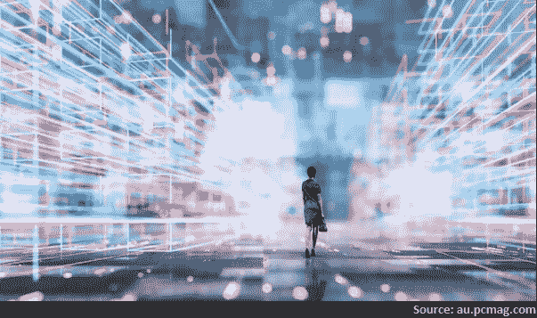
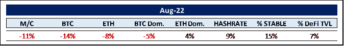
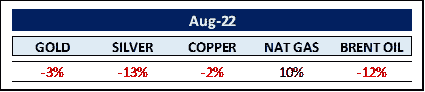
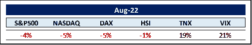
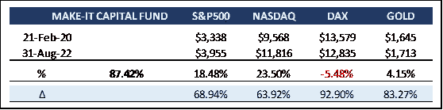

# Make-it 资本版#25

> 原文：<https://medium.com/coinmonks/make-it-capital-edition-25-a3e4098e7d65?source=collection_archive---------48----------------------->

我们在 2022 年 8 月看到的世界

加密货币的世界

8 月份，怀俄明州的八分钟演讲占据了整个会场。在截至 8 月中旬获得近 2000 亿美元的市场资本后，美联储主席杰罗姆·鲍威尔甚至不具体的评论引发了一波下跌，仅在加密市场就吸收了 3200 亿美元。

在对**合并**的预期中，以太坊( *ETH* )的损失小于比特币( *BTC* )，从而获得了市场份额。尽管如此，hashrate 仍然非常健壮，这是一个好迹象。

总稳定公司在加密市场的份额增加了 1.7%到 15%。话说回来，他们在一年中损失了约 300 亿美元——仅比整体市场损失少一点。

分散金融( *DeFi* )应用中锁定的总价值( *TVL* )在本月下降了约 13%，加剧了其与整体市场同步下降约 53%的急剧下降。一个有趣的想法是，**摩根士丹利**将 crypto 的市值下降视为等同于菲亚特世界的量化紧缩。

尽管天气寒冷，区块链应用程序的发展势头不减。随着风险资本和对冲基金(*将在下面进一步讨论*)的投资稳步增长，企业投资者继续大量投资于加密领域。

以**字母表** ( *谷歌*)为例。它已经投资了 15 亿美元(*成****Dapper Labs*******Fireblocks*******Voltage****，以及* ***数字货币集团*** )。此外，贝莱德承诺出资 12 亿美元，摩根士丹利承诺出资 11 亿美元，三星承诺出资 9.78 亿美元，高盛承诺出资 7000 亿美元，BNY 梅隆承诺出资 6.9 亿美元，贝宝承诺出资 6.5 亿美元。这个清单还在继续。我们认为，在明显的熊市中，这些惊人的承诺对中长期前景极为有利。**

**我们为这个月的版本选择了封面图片，以此向元宇宙最近的发展致敬。一些专家认为元宇宙只是一个郁金香泡沫。我们倾向于不同意。**

**以麦肯锡的最新报告为例，该报告将元宇宙与人工智能的发展进行了比较。因此，几年前，人工智能投资估计高达 100 亿美元。现在已经达到 930 亿美元。虽然估计相差很大，“我们预测[*]元宇宙*可能产生高达 5 万亿美元(*)的 t！*)到 2030 年，跨越消费者和企业使用案例。( ***)花旗*** *对 8-12 万亿美元的机会更加乐观。数量惊人。***

**元宇宙一词最早出现在 1992 年的小说《雪灾》中，作者是著名的美国科幻小说作家尼尔·斯蒂文森。在书中，元宇宙仅仅意味着“超越宇宙”。看来，尼尔·斯蒂文森对那些非常有影响力的公司最近的努力不太感兴趣(*我们提到过****Meta****吗？*)来主宰这个空间的未来。因此，他与志同道合的程序员一起创建了自己的元宇宙，被称为**第一层**(拉丁语第一层)。他把它描述为元宇宙特权创造者，而不是攫取金钱的公司。我们会留意的。**

**同样引起我们注意的是元宇宙的建筑发展。你知道吗，虚拟建筑设计对“元建筑师”的需求非常大，他们的工资高达 25 万美元。疯狂？也许吧。然而，这似乎是新的现实(*双关*)。**

**2021 年 3 月，克里斯塔·金创造了第一个虚拟房子，作为不可替代的象征(*NFT*)—**火星房子**——售价 50 万美元。阿根廷设计师安德烈斯·雷辛格以同样的价格卖出了一套虚拟家具。10 件纯数码产品包括一张凸出的浅粉色桌子和一把管状扶手椅，在 10 分钟内销售一空。**

**甚至梵蒂冈也在加紧与元宇宙开发公司 **Sensorium** 合作，在今年晚些时候推出一个 NFT 画廊。画廊将以虚拟现实( *VR* )的形式展示梵蒂冈的“艺术、内容和教育倡议”。为了探索“艺术民主化”的方法，该系列将展出大约 800 幅名作，包括米开朗基罗、拉斐尔和梵高等人的作品。**

**元宇宙并不打算取代 3d“真实”体验。相反，它将加强现有的机制。它的 3d 应用会达到 5 万亿美元甚至 12 万亿美元的市场价值吗？我们当然不会假装知道，但是，我们将确保我们的投资者将与我们一起乘风破浪。**

****商品世界****

****

**由于东欧持续的敌对状态，天然气价格抵抗住了商品市场不断增加的销售压力。**

**传统的避险货币黄金今年已经下跌了约 6%，而银和铜等更多工业金属的跌幅超过了 20%。对全球经济衰退的预期加剧了商品的过剩(更多关于此事的*)。***

***尽管回吐了最近的涨幅，布伦特原油今年仍上涨了 22%。当前油价走弱的趋势可能是由于对伊朗制裁的预期放松。在实施这些制裁之前，伊朗每天出口约 150 万桶石油。目前，这一数字已降至 29 万桶。因此，如果制裁真的放松，每天会有超过 100 万桶的额外供应流入市场。这是杯水车薪吗？***

***支持更高的油价——或者至少保持油价在每桶 100 美元以上——是大石油公司在新发现上花费更少。这似乎部分归因于 **ESG** 机芯。***

***就拿鲜为人知的投资公司**发动机№1** 来说。2020 年，它购买了石油巨头**埃克森美孚**(*XOM*)0.01%的股份，价值 4000 万美元。尽管如此，1 号引擎开始了一场影响 XOM 轨迹的运动。它表示，管理层“在石油和天然气大型项目上投入巨资，却未能考虑到能源转型带来的商业威胁，从而将自己置于生存风险之中。”engine 1 得到了几个主要股东的支持，并在削减新石油发现投资、支持 300 亿美元股票回购的过程中，成功赢得了众多董事会席位。***

**看看美国的石油钻井平台数量，就能进一步证明这一点，因为目前该油田只部署了 605 座石油钻井平台，远低于几年前 1600 座的最高水平。总而言之，在电动汽车革命需要时间的情况下，这导致石油供应减少。因此，油价可能会居高不下(*尽管取消了对伊朗、可能还有委内瑞拉的制裁*)。**

**还记得两年多前的负油价吗？**

**世界似乎比以往任何时候都变化得更快。**

****其余的……****

****

**正如导言中提到的，杰克逊霍尔的演讲让世界经济付出了沉重的代价。在所有市场中，约有 2 万亿美元在 8 分钟内蒸发。这相当于每秒钟损失 41.66 亿美元，这可能使这场演讲成为历史上最昂贵的演讲。不出所料，波动性指数和美国国债飙升。**

**通货膨胀正以其丑陋的面目困扰着市场。根据诺贝尔奖得主**米尔顿·弗里德曼**的说法，通货膨胀总是由同一件事引起的——货币供应比商品和服务产出增长更快，通常以国内生产总值( *GDP* )来衡量。就这么简单。再说一次，通货膨胀的定义是货币供应增长，而不是价格上涨。价格上涨是通货膨胀的症状，而不是原因。**

**自 2020 年 3 月“科罗纳疫情”来袭以来，仅美联储以其新凯恩斯主义的态度就增加了超过 40%的货币供应。应对措施将导致或已经导致衰退，而衰退通常对股票来说是坏消息。自 1970 年以来的八次衰退中，标准普尔 500 指数平均下跌了 35%，2000-2002 年甚至下跌了 49%，2008 年金融危机之后更是下跌了 57%。**

**不幸的是，所谓的**通货膨胀削减法案**，似乎只会导致再次给印钞机加油，也就是增加货币供应。嗯。宾夕法尼亚大学对该法案进行了详细的分析，并完美地总结道:“对通货膨胀的影响在统计学上与零没有区别。”**

**好消息是国税局的年度预算膨胀了 6.3 倍。87，000 名新的国税局代理人将被雇佣来“确保亿万富翁支付他们应得的份额”。问题是，根据联合税收委员会的数据，从少报收入中筹集的资金有 78-90%可能来自那些年收入低于 20 万美元的人。只有 4-9%来自年收入超过 50 万美元的人。一个更好的主意可能是消除税收漏洞，将美国税法从 6871 页减少到 68 页…**

**然后就是快速上涨的美元( *USD* )。事实上，自 2021 年 1 月以来，它已经上涨了 21%以上。对任何主要货币来说，这都是一个显著的变化，更不用说世界储备货币了。眼下的问题源于美元在全球交易和债务中的主导地位。大约 85%的外汇交易是用美元进行的。更重要的是，约 50%的跨境贷款和国际债务以美元计价。美元升值使得各国偿还以美元计价的债务更加困难。**斯里兰卡**已经拖欠债务。**俄国**也做了同样的事情，尽管出于不同的原因。但是，像萨尔瓦多、加纳、突尼斯、巴基斯坦、埃及、肯尼亚、阿根廷等国家违约的可能性似乎与日俱增。如果允许一系列违约发生，它可能会导致整个债务体系崩溃。这也是为什么美联储不能像沃尔克一样不加选择地提高联邦基金利率的另一个原因。至少可以说，这是一个有趣的情况。**

**由于对衰退的担忧减轻了一些压力，下一个消费者物价指数可能会下降。让我们看看。**

****MAKE-IT 资本基金(本基金)****

**该基金由 Make-It Singapore 运营，由 Make-It New Zealand 管理。作为区块链/加密货币综合投资组合的独特对冲基金，该基金让投资者只需一项投资即可参与区块链世界的完整生态圈。该基金始终以精确的资产净值交易，并对机构投资者和合格投资者开放。**

**该基金的主要目标是通过降低风险和波动性来实现资本保全。这是通过采用我们专有的 5 支柱战略实现的。**

****

**该基金继续展示其优异表现，但无法弥补加密市场自 2021 年 11 月以来遭遇的所有巨大损失。流动性供应、做市和选定的 DeFi 结构的多样化被证明是我们 5 支柱体系的重要支柱。**

**我们还利用这个低迷的市场投入了现金储备，同时仍持有约 12%的美元现金，以防我们判断错误或过早。无论如何，从长远来看，你都无法打败'低买高卖'。**

**当我们审视风险投资市场时，我们再高兴不过了。超过 230 亿美元的干粉撒在最著名的风险投资公司，准备部署到新的区块链项目。对于一个 2019 年只有 39 亿美元风险投资的行业来说，这是一个惊人的数字。这一点很重要，因为大量的风险投资往往先于该行业的新活动。有了这些资本，新项目得以启动，现有项目取得决定性进展，活动总体上有所回升。部分归因于这一发展，我们预计不会出现另一个像我们从 2018 年到 2020 年目睹的多年期加密熊。**

**吹着同样号角的是****Animoca Brands**的负责人 Yat Siu** ，亚洲最著名的区块链风投，得到了**红杉资本**和**乔治索罗斯**的支持。我们的观点是:“如果人们说这是一个加密的冬天，那么 2018 年是加密的冰河时代”——“现在是时候部署更多资本，而不是更少。”**

**此外，除了已经在 Web3 相关业务上投资了约 10 亿美元之外， **CoinFund** 刚刚又筹集了 3 亿美元的风险基金。据议员 David Pakman 称，新基金的目标是第一层区块链、web3 基础设施、DeFi、NFTs、 [g](https://techcrunch.com/2022/08/08/twitch-founder-justin-kan-on-crypto-web3-video-games-business-model-profit-play-to-earn/) 阿明、支付、交换以及分散应用(dA *pps* )。此外:“我们是长期投资者，相信 crypto 和 Web3 为当今整个科技行业的企业价值创造提供了最大的领域。这种观点与当前的市场状况无关。我们尽量不选择市场时机，而是进行长期投资。”**

**此外，Brevan Howard 资产管理公司(T21)推出了一只 10 亿美元的新加密对冲基金。该基金是传统金融资产管理公司对 crypto 做出的最大承诺，反映了阿伦·霍华德对数字资产的长期看好。**

**名单还在继续， **Galaxy Digital** 又募集了一只 1 亿美元的基金， **Invesco** 正在参与一只以元宇宙为中心的 3000 万美元的新基金，**Sandeep nail wal**,**Polygon**的创始人刚刚为一只基于 Web3 的风险投资基金**募集了 5000 万美元。**最后， **Reddit** 联合创始人 **Alexis Ohanian** 的风险投资公司 **Seven Seven Six** 计划为一个新的专注于加密的基金筹集 1.776 亿美元，描述了一个“以折扣价投资强大创始人的潜在独特机会”。**

**我们提到所有这些上市前活动，因为它们通常是公开市场将要发生的事情的前兆。**

**因此，似乎你的基金经理并不是唯一相信我们市场前景乐观的“专家”。**

**感谢您的时间和关注。**

**真诚地**

**菲利普·冯·戈特伯格**

***PS:如果你想更深入地研究上面提到的麦肯锡的元宇宙报告，你可以点击这个安全链接:***

** [## 元宇宙的价值创造

### 元宇宙有潜力在 2030 年创造高达 5 万亿美元的价值，对企业来说太大了，不容忽视。

www.mckinsey.com](https://www.mckinsey.com/business-functions/growth-marketing-and-sales/our-insights/value-creation-in-the-metaverse) 

> 交易新手？试试[加密交易机器人](/coinmonks/crypto-trading-bot-c2ffce8acb2a)或者[复制交易](/coinmonks/top-10-crypto-copy-trading-platforms-for-beginners-d0c37c7d698c)**