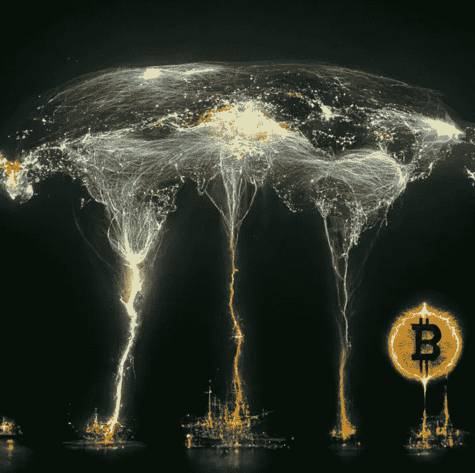
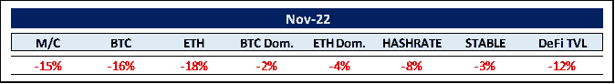
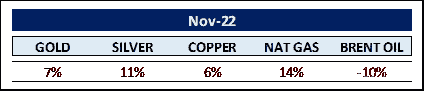
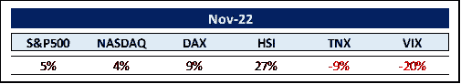
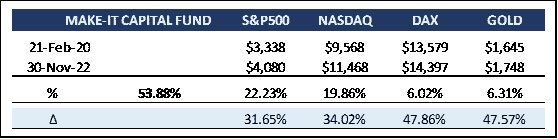

# Make-it 资本版#27

> 原文：<https://medium.com/coinmonks/make-it-capital-edition-27-d408cfe94723?source=collection_archive---------36----------------------->

我们在 2022 年 11 月看到的世界

加密货币的世界

秘密的 11 月淹没在红色的海洋中。仿佛全球财政、军事和情感的紧张局势还不够，**诈骗银行诈骗的** ( *名字创造***威利·吴** )纸牌屋内爆，带走了 1500 亿美元的总市值。

值得注意的是，没有一种基础加密货币失败，而是一家没有任何监督的集中式离岸公司带走了其他几家同样集中的机构。正如 S**ynchonicity Investments**的首席信息官 Ben Upward 所言，FTX 股市崩盘“可能是从这场持续一年的熊市中开始复苏所需的一次清洗”

有趣的是，分散金融(d *efi* )应用并没有受到负面影响。相反，例如分散的交易所( *DEXes* )遇到了巨大的交易量高峰，以弥补集中的缺点。正如**shape shift**的创始人 Eric Vorhees 对潜在监管者简明扼要地说:“是的，defi 剥夺了你作为监管者的一些权力……但它解决了你一直试图监管的问题。那不是更重要吗？”

从积极的一面来看，随着加密技术的普及，它也在不断进步。例如，富达投资公司是世界上最大的资产管理公司之一，管理着 4.5 万亿美元的资产(AUM )刚刚向他们的 4000 万零售客户打开了加密交易的大门。在 200 个国家运营的 P2P 支付和资金转移平台 **MoneyGram** 也不甘示弱，为其数百万客户增加了比特币和以太坊交易。另一家世界领先的资金管理公司，阿波罗全球管理公司，现在向其客户提供加密托管服务。

此外， **Meta** 正在使用 **Arweave** 和 **Polygon** 作为其向 **Instagram** 用户介绍 **NFT** minting 的计划的一部分。**摩根大通**刚刚交换了多边形区块链上的主权资产，借贷协议 **MakerDAO** 正在与法国银行 **Société Générale** 合作，将真实世界的资产带上链。

积极的消息似乎永远不会减少，即使在所有的厄运和黑暗中，例如前几天欧洲中央银行称“比特币正在走向无足轻重”。这可能是引导熊走出冬眠洞穴的完美相反指标吗？据媒体报道，自地下经济学家**于 2010 年 12 月 15 日以 0.23 美元的 BTC 价格锁定第一次死亡以来，比特币已经死亡 466 次。嗯…**

**MarketsandMarkets** 发布的一份报告明确支持区块链市场令人难以置信的未来，预计其规模将从 2021 年的 49 亿美元增长到 2026 年的 674 亿美元，复合年增长率( *CAGR* )为 68.4%。再加上一些负责任的监管活动，上述数字可能会相形见绌。

让我们对当前价格的热情有所停顿的是，在这次熊市中，比特币的主导地位没有像以往所有下跌周期中那样上升。事实上，从 40%到 38%略有下降。这给我们留下了两种可能的情况:要么熊市还没有结束，要么整个市场，即包括替代硬币，已经达到了更高的可信度。也许两者都有一点。

**商品世界**

对即将到来的全球经济衰退的担忧拉低了本月的油价。不过，除了石油(-10%)、小麦(-14%)和咖啡(-6%)之外，其他大多数大宗商品在 11 月份都处于看涨区间。

与此同时，美元指数出现大逆转，从 9 月份创下的几十年高点下跌逾 8%，从 114 美元左右跌至 105 美元。

如果美元继续下跌，大宗商品价格和加密货币可能会大幅获利。强势美元给全球经济带来了多重危险，因为它向全球其它地区输出了通胀，令其它国家难以维持盯住美元的汇率制度，并加大了美元计价债务的偿还难度。看到这一点，并努力避免广泛的货币和债务危机，世界主要国家可能已经同意恢复广场协议，以遏制美元的持续上涨？

**其余的……**

反向 **10/2 年** **收益率曲线**再次上涨 36%至-68 个基点，创下自 20 世纪 80 年代初以来的新高。

尽管这是即将到来的经济衰退的最强指标之一，世界范围内的股票市场上涨——由中国领涨。现在，许多专家认为这些进步不过是又一次熊市反弹。

然而，我们可能已经看到了一个持久的底部吗？毕竟，当前的市场低迷几乎完美地冲击了 353 天的平均熊市持续时间。

Be this as it may and coming back to China, **Citadel**’s founder **Ken Griffin** is upholding his plans for Asia expansion, encouraged by China President **Xi Jinping**’s renewed focus on the economy.

Beijing’s recent moves to support its massive property markets “indicates that Xi’s team is committed to, once again, re-accelerating Chinese economic growth,” Griffin said in an interview at the Bloomberg New Economy Forum in Singapore.

Faced with increasing opposition to his Zero-Covid policy, China could tip the scales to prevent a global recession by bringing international supply chains back online to pre-Covid levels.

Good things sometimes take time though, as seen with the release of the sixth studio album of US hard rock band **Guns N’Roses**. After ever new delays and 15 years of waiting it finally hit the market in 2008\. Fittingly, it bears the name “Chinese Democracy”.

MAKE-IT CAPITAL FUND (the Fund)

Unique blockchain hedge fund focusing on capital preservation whilst empowering investors to participate in the entire distributed ledger and crypto-asset spectrum.

The Five-Pillar Strategy reduces volatility and spreads inherent risk.

It is open to institutional and accredited investors. Open-end with a minimum investment of $50,000.

The Fund always trades at exactly NAV and is open to institutional and accredited investors.

The Fund keeps outperforming while demonstrating lower volatility. So par for the course.

Fortunately, the Fund never had any exposure to **FTX** or the fallout liquidations ensuing SBFs borderline criminal activities. Let’s think positively that governments don’t use the FTX implosion as an excuse to impose draconian and industry stifling regulations so that they can more easily implement their own plans to introduce central bank digital currencies (*CBDCs*). CBDCs will undoubtedly come, the question is how much impact they will have on everyone’s privacy. Fortunately, we are convinced that the mathematical nature of free cryptocurrencies will prevail avoiding an Orwellesque future for us all.

A quote we came across on bitcoinmagazine.com comes to mind: “For thousands of years money has been backed by trust and gold and, protected by ships. However, in this millennium, money will now be backed by encryption and math, and protected by chips.”

Zooming out, the overall trend is still incredibly bullish. In 2016, the crypto market was worth as much as $16 billion. Throughout 2019, it had grown to as much as $369 billion. And on November 30th, it was worth around $861 billion. So cryptos have grown exponentially in a short time.

To give a bit of perspective, it took 25 years for virtually risk-free, yield-bearing money market mutual funds to accumulate $861 billion in market cap. And it took 443 years for listed equities to accomplish the same…

我们已经看到了令人神经崩溃的波动，这种情况可能还会持续一段时间。然而，由未来学家和工程师**罗伊·阿马拉**创造的**阿马拉定律**浮现在脑海中:“我们倾向于高估技术在短期内的效果(*又名创造价格波动*)，而低估长期效果。”

无论我们处于这个周期的哪个阶段，精明的投资者都会希望以某种形式进行中长期投资。

感谢您的时间和关注。

真诚地

菲利普·冯·戈特伯格