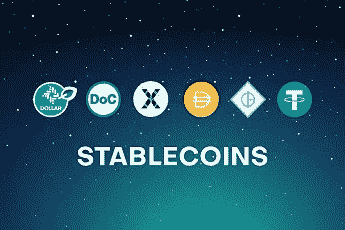

# 赚钱，散钱，给新手

> 原文：<https://medium.com/coinmonks/make-money-loose-money-for-beginners-666c6359c07d?source=collection_archive---------50----------------------->

如果你想在加密中赚钱，你必须准备好散钱。

嘿嘿，是那个吗？

绝对是。如果你想确保你所做的每一次努力，每一天的麻烦，你都可以带着一些钱回家，我很高兴地告诉你，你想要的是一份员工工作。这很好:你有健康保险，稳定的收入，可预测的现金流，你可以为你的房子贷款，并最终买一只狗。

密码是不同的。你可以赚钱，获得利润，创造收入，找到工作，最终积累财富。但是加密是一种投资，作为一种投资，你可以把它翻倍、三倍、减半或失去它。

如果您今天开始使用 crypto，并且您想要(猜猜是什么？)赚钱，以下是你必须深化的主要领域——如果你愿意，我们将在之前的帖子中一起做:

**更安全**

买稳定币，然后押上。稳定币是一种密码，其价值等于法币，通常是美元。你今天买了 10 美元，明天它会值 10 美元。而且，你可以在一些交易上下注，这就像把你的钱存在银行里并获得利息。通常它每年支付约 5%的利息:这不足以支付蓝宝，但肯定比你的银行存款多。

**信徒**

购买大巨头 BTC、瑞士联邦理工学院，并持有(或者更好，持有)它们。这里有一些风险。比如说，由于市场状况，昨天他们每个人都损失了大约 10%的价值。最终他们会回到之前的值，并超过它。目前，他们远离他们的 ATH(历史最高值)，他们达到的最大值。但是如果你突然需要你的钱，你不得不卖掉你的硬币，它们可能会比你买的时候贬值。

**冒险**

如果你正在阅读这篇文章，这些是你绝对不应该做的事情，因为阅读的事实意味着你仍然不够专业。

*   投资 DEFI、分散融资或加密融资:这是有回报且有风险的
*   投资 altcoin，就是买那些著名的公司(DOT，XPR，SOL)，仅仅因为你看到一些有趣的帖子，说他们做了 10 倍或者他们可以做 100 倍
*   交易任何替代硬币。每个人坐在马桶上的时候都这样，是吗？低价时买入，高价时卖出
*   投资 memecoin，比如 DOGE 或者 SHIB，你其实不知道他们是什么，但是你喜欢他们的 logo
*   长或短 BTC 或其他密码，因为你在 instagram 上看到过

还有其他方法，但这是主要的。除非你不熟悉 stablecoin，和/或这个问题:“好的，那 UST 呢？”没有来到你的脑海中，你还没有做好准备，更不敢。

挑选一些关键词，DYOR(我会帮助你:做你自己的研究)。

> 加入 Coinmonks [电报频道](https://t.me/coincodecap)和 [Youtube 频道](https://www.youtube.com/c/coinmonks/videos)了解加密交易和投资

# 另外，阅读

*   [Bookmap 点评](https://coincodecap.com/bookmap-review-2021-best-trading-software) | [美国 5 大最佳加密交易所](https://coincodecap.com/crypto-exchange-usa)
*   [如何在 FTX 交易所交易期货](https://coincodecap.com/ftx-futures-trading) | [OKEx vs 币安](https://coincodecap.com/okex-vs-binance)
*   [CoinLoan 审查](https://coincodecap.com/coinloan-review) | [YouHodler 审查](/coinmonks/youhodler-4-easy-ways-to-make-money-98969b9689f2) | [BlockFi 审查](https://coincodecap.com/blockfi-review)
*   XT.COM 评论[币安评论](https://coincodecap.com/profittradingapp-for-binance) |
*   [SmithBot 评论](https://coincodecap.com/smithbot-review) | [4 款最佳免费开源交易机器人](https://coincodecap.com/free-open-source-trading-bots)
*   [比特币基地僵尸程序](/coinmonks/coinbase-bots-ac6359e897f3) | [AscendEX 审查](/coinmonks/ascendex-review-53e829cf75fa) | [OKEx 交易僵尸程序](/coinmonks/okex-trading-bots-234920f61e60)