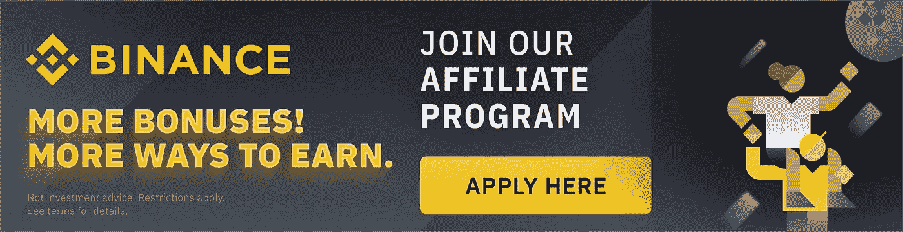
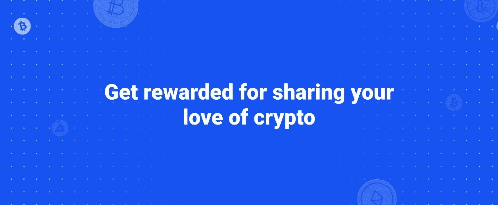
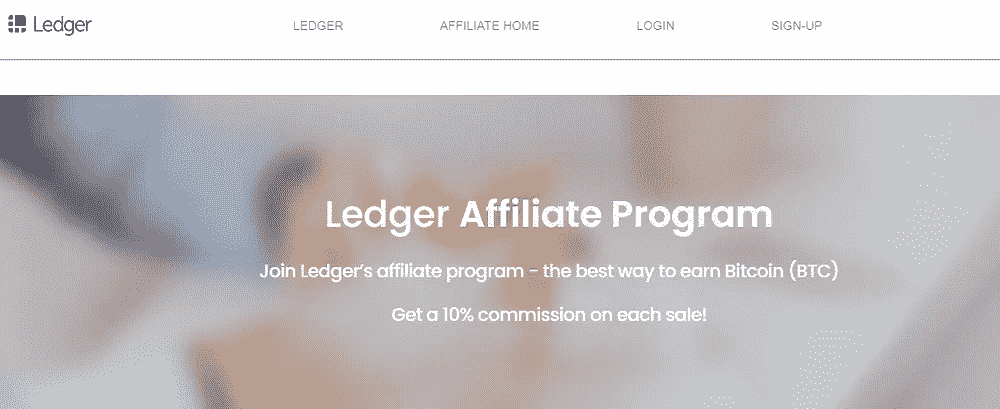
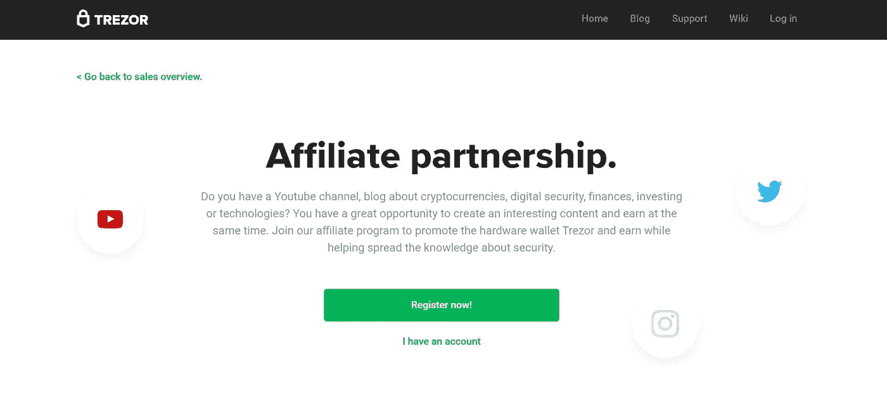
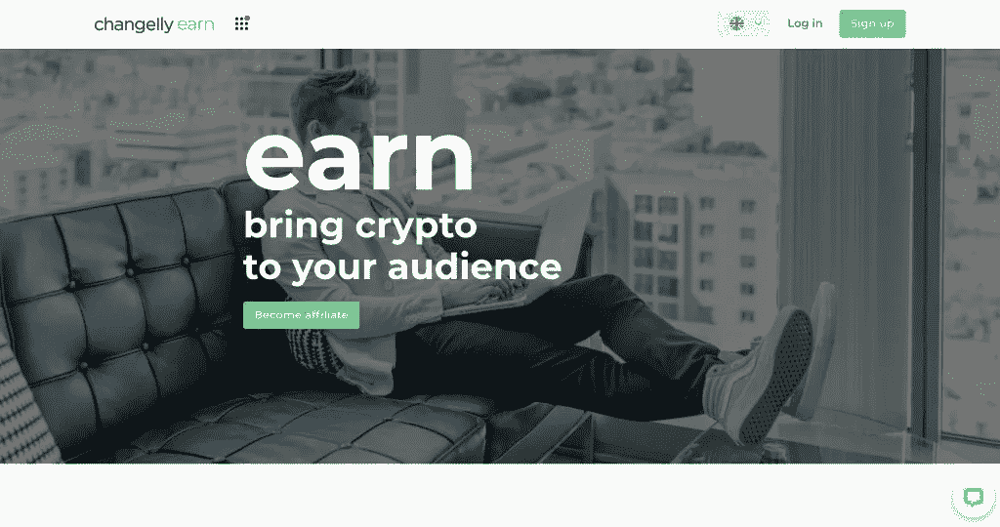

# 赚钱与此加密从属营销计划

> 原文：<https://medium.com/coinmonks/make-money-with-this-crypto-affiliate-marketing-programs-bc3a51801054?source=collection_archive---------14----------------------->

**联盟营销**是每个有影响力的人赚取被动收入的好方法。如果你已经有一个活跃的追随者基础，加入联盟营销计划应该是你的下一步。加密联盟营销计划是这些天的趋势，无论你是一个加密的影响者，加密爱好者，或只是一个加密新手，你一定要检查出来。

包括数字交易所、NFT 市场和数字钱包在内的加密货币企业使用联盟营销计划来增加他们的客户群。数百家加密企业之间存在激烈的竞争，而联盟营销计划是获得竞争优势的方法之一。有许多加密货币联盟市场，有各种各样的佣金和支付计划。

有大量的加密货币附属程序可供使用，这使得做出决定很困难。只有拥有良好声誉、高额佣金和及时支付的企业才能晋级。请记住，在选择联盟计划时，一定要考虑到你的受众。

# 15 大加密交易联盟计划

# 1.[币安](https://www.binance.com/en/activity/affiliate)

**佣金:**介绍交易费用的 50%或以上

**汇款:**加密货币

任何有抱负的加密货币影响者在谈论加密货币时都会提到币安。2017 年，赵昌鹏创立了世界上最大的加密货币交易所之一。交易所支持主要的加密货币和法定货币。此外，币安硬币有自己的货币(BNB)。

**币安** **会员计划为每笔符合条件的交易提供 40–50%的佣金**。这取决于有多少注册通过你的附属链接是成功的。除了佣金，币安还有一个名为币安未来联盟的项目，每月支付 72，000 USDT。对于佣金，没有上限和时间限制。

币安采用独特的联盟网络，审批是人工处理的。有影响力的人至少需要 5000 名追随者。

# 2.[比特币基地](https://www.coinbase.com/affiliates)

**佣金:**前三个月介绍交易费用的 50%

**付款方式:**当地法定货币($、€等。)

比特币行业的另一个知名品牌是比特币基地。该交易平台支持比特币、以太坊和其他广泛交易的加密货币。为了促进分散货币和促进平等，它于 2012 年成立。

超过 9800 万人在 100 多个国家使用比特币基地。因为该网络提供高达 250，000 美元的加密保险，所以用户对它很有信心。这使得它对仍在了解虚拟货币的加密货币投资新手很有吸引力。

得益于**比特币基地的加盟计划，你可以在前三个月从你的推荐交易费中获得 50%的佣金**。通过 PayPal 或您当地的银行，您可以获得本币付款。它还利用了 Impact，这是一款以用户友好界面而闻名的联盟营销软件，可以轻松跟踪活动和检查链接的有效性。

# 3.[总账](https://affiliate.ledger.com/)

佣金:每笔销售额的 10%

**支付方式:**比特币

加密货币由硬件钱包保护，防止恶意用户使用。它们为用户的私钥提供最高级别的安全性(授权区块链上的传出交易所需的字符串)。目前最好的硬件钱包是由 Ledger 提供的，它于 2014 年推出，并得到了法国网络安全组织 ANSSI 的认证。

安全元件芯片和独特的操作系统是其钱包的特色。用于日常交易的日常钱包和用于未决交易的加密保险箱是提供的两种类型。全球超过 400 万客户信任分类账钱包。

> 交易新手？尝试[加密交易机器人](/coinmonks/crypto-trading-bot-c2ffce8acb2a)或[复制交易](/coinmonks/top-10-crypto-copy-trading-platforms-for-beginners-d0c37c7d698c)

**莱杰的加盟计划为每笔销售提供 10%的推荐佣金**。此外，它还给予会员额外的优惠，包括免费的账本设备、赞助机会、参加独家账本活动、社区赠品和独家 NFT 优惠。它的会员计划允许用户赚取免费的比特币，因为支付是使用比特币进行的。它利用全球会员网络 Awin 和内置会员软件。

此外，亚马逊上提供分类账钱包，这对亚马逊员工来说太棒了。

# 4.特雷佐

佣金:每笔销售额的 12-15%

**支付方式:**比特币或欧元电汇

另一个广泛使用的加密货币硬件钱包是 Trezor。它有两种不同功能的变体，支持 1000 多枚硬币。易于使用的设计和专门的保费援助，这是用户友好的初学者。

**Trezor 的会员计划为每笔销售提供 12–15%****的佣金**。鉴于 Trezor 的优质产品价格在 200 至 530 欧元之间，你可以从推广 tre zor 产品中获得可观的代销商佣金。分支机构可能会收到欧元或比特币形式的佣金。

此外，它还提供适应性强的营销材料和对管理平台的全天候在线访问，作为对其附属机构的支持。

# 5.[多变](https://changelly.com/earn)

**佣金:** 50%寿命

**支付方式:**加密交易货币

一家名为 Changelly 的混合加密货币交易所成立于 2015 年。在 Changelly 上完成兑换，不需要存入任何货币或数字货币。您可以使用 150 种不同的加密货币交易或购买加密货币。

**change lly 的关联公司从其推荐的所有成功交易中获得 50%的佣金**。对于通过 Changelly 进行的每笔交易，将收取 0.25%的固定费用。任何人都可以申请成为会员，并且很快就会获得批准。被接受后，您可以访问一系列附属工具，包括小部件、横幅和链接，您可以根据自己的业务进行定制。

# 最后的想法

加入这个潮流永远不会太晚。今天，您可以通过成为加密联盟营销商来赚取加密货币。使用相同的联盟营销策略为其他传统的联盟计划，你可以建立一个蓬勃发展的加密联盟业务。

 [## XRP 很大。原因如下…

### 撰写本文时，XRP 是世界第七大加密货币，也是一项独立的数字资产。围绕着…

medium.com](/coinmonks/xrp-is-huge-here-is-why-7777b6c9f9d1)  [## 如何识别下一个比特币

### 每个交易者都想在加密货币大幅升值之前，在它变得微不足道之前购买它…

medium.com](/coinmonks/how-to-identify-the-next-bitcoin-2d6ccc1b5b2b) 

> 加入 Coinmonks [电报频道](https://t.me/coincodecap)和 [Youtube 频道](https://www.youtube.com/c/coinmonks/videos)了解加密交易和投资

# 另外，阅读

*   [如何在 Uniswap 上交换加密？](https://coincodecap.com/swap-crypto-on-uniswap) | [A-Ads 审查](https://coincodecap.com/a-ads-review)
*   [加密货币储蓄账户](/coinmonks/cryptocurrency-savings-accounts-be3bc0feffbf) | [YoBit 评论](/coinmonks/yobit-review-175464162c62)
*   [Botsfolio vs nap bots vs Mudrex](/coinmonks/botsfolio-vs-napbots-vs-mudrex-c81344970c02)|[gate . io 交流回顾](/coinmonks/gate-io-exchange-review-61bf87b7078f)
*   [CoinFLEX 评论](https://coincodecap.com/coinflex-review) | [AEX 交易所评论](https://coincodecap.com/aex-exchange-review) | [UPbit 评论](https://coincodecap.com/upbit-review)
*   [AscendEx 保证金交易](https://coincodecap.com/ascendex-margin-trading) | [Bitfinex 赌注](https://coincodecap.com/bitfinex-staking) | [bitFlyer 审核](https://coincodecap.com/bitflyer-review)