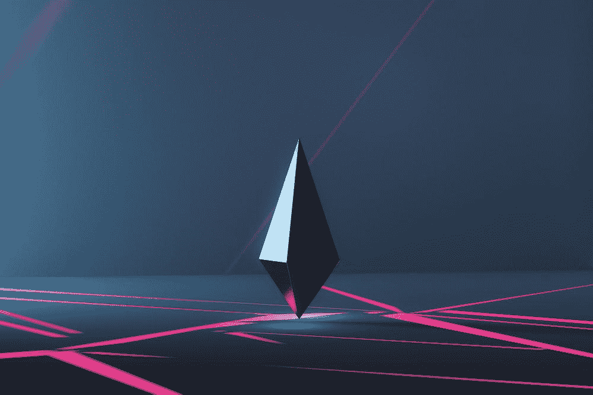

# maker Dao——一个公正的全球金融体系

> 原文：<https://medium.com/coinmonks/makerdao-an-unbiased-global-financial-system-13e0e394cb11?source=collection_archive---------30----------------------->

自 2014 年以来，MakerDAO 一直致力于建立一个公正的全球金融体系。他们最初推出了与美元挂钩的戴稳定币，但后来扩大到包括各种其他资产。

马克尔道是以太坊区块链上的一个分散自治组织(DAO)。这意味着它由智能合约管理，任何人都可以参与其中…