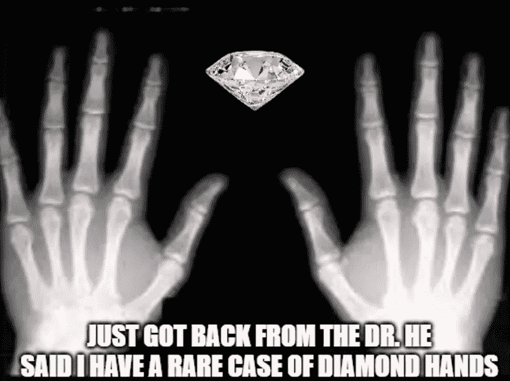
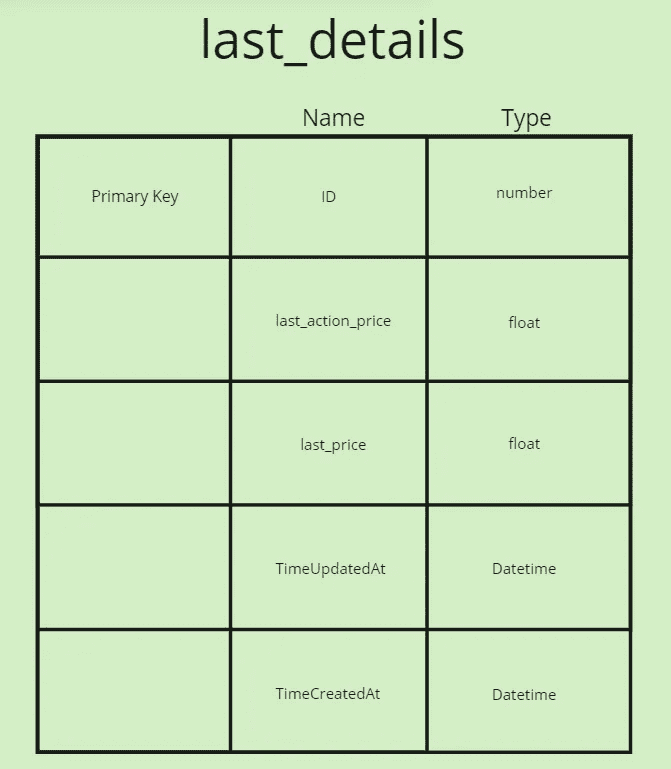
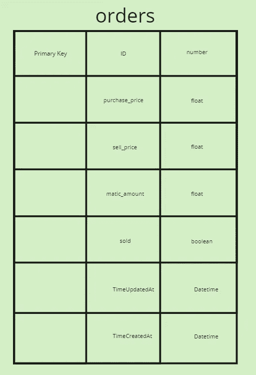
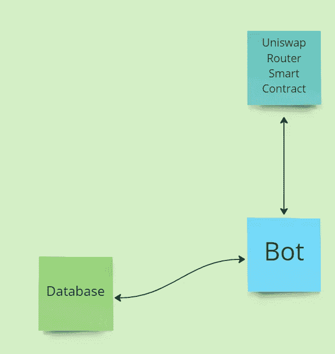
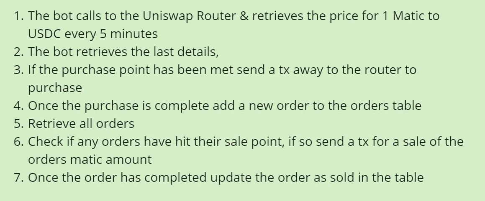

# 制作钻石手加密交易机器人

> 原文：<https://medium.com/coinmonks/making-a-diamond-hands-crypto-trading-bot-47ab0a54c0c7?source=collection_archive---------12----------------------->

没错，你听到了我的话，一个利用波动性的机器人&等着瞧吧，就像冠军一样。

这里的想法是有一个美元余额&观察一个主要的代币价格。如果下跌了 5%，那么用你钱包余额的 5%购买一些代币。然后它钻石手，直到它的价格增加了 5%。

技术

*   java 描述语言
*   Ethers.js
*   Sequelize 和 Sequelize-cli
*   SQL(一点点，虽然不是必需的)
*   Postgres

数据库

ID，TimeUpdatedAt & TimeCreatedAt 由 sequelize 为我们处理。

因为我们将存储大的数字，所以我们将把它们存储为浮点数。

机器人

续集——第一部——https://medium.com/p/f5caa9ceb30f

续集——第二部——https://medium.com/p/203b44cb7e95

如果你觉得这很有趣，那么试试这个！【https://medium.com/p/e8454dfe8189】T5

稳健发展研究小组—[https://discord.gg/KzbcGmrnfN](https://discord.gg/KzbcGmrnfN)

-多边形联盟—[https://www.polygonalliance.com/](https://www.polygonalliance.com/)

-多边形联盟不和—[https://discord.gg/kJKPCGQu66](https://discord.gg/kJKPCGQu66)

你喜欢这篇文章吗？想请我喝杯咖啡吗？
Polygon/Eth/Bsc—0x4a 581 E0 EAF 6b 71d 05905 e8e 6014 DC 0277 a1 b 10 ad

> *交易新手？试试* [*密码交易机器人*](/coinmonks/crypto-trading-bot-c2ffce8acb2a) *或* [*复制交易*](/coinmonks/top-10-crypto-copy-trading-platforms-for-beginners-d0c37c7d698c) *上* [*最好的密码交易*](/coinmonks/crypto-exchange-dd2f9d6f3769)

> 加入 Coinmonks [电报频道](https://t.me/coincodecap)和 [Youtube 频道](https://www.youtube.com/c/coinmonks/videos)获取每日[加密新闻](http://coincodecap.com/)

# 另外，阅读

*   [免费加密信号](/coinmonks/free-crypto-signals-48b25e61a8da) | [加密交易机器人](/coinmonks/crypto-trading-bot-c2ffce8acb2a)
*   [杠杆代币的终极指南](/coinmonks/leveraged-token-3f5257808b22)
*   [16 款最佳折叠电动自行车](/coinmonks/top-17-folding-electric-bikes-5e296f0918cb)
*   [28 款最佳电动自行车点评](/coinmonks/the-28-best-electric-bikes-review-and-buying-guide-in-2023-7bb3146cb403)
*   前三名[币安期货交易机器人](/coinmonks/top-3-binance-futures-trading-bots-e6031f84b3f9)