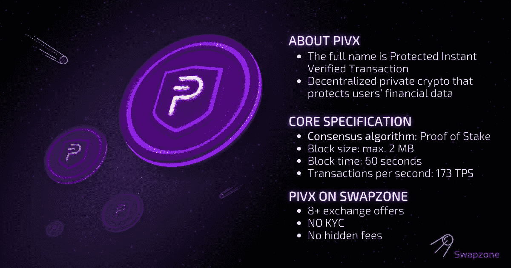

# 让隐私成为一项基本权利:PIVX

> 原文：<https://medium.com/coinmonks/making-privacy-a-basic-right-pivx-270c6a76d33?source=collection_archive---------34----------------------->

有很多加密货币不是匿名的，或者不遵循去中心化原则。这意味着你在其中进行的所有交易都可以在他们的公共账本或区块链上看到。这使得机构、研究人员、私人代理、政府机构和追踪者能够追踪持有者和交易者的真实身份。这样，没有一个密码交易员是 100%安全的。这为 PIVX 等加密货币的崛起铺平了道路。

# PIVX 是什么？

PIVX 的创建围绕着成为最先进的私人加密货币的目标，因为 PIVX 使用了一些最顶尖的技术，是许多私人硬币的潮流引领者。PIVX 代表私人即时验证交易。它是 DASH 的一个分支，但 Dash 工作于工作证明，而 PIVX 设计用于工作于利益证明系统。PIVX 的创始人认为，在奖励矿工方面，股权证明是一种更公平的制度。它有一个跷跷板机制，自动平衡奖励和支出。

# PIVX 区块链

PIVX 有一个独立的动态和支付竞争的区块链。PIVX 区块链在创建新区块时使用利害关系证明共识。它包括主节点和桩节点，或者验证器，将系统分散到其核心。

# PIVX 加密货币

PIVX 是一种开源、分散的加密货币，主要致力于为加密世界带来安全性、匿名性和隐私性。PIVX 为其客户提供即时交易，并建立在四个支柱上，即隐私、自由、技术和治理。通过这样做，他们正朝着实现他们的主要目标前进，即创建一个具有即时私人交易的示范性去中心化系统，以及比 Dash 更好的社区治理模式。

PIVX 最初是作为 DarkNet (DNET)推出的，没有初始硬币发行(ICO)。而是预采了 6 万枚硬币。与[比特币](https://swapzone.io/currencies/bitcoin)不同，PIVX 币没有限制。其供应量每年增加约 260 万。它的区块挖矿时间是 1 分钟，比比特币挖矿时间快了很多。

# 项目的关键点

以下是该项目的主要特点:

# 将 PIVX 放在钱包里可以获得奖励

当您持有 PIVX 并保持钱包在线同步时，PIVX 会奖励您额外的硬币。通过持有 PIVX，您对网络的稳定性做出了贡献。这就像你自己的银行账户，根据你持有的金额来奖励你。

# PIVX 致力于利益相关者共识的证明

如前所述，PIVX 工作在一个 stake proof 系统上，有两种类型的节点:主节点和 staking 节点，或者验证器。Masternodes 参与对社区成员提出的提案进行投票，并尽快验证交易。要运行 masternode，你需要有 10，000 PIVX 的股份。

验证器被分配给挖掘 PIVX 的作业。当生成一个新的块时，6 个 PIVX 硬币在验证器、主节点和国库系统之间分配:3 个分配给验证器，2 个分配给主节点，1 个分配给国库。跷跷板机制在主节点和锁定节点之间保持平衡。

# PIVX 没有紧张的市场供应上限

由于可以开采的 PIVX 数量无限，它没有严格的市场上限，通货膨胀率约为 3%至 4%。它的软上限是由于交易费。每笔交易的交易手续费在 0.01 PIVX 左右。

# PIVX 有 SwiftTX，允许即时交易

如果讨论 PIVX vs 比特币，即时交易可以成为 PIVX 的一个制胜点。即时交易一直是 PIVX 生态系统的一部分。由于 SwiftTX 技术，PIVX 中接近即时的交易时间已经成为可能。这解决了双重支出的挑战以及更多问题。

# PIVX 有一个透明的路线图

就全面和透明的路线图而言，没有多少人接近 PIVX。PIVX masternodes 在形成项目的基本方向方面非常活跃。此外，zk-SNARKs 现在用于交易，而不披露处理的金额。

# PIVX 是真正意义上的去中心化

随着时间的推移，各种加密货币因变得有些集中而受到批评。PIVX 确保 PIVX 项目不会发生这种情况。该系统有 1700 个积极参与的主节点，其核心是分散的。区块链为每个主节点提供单一投票权，进一步为基于社区的治理铺平了道路。目前，masternodes 正在享受 9%的年回报率。

# 如何在 Swapzone 上交换 PIVX？

许多用户经常询问如何将他们的密码转换成 PIVX。答案相当简单。有像 Swapzone 这样的加密交换聚合器，可以帮助用户轻松地交换他们的资产。您只需按照下面提到的步骤来完成整个过程:

1.  例如，在发送部分选择 BTC。
2.  指定您要兑换的总金额。
3.  在“到达”部分选择 PIVX。
4.  查看屏幕上的优惠。您会发现多个报价，最优惠的价格列在顶部。您还可以看到完成 BTC-PIVX 交换需要多少分钟。
5.  选择您希望继续的优惠，然后进入钱包接收 PIVX。
6.  复制生成的 BTC 地址，并发送您的 BTC 存款。
7.  等待兑换服务处理存款，兑换完成。
8.  不要忘记对交换合作伙伴进行评级，这样我们可以为未来的用户收集更多关于交换的信息。

# PIVX 的未来

PIVX 的未来看起来很光明，因为它将取代低效的现有模型，代之以更好的 POS 系统和奖励策略。许多分析师认为，在服务、交易处理和成本方面，它可能会超过 Dash。而且它已经采取了行动，引入了交易匿名。

PIVX 正在进行非常有前景的开发，例如引入将基于链上数据进行管理的确定性主节点。除了透明硬币之外，他们还想办法让投资者投资屏蔽硬币。有了这些里程碑式的进展，可以看出 PIVX 有很大的潜力。

# 要转换 PIVX 的常用对

[PIVX 到 BTC](https://swapzone.io/exchange/pivx/btc)
[PIVX 到 ETH](https://swapzone.io/exchange/pivx/eth)
[PIVX 到 LTC](https://swapzone.io/exchange/pivx/ltc)
[PIVX 到 BNB](https://swapzone.io/exchange/pivx/bnb)
[PIVX 到 BCH](https://swapzone.io/exchange/pivx/bch)
[PIVX 到 USDT](https://swapzone.io/exchange/pivx/usdt)
[PIVX 到θ](https://swapzone.io/exchange/pivx/theta)
T21【PIVX 到 XMR
[PIVX 到 TRX](https://swapzone.io/exchange/pivx/trx)
[PIVX 到](https://swapzone.io/exchange/pivx/bsv)

> 交易新手？尝试[加密交易机器人](/coinmonks/crypto-trading-bot-c2ffce8acb2a)或[复制交易](/coinmonks/top-10-crypto-copy-trading-platforms-for-beginners-d0c37c7d698c)