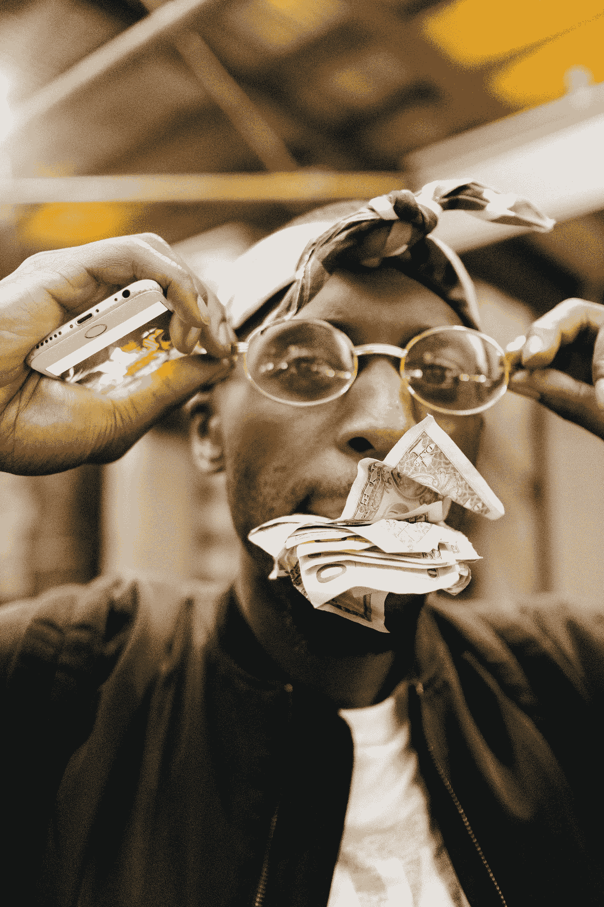

# 从智能合同中获取意义(和版税)

> 原文：<https://medium.com/coinmonks/making-sense-and-royalties-from-smart-contracts-f18d66dacdeb?source=collection_archive---------25----------------------->

区块链科技的吸引力很大一部分在于，有潜力的艺术家和创作者可以从他们的内容中获得稳定的收入。从历史上看，获得发行版版税的途径并不总是将原创者视为收入的象征——相反，音乐行业的一些角落因从艺术家那里转移收入而臭名昭著。在我们深入研究区块链技术所提供的潜力和安全性之前，让我们先简要了解一下音乐家和艺术家在试图获得版税时所面临的一些典型挑战。

即使在最高层
人们可能会相信，最有成就和最知名的艺术家将会控制和获得他们音乐的发行和收入潜力，但即使在最高层，游戏也很容易被操纵。查克·D([公敌](https://www.youtube.com/watch?v=mmo3HFa2vjg)成名)直言不讳地反对主要唱片公司和他们囤积版税的倾向。2011 年，说唱歌手[起诉](https://www.theguardian.com/music/2011/nov/04/chuck-d-sues-universal)环球唱片公司索赔 1 亿美元，声称《公敌》仅获得其网络销售收入的 25%。考虑到环球公司一开始只削减了《公敌》18%的数字下载销售额，这就更加令人震惊了。到 2015 年，该案件已经与其他几起寻求公平赔偿的案件合并在一起，包括罗布·祖姆比和瑞克·詹姆斯遗产公司等名字被归入反对环球公司支付不足的倾向。这起集体诉讼于 2016 年结束，环球公司不得不向旗下约 7500 名艺术家支付 1150 万美元。

可以理解的是，对于正在崛起的人才来说，面对一个历来有拿走你大部分收入趋势的行业，他们会失去动力。就其本身而言，流媒体平台盈利潜力的承诺很难让人放心。主要唱片公司的艺人平均将从流媒体平台收入中获得约 18%的收入，而那些独自创业的艺人将面临惨淡的 6-7%的收入(T3)。受人尊敬的作曲家兼吉他手[奈尔斯·罗杰斯](https://www.theguardian.com/music/2021/apr/10/music-streaming-debate-what-songwriter-artist-and-industry-insider-say-publication-parliamentary-report)坚定地表达了他对版税分配和主要唱片公司突出的缺陷的看法，指出缺乏一致性、透明度和平等代表性是唱片公司长期存在的根本问题。尽管主流唱片公司被指责流回报率低，但人们不得不假设沉淀已经沉入海底，那些刚刚起步的无代表艺术家可能会得到最差的待遇。因为这个行业仍然受到网络和声誉的推动，版税的分配经常受到炒作和地位的影响——这两者在艺术家的早期几乎不可能产生。仅在英国，2021 年上半年就处理了 20，000 份针对业余表演者的困难资助申请。

令人欣慰的是，随着智能合约的出现，音乐领域引入了 NFTs。智能合同本质上是嵌入到基于区块链的产品中的两方或多方之间的数字合同。该合同与其他合同的[区别](/@salkaysi48/blockchain-smart-contracts-and-reconstructing-the-music-industry-29317e0a9745)在于它的自我执行能力——本质上是在不需要第三方维护或干预的情况下执行合同条款。因为智能合同是基于软件的，它们可以预先设定条件，当满足这些条件时，会导致立即交易或将版税分配给适当的一方。区块链技术强调透明性和安全性，这意味着违反合同的可能性远低于传统的标签控制合同。

实际上，智能合约还包含什么？这在一定程度上取决于相应的 NFT 发布的市场，但一般来说，他们拥有与所述 NFT 相关的所有必要的[信息](https://nftevening.com/nft-smart-contracts-how-to-read-them-and-why-youd-need-to/)。例如，在像 [OpenSea](https://opensea.io/) 这样的平台上，NFTs 显示一个“合约地址”，点击它会将用户带到[ethers can](https://etherscan.io/)——元数据、交易、钱包地址和智能合约本身的中心，所有这些都与单个令牌的身份有关。向希望发布内容的用户提供如此多的自由和控制，与过去几十年主导该行业的主要唱片公司的排他性、模糊性和不可接近性形成了鲜明对比。将大部分利润分配给传统上监管版税系统的第三方的日子已经一去不复返了。

你是一个崭露头角的艺术家，想要为自己建立一个名字吗？寻找一份能让你获得应得版税的合同？Publicator 致力于为艺术家、粉丝和 NFT 爱好者创建一个平台，完全拥抱音乐产业的去中心化未来。我们袖手旁观创意，原创和艺术家所有权的潜在价值。你可以申请成为 https://the-publicator.com/的测试员。

> 交易新手？试试[密码交易机器人](/coinmonks/crypto-trading-bot-c2ffce8acb2a)或者[复制交易](/coinmonks/top-10-crypto-copy-trading-platforms-for-beginners-d0c37c7d698c)