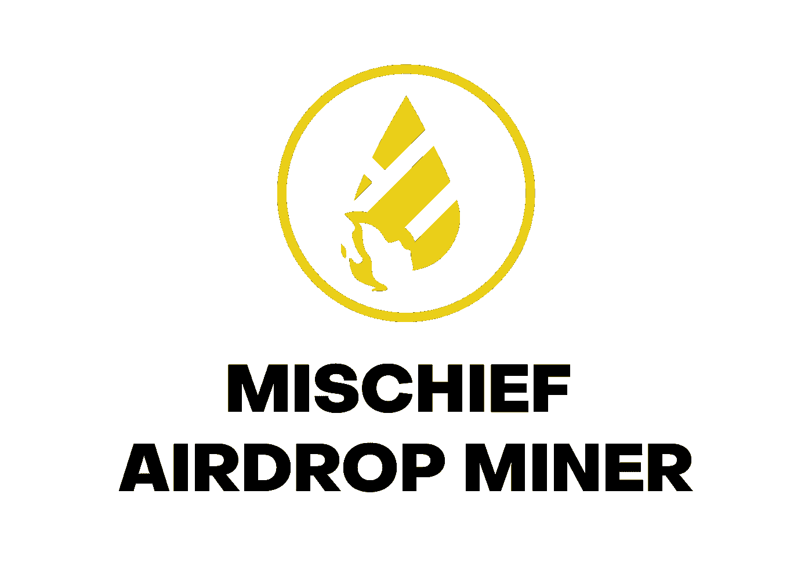
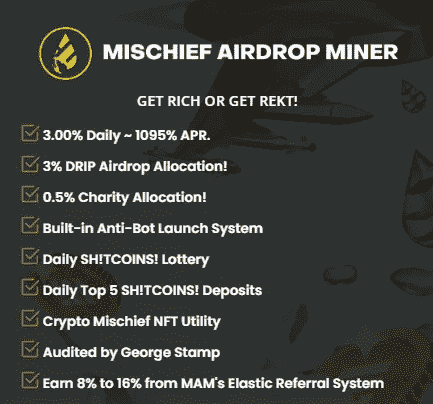
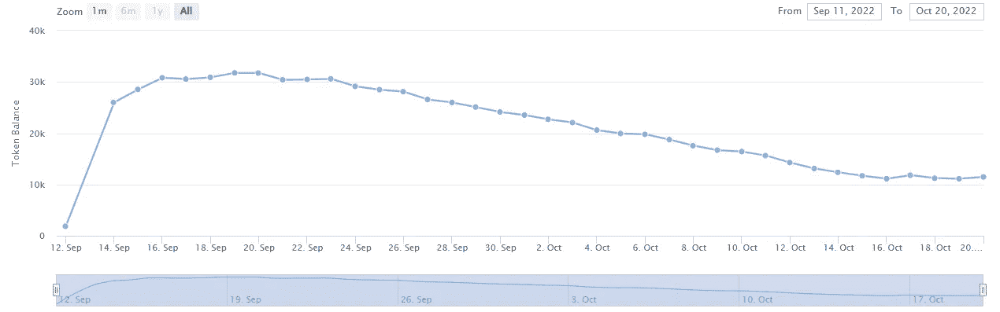
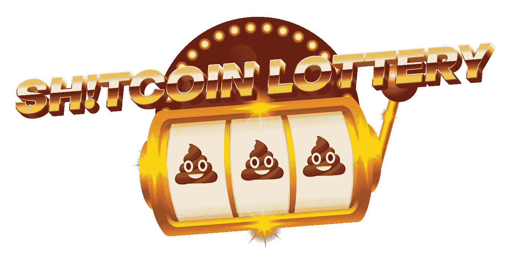
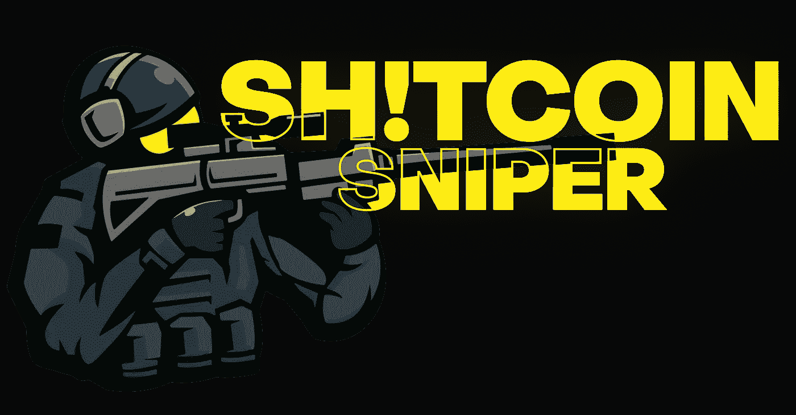
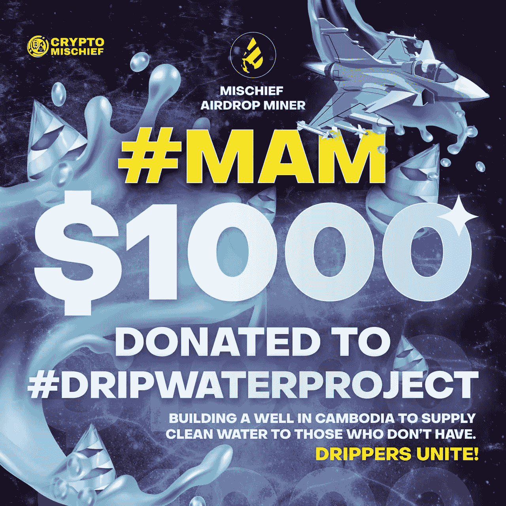

# MAM——为密码新时代铺平了道路…

> 原文：<https://medium.com/coinmonks/mam-paving-the-way-into-a-new-age-in-crypto-2c47969500f8?source=collection_archive---------3----------------------->

你好，我的名字是尼尔森，我将告诉你关于 [MAM](https://mischiefminer.io/?ref=0xFc49434836bfE183a0042B097F993FBe2C46275e) 的事情，他们说是一个矿工…加入我，让我们一起来发现吧！

[**玛姆**](https://mischiefminer.io/?ref=0xFc49434836bfE183a0042B097F993FBe2C46275e) **—恶作剧空投矿工……**

首先，这个项目名称中有“miner”的唯一原因是，当人们加入时，他们使用 BUSD 购买“shitcoin ”,这些“shit coin”用于确定你在这个项目中的持股价值，受通货膨胀的影响，我们可能会看到每个“shit coin”的价值上下波动。
最终，这将决定你是否能获得更高的薪酬…
这也是矿工协会的终结…

这个项目给我们带来了一些独特的、经过深思熟虑的功能，使它非常有趣和创新。
其中之一就是其中的空投功能，即 DRIP AIRDROP。
*“滴滴空投从来都只是一个附加福利。这是我最喜欢的项目，我想“* ***尽我的一份力量*** *”添加到水龙头税收金库作为* ***我的团队真的很大，我想看到他们都得到他们的投资回报率*** *。我也不想自己拿点滴，因为那是不对的，所以我决定把它发给我的点滴团队。因此，如果你在滴滴和我的团队中，你会看到自 MAM 推出以来，你的空投点滴增加了。**”—小齐隐密恶作剧。*

我将在这里花一点时间，简单地为此鼓掌！
我是社区驱动的信徒，我们这里有 Richie，他是滴滴的投资者，他热爱滴滴，以至于创建了一个全新的项目，旨在帮助他最喜欢的项目，同时，试图让他的所有或大部分团队成员从赤字变回绿色……尊重！

如果你已经在密码行业工作了一段时间，尤其是如果你听说过滴滴，你肯定知道里奇。
我不在滴滴，但我关注 Richie 的 youtube 频道已经有一段时间了，我喜欢他的评论，因为他根本不在乎引用。他喜欢谈论加密和审查项目，把钱扔进去，看着它成长，德根式…
我们还可以指望的是，他不会给我们废话，如果一个项目看起来不错，他会告诉我们，如果有一些背后的团队可能不希望我们知道的废话，而他发现了，你可以肯定他会简单地打开麦克风告诉我们…
至于屏幕后面的人…我之前的声明应该会告诉你一些事情…

记得我在上面说过我们购买“shitcoins ”,但是通货膨胀是存在的……这意味着就像我们购买代币一样，如果每枚代币的价格上升，我们包的总价值就会上升，如果每枚代币的价格下降，我们包的总价值也会下降。这是“矿工”的部分。这一点很重要，因为这 3%是在我们一袋“屎硬币”的总价值之上支付的。目前，500BUSD 给了我们大约 7913 枚“屎币”,价格定在每枚“屎币”大约 0.063 BUSD。
**不好的部分…**
随着时间的推移，当人们要求他们的奖励时，他们的包的价值和项目中其他人的价值都会下降，这意味着如果我们的包价值更低，我们在日常奖励中得到的就更少…
**好的部分！**
好消息是，MAM 是新一波项目的一部分，这些项目利用外部资源产生额外收入，这些收入将用于抗击通胀，使每枚“屎币”的价格保持在一个更平衡的值。**有效终止** [**中的矿工部分**](https://mischiefminer.io/?ref=0xFc49434836bfE183a0042B097F993FBe2C46275e)**MAM！**

MAM analytics chart

我们在这里可以看到的是，在第一天和它推出的初始阶段 [MAM](https://mischiefminer.io/?ref=0xFc49434836bfE183a0042B097F993FBe2C46275e) 充当了一个矿工，在 TVL 和每“屎币”价格上升，一旦人们开始声称 TVL 下降，带来每“屎币”价格下降，但后来开始发生一些事情… TVL 在 10K BUSD 稳定到 12K BUSD 范围…为什么？

**再抵押…或者如里奇所称的“镜像池”…**
里奇热爱滴滴，MAM 是一种帮助滴滴的方式，激励其他热爱滴滴的人卷起袖子，开始做一些有利于滴滴的事情，但是，**里奇也热爱他的社区和团队。**这使得里奇在玛姆离开之前就开始了镜像池，在最初的阶段[玛姆](https://mischiefminer.io/?ref=0xFc49434836bfE183a0042B097F993FBe2C46275e)他正在建立镜像池，用他自己的钱，几乎是 10K·BUSD 的钱，他投资了坟墓、灰熊、部落和其他游戏，并且已经建立了将近 40K BUSD，他现在从这些游戏中索取并添加到[玛姆](https://mischiefminer.io/?ref=0xFc49434836bfE183a0042B097F993FBe2C46275e) TVL **平均每周 800 到 1000 BUSD 的价值！**这必然会“杀死”矿工，看到一个 ROI Dapp 诞生！在这种情况下，来自镜像池的收入将充当 LMS，以防止价格跌至过低水平。任何时候都是很好的切入点…

[MAM](https://mischiefminer.io/?ref=0xFc49434836bfE183a0042B097F993FBe2C46275e) 也有每日和更高的存款乐透，类似于我们最近在这个领域看到的其他乐透，但 Richie 是 Richie，需要改变一下…

排名靠前的存款人…
" *排名 1: 30%，排名 2: 25%，排名 3: 20%，排名 4: 15%，排名 5: 10%。奖励池每天上限为 2000 BUSD "* 这个小而美的转折所做的是将奖励分散给更多的人，从而限制了一个人支配乐透的能力，并以指数方式增加他的“shitcoin”袋，从而防止鲸鱼在 [MAM](https://mischiefminer.io/?ref=0xFc49434836bfE183a0042B097F993FBe2C46275e) 中支配。
我喜欢顶级储户奖，我相信我会得到好几次，**顺便说一句，这也是赌你的通货膨胀和 DCA 你的“shitcoin”袋的好方法。**

**ERS——弹性推荐系统…** 这是激励社区先令的一种简单而美好的方式！任何产品/项目的最佳营销都是口碑相传，Richie 对此非常清楚。
从 8%到 16%的引荐奖金。如果合同余额在增长，则推荐奖励设置为 8%。如果合同余额减少，推荐奖励将提高到 12%。”

因此，随着 TVL 的上升，推荐奖励下降到 8 %, TVL 将推荐奖励下降到 12%,以此来激励用户分享关于 [MAM](https://mischiefminer.io/?ref=0xFc49434836bfE183a0042B097F993FBe2C46275e) 的消息，并吸引人们加入，使平衡回到稳定和正常的水平。在“紧急情况”下，**推荐奖励可高达 16%……**

这是让用户理解口碑在加密领域有多重要的一个非常巧妙的方法！

**滴滴协会……**
[MAM](https://mischiefminer.io/?ref=0xFc49434836bfE183a0042B097F993FBe2C46275e)与滴滴没有任何直接关联。从市场上购买滴滴并空投给里奇的滴滴团队中的 [MAM](https://mischiefminer.io/?ref=0xFc49434836bfE183a0042B097F993FBe2C46275e) 用户需要缴纳 3%的税。在我看来，**如果你是滴滴的粉丝你就应该在这个项目里！**离开你的座位，以 Richie 为榜样，做一些事情来帮助改善和延长你所热爱的项目的寿命，如果你是一个“百万富翁”,那么你应该把目光放在这上面，并为一个给了你这么多的项目回报一些…

如果你和我一样不是滴滴粉丝，也没有投资滴滴，不要认为它不值得加入 [MAM](https://mischiefminer.io/?ref=0xFc49434836bfE183a0042B097F993FBe2C46275e) ！
**我做到了！现在，在它发布大约一个半月之后，我终于开始进入**[**MAM**](https://mischiefminer.io/?ref=0xFc49434836bfE183a0042B097F993FBe2C46275e)**了，就像我第一天应该做的那样！**

MAM 是一个已经实现了减少庞氏骗局的项目，我相信它很快就会摆脱庞氏骗局。加密空间需要这样的项目！更多的团队愿意努力减少或打破扼杀许多项目的经济困境，**不再有迟到的失败者，不再有在最初的 5 分钟后被视为“死亡”的项目…**

最重要的是，0.5%的慈善税！这是密码工作在其最佳状态！它应该是这样的…

如果你做到了这一步，你可能会对提到的 NFT 实用程序感到疑惑，但遗憾的是，这是我将在即将到来的一篇新文章中涉及的内容！

**总而言之！**
250 个 BUSD 此时会给你 4040 个“屎币”,每天可以赚到 7.5 个 BUSD，每周 22.5 个 BUSD，如果你每周申请 3 天，平衡是关键，因为你在计算其他 4 天的复利，你的袋子在增长，随着镜像池的设置和工作，你肯定能够建立一个漂亮的袋子，每周可以赚到更多。**这就是我所说的被动收入…** 我很少后悔没有在第一天加入一个项目，但我不能继续远离，我希望这能帮助你理解加密空间正在变化，发展，新的心态正在出现，加密的新时代将会到来，不要无所事事，**采取行动**并加入运动**让 DeFi 变得更好，更安全，对所有人更公平！**

有用链接
> > [MAM 站点](https://mischiefminer.io/?ref=0xFc49434836bfE183a0042B097F993FBe2C46275e)<<
>>[恶作剧 TG 频道](https://t.me/cryptomischief2)<<
>>[小齐 YT 频道](https://www.youtube.com/c/CryptoMischief) < <

如果你喜欢我的文章，请考虑一些掌声，因为它有助于达到更多的人，如果你想知道更多关于我的加密之旅考虑订阅。

*本文不构成投资建议。作者和出版物均不对您可能因这些信息而招致的任何投资、利润或损失承担任何责任或义务。我们鼓励读者在做出任何和所有投资决定之前，进行尽职调查和研究，或咨询持牌金融顾问或经纪人。此内容仅用于一般信息和教育目的。尽管作者力求准确，但文章中的数据并不可靠。作者可能拥有文中讨论的加密货币和代币。文章可能包含附属链接。*

> 交易新手？试试[加密交易机器人](/coinmonks/crypto-trading-bot-c2ffce8acb2a)或[复制交易](/coinmonks/top-10-crypto-copy-trading-platforms-for-beginners-d0c37c7d698c)