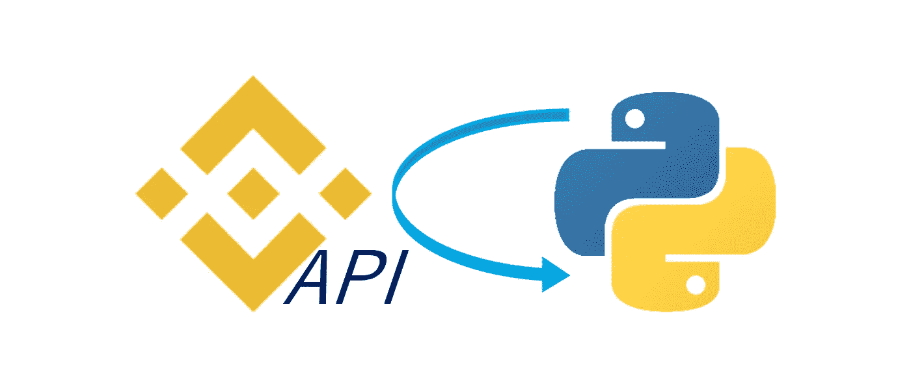

# 使用 Python 管理您的币安帐户

> 原文：<https://medium.com/coinmonks/manage-your-binance-account-with-python-27098e3dbee2?source=collection_archive---------2----------------------->

在我的上一篇文章中，我解释了如何使用币安 API 通过 Python 简单地提取公共数据，比如 OHLCV 数据。在这一篇中，我将进一步向您展示如何使用相同的 API 通过 Python 管理您的帐户。您将能够访问您的帐户余额(每种资产您目前有多少)，甚至可以发布各种订单(购买/出售，市场/限制，带止损或带…