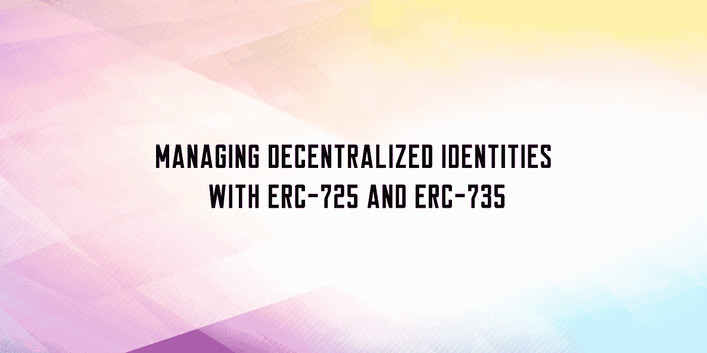

# 用 ERC-725 和 ERC-735 管理分散的身份

> 原文：<https://medium.com/coinmonks/managing-decentralized-identities-with-erc-725-and-erc-735-ecd1a5291107?source=collection_archive---------0----------------------->

在本文中，我们将探讨如何使用 ERC-725 和 ERC-735 这两个广泛使用的以太坊标准来管理分散身份(did)。did 是以太坊区块链上代表个人或组织的唯一标识符，可用于以分散的方式证明身份和其他属性。在本教程结束时，您将知道如何创建和管理…