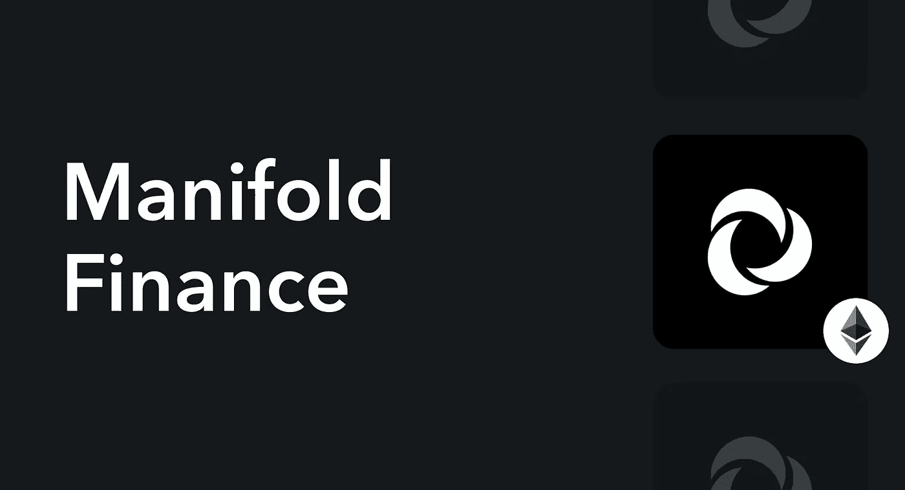
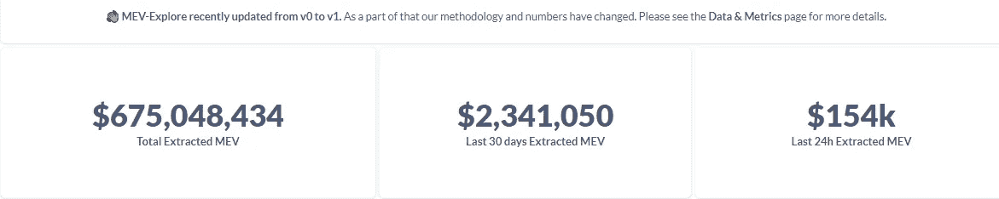

# 流形金融，最适合捕捉 MEV？

> 原文：<https://medium.com/coinmonks/manifold-finance-the-best-positioned-to-corner-mev-68f4caa9ce47?source=collection_archive---------7----------------------->

当以太坊完成向股权证明(PoS)的转移后，Manifold 将成为其中一员。块构建者对交易进行排序(通常目标是构建 MEV 最高的块)，然后将它们作为块发送给 Lido 和 Rocket Pool 这样的块生产者。但是在我们开始分解多种金融之前，让我们解释一下什么是 MEV。

> **什么是 MEV？**

MEV 是矿工试图在 mempool 中确认的所有事务的值。一旦合并完成，验证器将代替挖掘器完成这项工作。但是现在，很多 MEV 是由被称为“搜索者”的人挖掘的，他们试图找到有利可图的交易提交给网络。

> **MEV 为什么重要？**

合并后，MEV 可以帮助验证者赚更多的钱。这可能导致拥有最有价值的资源的人获得最高的 MEV 回报，这将增加集中化的风险。为了让更多的人参与进来，让事情变得更加公平，我们打算将积木式构件功能和验证功能分开。

> 在实践中，这一切是如何发生的？

为了进行区块链交易，用户需要首先将其发送到网络。然后，网络会将事务放在公共或私有内存池中。如果用户希望事务是私有的，他们需要设置一个私有 RPC。此时，我们有三个参与者:

1.  **用户/搜索者:**将向积木搭建者发送一组交易，然后积木搭建者将收取费用。
2.  **积木搭建者:**他们试图找出结合搜索引擎 tx 和私人订购的最佳方式，以赚取最大的利润。
3.  验证者:他们会从所有建造区块链的人花钱买的积木中选出最好的积木。一旦这个街区被纳入区块链，每个帮助创建它的人都将得到一份购买所得。

> **这里的歧管在哪里？**

[歧管](https://www.manifoldfinance.com/)是一个砌块建筑商。这意味着从验证者的角度来看，他们希望成为引用实体。为此，他们必须始终如一地构建“最高价值”的模块。一般来说，它拥有的公共或私人订单流越多，它就越强大。Manifold 有自己的私有 RPC，称为 SecureRPC。

They recently partnered with Sushiswap and both Balancer and LayerZero will be the next to join.

MEV 市场是一个人们可以通过交易赚钱的地方。Manifold 背后的团队表示，他们的大部分收入来自大宗拍卖市场，而不是寿司路由器。有人认为团队在提前卖区块槽。其他收入来自他们的积木业务，只有在合并和未来整合后才会开始。

Total MEV extracted to date, in the last month, and in the last 24 hours, respectively.

> 总之，Manifold 充当验证者和用户之间的中介，以最佳方式将所有 tx 整合到一个块中，为所有利益相关者产生最高的 ROI。

> 交易新手？试试[加密交易机器人](/coinmonks/crypto-trading-bot-c2ffce8acb2a)或者[复制交易](/coinmonks/top-10-crypto-copy-trading-platforms-for-beginners-d0c37c7d698c)