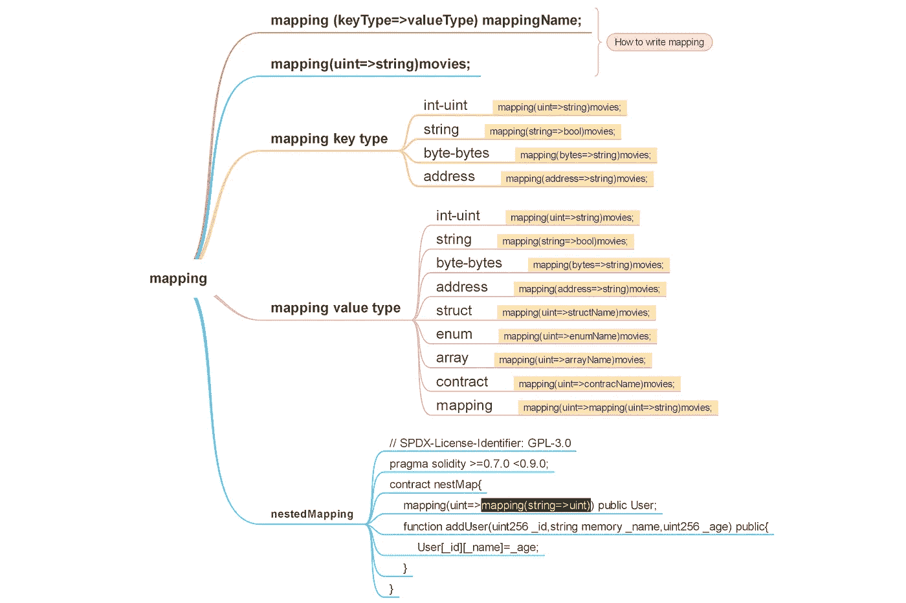

# 从零到英雄的立体映射

> 原文：<https://medium.com/coinmonks/mapping-in-solidity-from-zero-to-hero-a5d7769fd03d?source=collection_archive---------8----------------------->

*   映射是作为数组和结构的引用类型
*   映射是 solidity 中使用最广泛的复杂数据类型之一
*   映射类似于其他语言中的哈希表或字典
*   映射是可以有键和值的哈希表
*   映射允许您保存数据和添加键来指定您的数据
*   将关键字另存为哈希映射到访问值
*   映射存储键值对
*   映射当我们设置新值时，我们也覆盖了旧值
*   映射语法**mapping(key datatype =>value datatype)mapping name**



```
// SPDX-License-Identifier: MIT
pragma solidity ^0.8.0;contract mappingTest{
**mapping**(address=>uint) appleProduct;
}
```

*   **映射中的键类型**可以是任何数据类型或任何契约或枚举，但不允许结构-数组-映射

# 映射关键字类型&枚举

```
// SPDX-License-Identifier: MIT
pragma solidity ^0.8.0;contract mappingTest{
enum **appleEnum**{ipad}
mapping(**appleEnum**=>string) appleProduct;
}
```

# 映射关键字类型和合同

```
// SPDX-License-Identifier: MIT
pragma solidity ^0.8.0;
contract **mappingKey**{
}contract mappingTest{
mapping(**mappingKey**=>string) appleProduct;
}
```

# 不允许映射关键字类型& Struct

```
**//TypeError: Only elementary types, contract types or enums are //allowed as mapping keys.**// SPDX-License-Identifier: MIT
pragma solidity ^0.8.0;contract mappingTest{
struct appleStruct{
uint ipad;
}mapping(appleStruct=>string) **appleProduct**;
}
```

# 不允许映射关键字类型& Array

```
// SPDX-License-Identifier: MIT
pragma solidity ^0.8.0;contract mappingTest{
uint[] appleArray;
**//Error not compile**
mapping(appleStruct=>string) appleProduct;
}
```

**映射中的 ValueType** 可以是任何数据类型，包括复杂类型结构、数组和映射

# 映射值类型和枚举

```
// SPDX-License-Identifier: MIT
pragma solidity ^0.8.0;contract mappingTest{
enum **appleEnum** {ipad}
mapping(uint=>**appleEnum**) appleProduct;
}
```

# 映射值类型和合同

```
// SPDX-License-Identifier: MIT
pragma solidity ^0.8.0;
contract **mappingValue**{
}
contract mappingTest{
mapping(string=>**mappingValue**) appleProduct;
}
```

# 映射值类型和结构

代码 1

```
// SPDX-License-Identifier: MIT
pragma solidity ^0.8.0;
contract mappingTest{struct **appleStruct**{
uint ipad;
}mapping(string =>**appleStruct**) appleProduct;
}
```

代码 2

```
// SPDX-License-Identifier: MIT
pragma solidity ^0.8.7;
contract mappingStruct {struct **allMovies**{
string title;
string director;
}mapping (uint=>allMovies) **movies**;function addMovies(uint id,string memory title ,string memory director)public {
movies[id]=allMovies(title,  director);
}function getFilmDetails(uint id)public view returns(allMovies memory){
return movies[id];
}
}
```

代码 3

```
pragma solidity 0.8.7;

contract mappingStruct {

    struct Person{
        uint256 age;
        string name;
    }

    mapping (uint256 => Person) public User;

    function adduser(uint256 _Id, uint256 _age, string memory _name) public {
         User[_Id].age = _age;
         User[_Id].name = _name;
    }

    function user(uint256 _Id) public view returns(Person memory) {
        return User[_Id];
    }
}
```

# 映射值类型和数组

代码 1

```
// SPDX-License-Identifier: MIT
pragma solidity ^0.8.0;contract mappingTest{
mapping(string=> **uint[]**) appleProduct;
}
```

代码 2

```
// SPDX-License-Identifier: MIT
pragma solidity ^0.8.7;
contract mappingStruct {mapping (uint=>string[]) **mappingAndArray**;function addToMapping(uint myKey1,string memory word1,string memory word2) public{
**mappingAndArray**[myKey1]=[word1,word2];
}function getMappingArray(uint mykey1) public view returns(string [] memory){
return **mappingAndArray**[mykey1];
}
}
```

# 映射&映射(嵌套映射)

代码 1

```
// SPDX-License-Identifier: MIT
pragma solidity ^0.8.0;contract mappingTest{
mapping(address =>mapping(string=>uint)) nestedMapping;
}
```

代码 2

```
// SPDX-License-Identifier: MIT
pragma solidity ^0.8.0;
contract mappingTest{**mapping**(address=>**mapping**(uint=>**mapping**(string=>bool))) threeMapping;
```

# 映射和可见性

您可以将映射类型的状态变量标记为 public，solidity 为您创建一个 getter，key type 成为 getter 的一个参数

```
// SPDX-License-Identifier: MIT
pragma solidity ^0.8.0;contract mappingTest{mapping(address =>uint)  **public** appleProduct1;
mapping(address =>uint)  **internal** appleProduct2;
mapping(address =>uint)  **private** appleProduct3;
}
```

# 从映射中添加和返回值的函数

```
// SPDX-License-Identifier: GPL-3.0
pragma solidity 0.8.0;contract addToMapping{
mapping(uint=>string) apple;function **appleProduct**(uint appleId,string memory _appleProduct)
public{
apple[appleId]= _appleProduct;
}function **getAppleProduct**(uint id) public view returns(string memory){
return apple[id];
}
}
```

# 示例集名称和获取年龄

```
// SPDX-License-Identifier: MIT
pragma solidity ^0.8.0;contract mappingTest{mapping(string=>uint) age;function addToMapping(string memory _name,uint _age) public{
age[_name]=_age;
}function getAge(string memory _name) public view returns(uint){
return age[_name];
}
}
```

# 映射设置和获取值另一个例子

```
// SPDX-License-Identifier: MIT
pragma solidity ^0.8.0;contract mappingTest{
mapping(address =>string)  **ChooseAppleProduct**;function setAppleProduct(string memory appleProduct) public {
**ChooseAppleProduct**[msg.sender]=appleProduct;
}function getMyChoice()public view returns(string memory){
return **ChooseAppleProduct**[msg.sender];
}
}
```

# 映射示例

```
// SPDX-License-Identifier: MIT
pragma solidity ^0.8.0;contract mappingTest{mapping(uint=>address) member;
uint counter;function addMember(address _add) public {
counter++;
member[counter]=_add;
}function getMember(uint id) public view returns(address){
return member[id];
}
}
```

# 将数组添加到映射的函数

```
// SPDX-License-Identifier: GPL-3.0
pragma solidity 0.8.0;contract addToMapping{
mapping(uint=>string[]) apple;function **addAppleProduct**(uint appleId,string memory appleProduct1,string memory appleProduct2,string memory appleProduct3) public{
apple[appleId]= [appleProduct1,appleProduct2,appleProduct3];
}function **getAppleProduct**(uint id) public view returns(string [] memory){
return apple[id];
}
}
```

# 如何删除映射中的值

msg.sender 全局变量消息的发送者(当前调用)

```
// SPDX-License-Identifier: MIT
pragma solidity ^0.8.0;
contract mappingDelete{mapping(address=>string) userName;function setUserName(string memory _name) public {
userName[msg.sender]=_name;
}function getUserName() public view returns(string memory){
return userName[msg.sender];
}function **deleteMappingValue**() public{
delete userName[msg.sender];
}
}
```

# **映射迭代**

虽然映射不支持迭代，但是有一些方法可以解决这个限制。下一个例子说明了迭代映射的方法之一。请注意，就气体使用而言，迭代和循环是以太坊中开销很大的操作，通常应该避免。在这个例子中，维护一个单独的计数器来保持
跟踪存储在映射中的条目的数量。该计数器还充当映射中的键。可以构造一个局部数组来存储映射的值。
可使用计数器执行循环，并可从本地数组中的映射中提取和存储每个值，

```
// SPDX-License-Identifier: GPL-3.0
pragma solidity >=0.7.0 <0.9.0;
contract MappingLooping {mapping (uint => string) Names;
uint counter;function **addtoMapping**(string memory apple) public{
counter = counter + 1;
Names[counter]=apple;
}function **getMappingMember**() public view returns (string[]
memory) {
string[] memory **allAppleProduct** = new string[](counter);
for(uint i=1; i<= counter; i++){
**allAppleProduct**[i - 1] = Names[i];
}
return allAppleProduct;
}
}
```

> 交易新手？尝试[加密交易机器人](/coinmonks/crypto-trading-bot-c2ffce8acb2a)或[复制交易](/coinmonks/top-10-crypto-copy-trading-platforms-for-beginners-d0c37c7d698c)