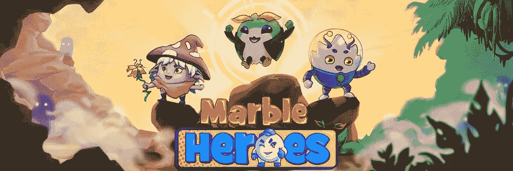
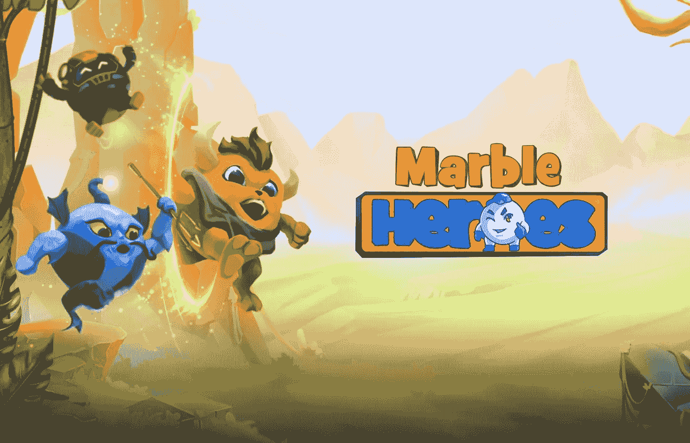
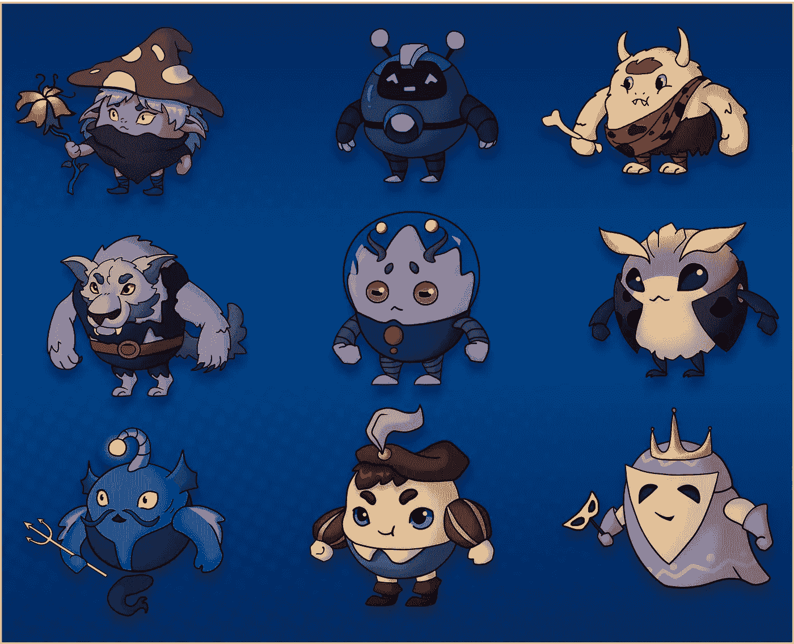
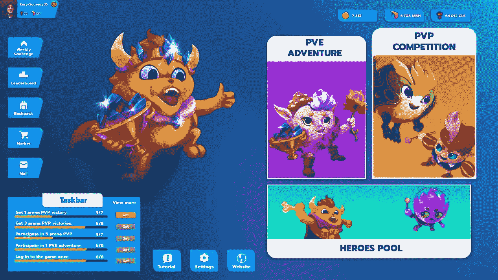
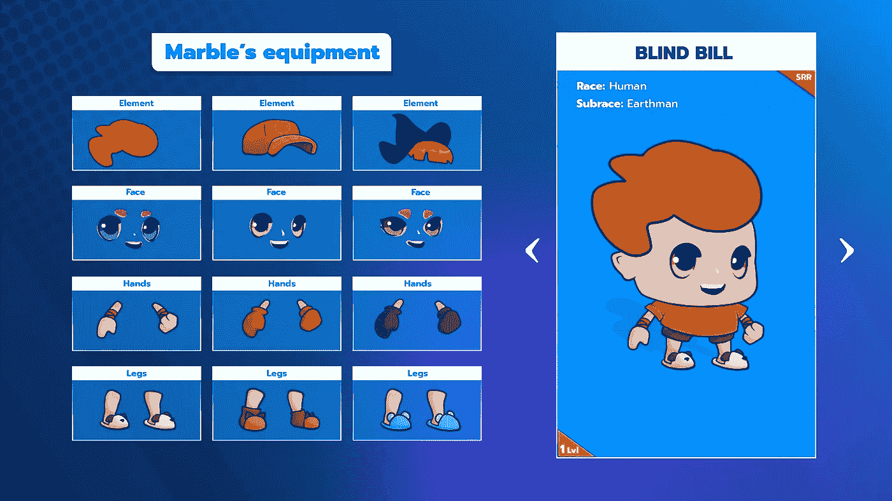
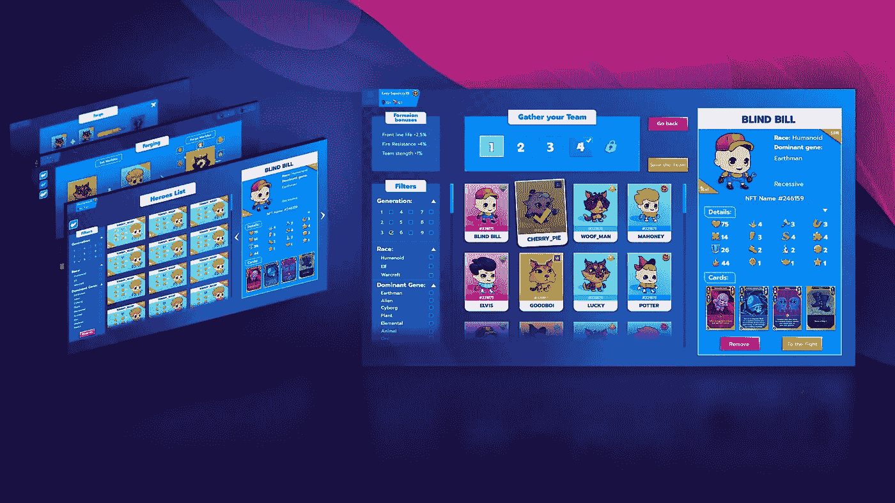

# 大理石英雄:所有你需要知道的免费游戏赚取宇宙。

> 原文：<https://medium.com/coinmonks/marble-heroes-all-you-need-to-know-about-the-free-play-to-earn-universe-e74613273cfe?source=collection_archive---------10----------------------->

Marble Heroes

传统游戏行业长期以策略游戏为主。这些游戏中的大多数是成功的，因为它们遵循了可靠的游戏机制。

这些游戏最初很有趣，但随着时间的推移，它们变得无聊和重复，因为它们太相似了。随着 GameFi 的增长和 2021 年游戏元宇宙的出现，出现了许多全新的名字。

当《弹球英雄》在各大平台首次亮相时，它将成为首批将区块链游戏的优势与传统策略的完美特征相结合的游戏之一。惊人的，巨大的，可爱的大理石英雄宇宙是开发了一个特殊的功能。

# 什么是大理石英雄？

[弹球英雄](https://www.marbleheroes.co/)是一款免费的区块链在线游戏，由 [Vitaliy Yare](https://www.linkedin.com/in/iarema-vitalii) 所有，玩家可以在游戏中找到伙伴，与对手战斗，并利用 NFT 弹球生物获得奖励。

Marble Heroes

除了作为一款卡牌游戏的核心属性之外,《弹球英雄》还融入了中世纪象棋的风格和童话般的想象力。玩家可以在弹球英雄中同时获得乐趣和赚钱，因为它有独特的角色和引人入胜的游戏性。

# 大理石英雄令牌组学。

> **令牌名称:大理石英雄令牌**
> 
> **令牌符号:$MBH**
> 
> **总供应量:5.5 亿**

大理石英雄令牌是一个 ERC 20 令牌建立在 BSC 区块链。它的主要目的是在整个 Marble Heroes 生态系统中进行交易和互动。大理石英雄令牌将被用作生态系统中的本地游戏内货币，以及治理和赌博资源。

# 大理石英雄角色设计。

大理石英雄有三个种族，每个种族有三种不同类型的英雄。以下是大理石英雄赛。

Marble Heroes

# 人族种族。

人族是一个有创造力的种族，擅长利用和改变资源来有效地完成目标。他们是一个智力高，体力中等的种族。它有非常灵活的卡片技巧，可以有效地处理各种情况。

人族由英雄类型组成，例如:

*   **地球人。**

地球人是人族英雄，体能一般。

他们使用多种武器，擅长中远程攻击。它们可以有效地对付大多数物种，因为它们处于大理石宇宙食物链的顶端。

*   **外星人。**

外星人是来到大理石英雄宇宙寻找外层文明新家的人族英雄。尽管有着纤弱的身体，他们却拥有先进的科技知识。他们擅长远程打击。

*   **人造人类。**

人造人是由人工智能建造的人族英雄，人工智能由 AI 矩阵控制。他们擅长中近程攻击。他们增加了自我修复能力和许多备用部件，尽管他们仍然具有地球人的灵活性。

# 精神竞赛。

在大理石英雄宇宙中，一个被称为精神种族的种族拥有可以改变自然能量的神秘魔法技能。他们身体虚弱，却拥有惊人的魔法能力。

Marble Heroes

精灵族的英雄是:

*   **植物。**

在大理石英雄的世界里，植物是最受欢迎的生物。植物有很好的隐蔽和自卫能力。他们拥有从地球吸收能量的神奇能力，并擅长治疗。不幸的是，他们缺乏灵活性。

*   **动物。**

动物，大理石英雄宇宙中的精灵种族英雄，自古以来与植物和平共处。他们经常搬家。他们擅长将远程攻击快速转化为近程攻击。动物有强烈的狩猎本能，这使它们能够更有效地打击敌人的弱点。

*   **元素。**

元素是魔法能量的代表，特别擅长利用行星的魔法能量和能力转化成其他元素。虽然他们有强大的魔法技能，但他们相当虚弱。

# 魔兽争霸赛。

魔兽种族是因为某种邪恶魔法的侵蚀而由精灵变异而来的。通过魔法的使用，他们的体能得到了极大的增强。它们很难清除，而且具有严重的破坏性影响。

Marble Heroes Universe

大理石英雄宇宙中的魔兽英雄有:

*   **半兽人。**

作为魔兽种族的英雄，兽人拥有强大的体质和高疼痛阈值。虽然他们厚厚的皮肤使他们难以承受致命的伤口，但他们的低智商使他们很容易被外表所欺骗。愤怒时，他们拥有难以置信的爆发力。

*   **不死。**

亡灵是魔兽英雄，拥有死亡和灵体的外表，让敌人很难发现他们。当他们想要发动致命的攻击或者将要被攻击时，他们可以躲在敌人周围。

*   **泽格斯。**

小狗是小魔兽英雄，虽然非常脆弱，但当它们团结在一起时，可以恐吓对手。瑞格人擅长融入周围环境，并凭借其巨大的人口优势吞噬对手。

# 大理石英雄商业模式。

大理石英雄将是一个免费的游戏，将作为一项服务。正如[项目白皮书](https://marbleheroes-games.gitbook.io/play-to-earn/)中所述，大理石英雄的商业模式将由强大而多样化的收入模式驱动，例如:

**NFT 销售**——包括英雄、装备和其他游戏内资产的销售。

**交易费**——大理石英雄将收取$MBH 代币交易量的一小部分。

其他收入 —包括广告、高级玩家订阅和服务。这将在游戏成熟后添加。

# 最后的想法。

[项目白皮书中包含的路线图](https://marbleheroes-games.gitbook.io/marble-heroes/road-map-and-future-vision)称《弹球英雄》游戏将于 2023 年第一季度发布。到那时，大理石英雄元宇宙的愿景将已经完全实现，并将是全新的，比以往任何时候都更令人惊叹。

> **更多最新更新请点击大理石英雄链接:**
> 
> 📢推特:[https://twitter.com/marble_heroes](https://twitter.com/marble_heroes)
> 
> 📢网址:[http://www.marbleheroes.games/](http://www.marbleheroes.games/)
> 
> 📢https://www.facebook.com/gaming/marbleheroes.official
> 
> 📢电报社区:[https://t.me/marbleheroes_chat](https://t.me/marbleheroes_chat)
> 
> 📢不和:[https://discord.gg/CqQAEK5tRW](https://discord.gg/CqQAEK5tRW)
> 
> 📢白皮书:[https://marbleheroes-games.gitbook.io/play-to-earn/](https://marbleheroes-games.gitbook.io/play-to-earn/)

## 不要忘了订阅这个频道，并继续关注 mor e 关于游戏赚钱项目的更新。

## 只有优质内容。

> 交易新手？尝试[加密交易机器人](/coinmonks/crypto-trading-bot-c2ffce8acb2a)或[复制交易](/coinmonks/top-10-crypto-copy-trading-platforms-for-beginners-d0c37c7d698c)