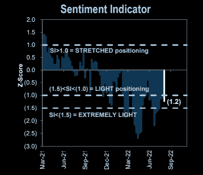
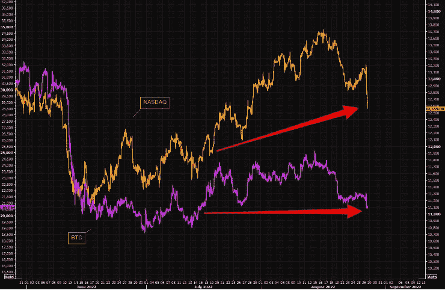

# 市场大屠杀，9 月季节性，外流之王

> 原文：<https://medium.com/coinmonks/market-bloodbath-september-seasonality-the-king-of-outflows-b27a007a8a5f?source=collection_archive---------24----------------------->

嘿，我是基兰！市场又将迎来新的一周，以下是需要注意的关键事件，以及来自投资银行的最有趣的宏观研究。我希望能在本周的[贸易挑战](http://www.traderseed.io/)中与你交谈，并且一如既往，如果你有任何问题，请在下面给我留言。

# 每周观察列表

本周值得关注的关键事件是周五发布的美国 8 月份就业报告。这将是美联储 9 月 20 日至 21 日会议前的最后一份就业报告，届时他们将决定加息多少才能控制住通胀。

同样在本周，欧元区将于周三公布 8 月份的 CPI 数据，预计年通胀率将从 7 月份的 8.9%升至 9.0%，远高于欧洲央行 2%的目标。这些数据可能会增加欧洲央行在即将到来的 9 月会议上大幅加息的压力，即使经济衰退的风险越来越大。

# 宏观视角

**九月季节性。从历史上看，9 月是股市一年中表现最差的月份。看起来我们今年提前了几天开始，因为标准普尔 500 指数周五下跌了 3.4%，今天上午再次承压。**

**S & P 500 -3%天。下周会发生什么？在周五之前，今年到目前为止，我们有 6-3%的天数。然而，接下来一周的价格走势是不确定的。**

1.4 月 29 日:-3.6%下周:-0.2%
2。5 月 5 日:-3.6%下周:-5.2%
3。5 月 9 日:-下周 3.2%:+0.4%
4。5 月 18 日:-4.0%下周:+1.4%
5。6 月 13 日:-3.9%下周:-2.0%
6。6 月 16 日:-下周 3.3%:+3.5%

周五的抛售是今年第七次单日跌幅达到或超过 3%。在过去的 70 年里，只有 2022 年的停工天数超过 3%的年份？2008 年、2009 年和 2020 年。2008 年我们有 23 个，所以如果我们今年要接近这个数字，还有很长的路要走。

**S & P500 2008 vs 2022 类比。**说到 2008 年，如果类比从这里继续呢？到目前为止，今年与 2008 年非常接近，让我们看看大的最后阶段是否会从这里开始。

**定位远非“极轻”。高盛出色的定位指标是:a)仍未达到“极低”水平；b)远低于今年早些时候的极端水平；c)接近自股市见顶以来的平均水平。当你处于熊市时，你会想到很多…**

**比特币&科技连线。**在最近的科技股暴跌之后，纳斯达克与 BTC 的差距略有缩小，但仍然相当大。这两个总有一天会再见面的，问题是在哪里？

欧洲——外流之王。欧洲有什么看涨的事情发生吗？看到资金连续第 28 周流出欧洲股市，并不令人意外。

我希望你觉得这很有趣，很有用。像往常一样，把风险管理放在第一位，安全交易，保持敏捷。

祝你一周愉快！
基兰
www.traderseed.io

**想在本周交易市场吗？** 100k 节目起 **$75** ！！点击这里查看新的 Traderseed 程序 [**！**](http://www.traderseed.io/)

> 交易新手？尝试[加密交易机器人](/coinmonks/crypto-trading-bot-c2ffce8acb2a)或[复制交易](/coinmonks/top-10-crypto-copy-trading-platforms-for-beginners-d0c37c7d698c)