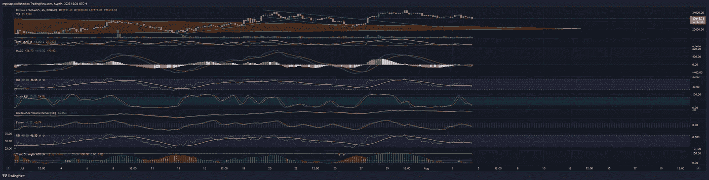
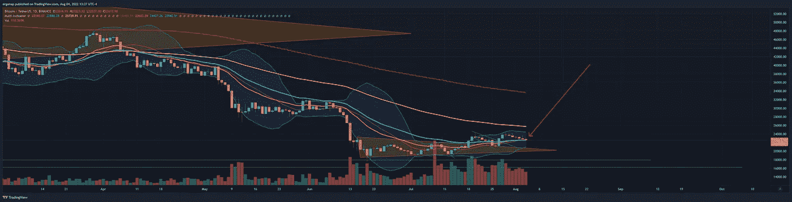
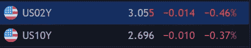
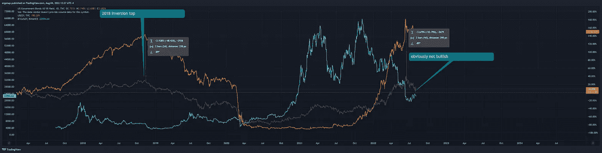
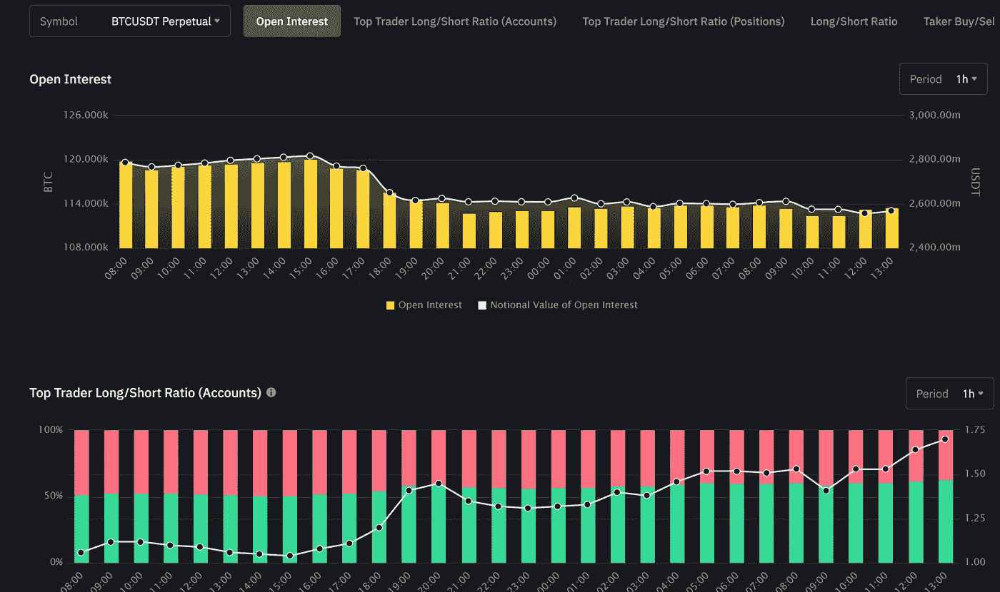
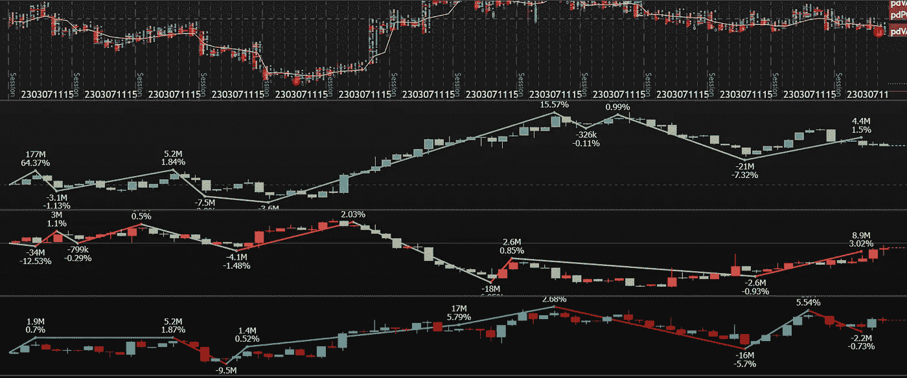

# 市场感觉非常混乱——危险！

> 原文：<https://medium.com/coinmonks/market-feels-very-toppish-danger-ff664c1566b9?source=collection_archive---------23----------------------->

BTC/加密货币市场分析 8/4

清晰:我回到现金。利润->银行。抱歉，但这对这里的市场来说不是好消息。还有上涨的空间，但我们还没有达到。反弹似乎要结束了。如果有什么不同的话，我会期待 BTC 在你能统治的地方。

this screams consolidation downward is coming, very soon. I’d love to be wrong, but I doubt it.[https://www.tradingview.com/x/oXQdPv5J/](https://www.tradingview.com/x/oXQdPv5J/)

最大的危险就在这里。这里的下行风险远大于上行风险。

cross down under daily 34EMA and I’ll see you at 10k. Clearly everyone will be shocked, except me. [https://www.tradingview.com/x/EBnInyTa/](https://www.tradingview.com/x/EBnInyTa/)

我们应该有几周甚至几个月的时间来计划这件事，所以底部不会在一夜之间到来。请记住,[反向收益率曲线](https://ig.ft.com/the-yield-curve-explained/)当然在起作用。一个大的。

 [## 反向收益率曲线:投资者为何密切关注

### 债券市场正在发出关于美国经济增长前景的警告信号，就像各国央行行长…

ig.ft.com](https://ig.ft.com/the-yield-curve-explained/) 

如果你认为我们一直看涨，我想提醒你下面是一个大问题。

 [## 收益率曲线反转达到 22 年来的最大水平

### 2 年期和 10 年期美国国债之间的收益率曲线已经反转至 22 年来的最宽点，可追溯至…

seekingalpha.com](https://seekingalpha.com/news/3867254-yield-curve-inversion-hits-widest-level-in-22-years) 

我将为那些看不懂的人复制这篇文章(反正我喜欢绕过 seekingalpha 的付费墙尝试):

> 2 年期和 10 年期国债收益率曲线已经反转到 22 年来的最宽点**，可以追溯到 2000 年 9 月。**
> 
> **周四上午，2 年期和 10 年期国债收益率之间的息差徘徊在-38 个基点左右。在当天早些时候的行动中，美国 10 年期国债收益率( [US10Y](https://seekingalpha.com/symbol/US10Y?source=content_type%3Areact%7Csection%3Amain_content%7Cbutton%3Abody_link%7Cfirst_level_url%3Anews) )下滑 7 个基点，至 2.67%，而美国 2 年期国债收益率( [US2Y](https://seekingalpha.com/symbol/US2Y?source=content_type%3Areact%7Csection%3Amain_content%7Cbutton%3Abody_link%7Cfirst_level_url%3Anews) )回落 5 个基点，至 3.05%。**
> 
> **更大的画面，2022 年，10 年期已经上涨 114 个基点，2 年期上涨 229 个基点。今年迄今，这两种工具之间的息差收缩了 115 个基点。**
> 
> **从历史上看，延长的反转期往往预示着未来的市场低迷。自 2000 年以来，有两个主要的例子:2006 年至 2007 年，收益率曲线反转了一段较长的时间，并成为 2008 年至 2009 年大衰退的前兆。此前，类似的情况发生在 2000 年，预示着 2001 年至 2003 年的市场崩溃。**
> 
> **DoubleLine Capital LP 首席执行官杰弗里·冈德拉奇[表示](https://seekingalpha.com/news/3866991-nasdaq-sp-and-dow-futures-push-higher-and-the-yield-curve-inverts-further?source=content_type%3Areact%7Csection%3Amain_content%7Cbutton%3Abody_link%7Cfirst_level_url%3Anews)“2 年期 10 年期收益率曲线的反转势头正在增强。现在是 36 个基点。前路坎坷。”**

**简单地说，这意味着聪明的投资者现在想投资债券，而不是以后想投资安全的资金。这暗示着崩溃即将来临。**

****

**here’s the photo version.**

****

**blue is btc, yellow is the other bond. Notice some similarities here.**

**我们在真正的 btc 底部见。我想我们很快会找到的。**

**勘误表:融资数据似乎显示空头正在获利，多头正在变得过大。**

****

**this looks like either longs are building or shorts are taking profit. I assume the latter based on how it’s looking.**

****

**exocharts is telling me shorts are leading hte show on bitmex as well**

**另外提醒:Eth POS 再次延迟，这将与 toppish 一致。**

> **交易新手？试试[密码交易机器人](/coinmonks/crypto-trading-bot-c2ffce8acb2a)或者[复制交易](/coinmonks/top-10-crypto-copy-trading-platforms-for-beginners-d0c37c7d698c)**