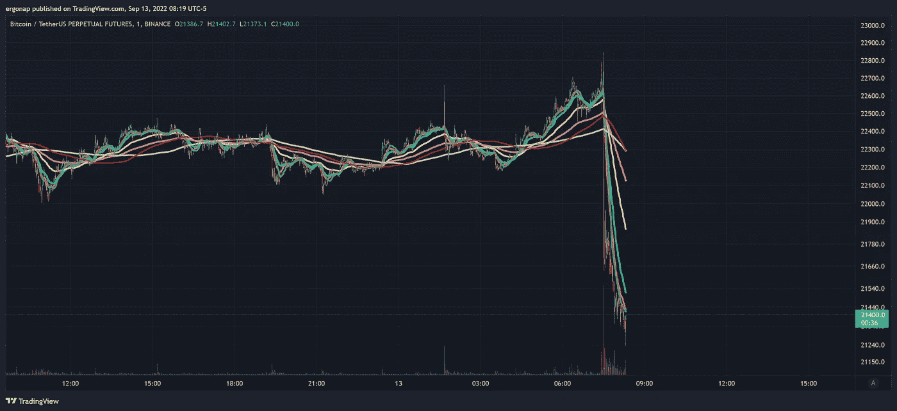

# 市场下跌

> 原文：<https://medium.com/coinmonks/market-go-down-1dfc3a19f2fe?source=collection_archive---------44----------------------->

[https://www.tradingview.com/x/5SBruiDN/](https://www.tradingview.com/x/5SBruiDN/)

海量 CPI 数据出来，一切又回到宏观利空。

提醒一下，这篇文章强调了基本的加密问题。他们不是在开玩笑。

 [## 不可能

### 我开始看到一系列的论文，每一篇都表明一些关于加密货币生态系统的断言…

blog.dshr.org](https://blog.dshr.org/2022/09/impossibilities.html) 

密码量子警报，[2022 年 9 月 13 日上午 5:01]
🚨🚨🚨10，874.98 # BTC(＄243，556，778)
流入#比特币基地专业

密码量子警报，[2022 年 9 月 13 日上午 5 点 48 分]
🐳🐳🐳9，991.07 # BTC(＄225，385，428)
合计流入#霍比环球

密码量子警报，[2022 年 9 月 13 日上午 6:49]
🐳🐳🐳30，897.13 # BTC(＄696，591，441)
合计流入#火币全球

密码量子警报，[2022 年 9 月 13 日上午 7 点 17 分]
🐳1，500.01 # BTC(＄33，894，697)
流入#Bitfinex 的资金总额

> 交易新手？尝试[加密交易机器人](/coinmonks/crypto-trading-bot-c2ffce8acb2a)或[复制交易](/coinmonks/top-10-crypto-copy-trading-platforms-for-beginners-d0c37c7d698c)