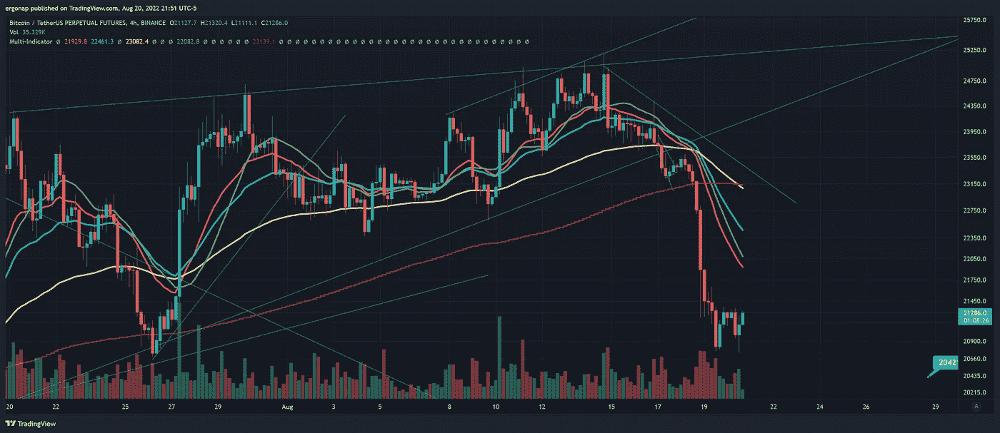
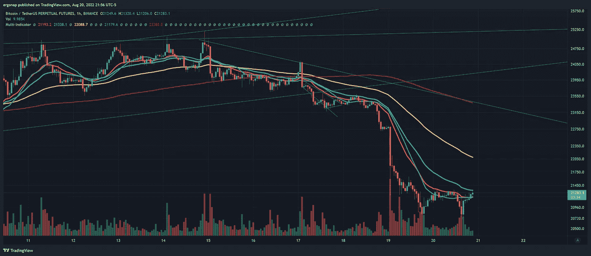
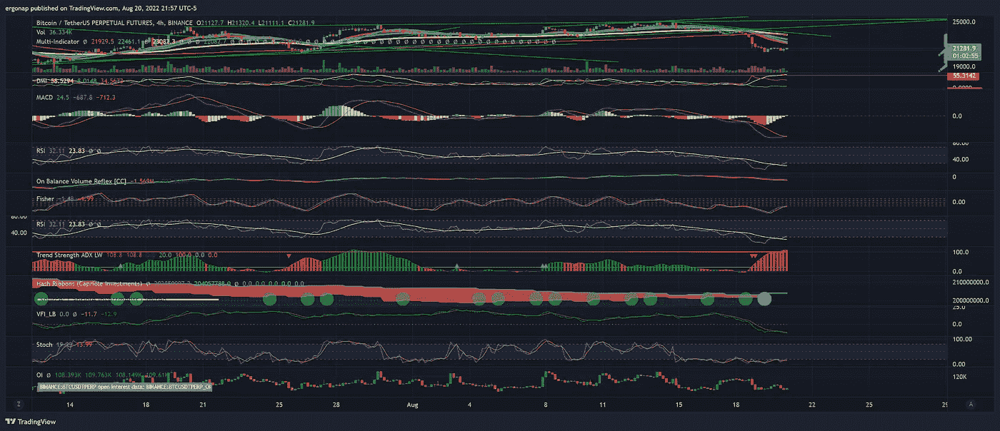

# 市场下跌(咄)

> 原文：<https://medium.com/coinmonks/market-go-down-duh-e1b72b616d0b?source=collection_archive---------27----------------------->

比特币/加密货币市场分析 8/20

我知道每个人都对市场下跌感到惊讶。永远地宣布它。

right now we have a laughable countertrend in a bear market. Just look at the volume! [https://www.tradingview.com/x/euw488AX/](https://www.tradingview.com/x/euw488AX/)

这是新的熊市延续，这是一个很好的做空点，因为我们正在第 n 次测试同一个顶部。即使是现在，在最短的时间框架内(下面 1 小时),一个很长的，没有的量也在减少

if anything, I think we’re going much lower from here. [https://www.tradingview.com/x/5jx8wpa9/](https://www.tradingview.com/x/5jx8wpa9/)

任何地方也没有指标发出长时间的尖叫。

they are screaming get the hell out of the market, though. [https://www.tradingview.com/x/izRThIDH/](https://www.tradingview.com/x/izRThIDH/)

融资数据显示，散户多头对比特币的疯狂看多程度不亚于对龙卷风现金的疯狂看多程度，原因也是一样的。我们会看到这些多头在哪里清算。

> 交易新手？试试[加密交易机器人](/coinmonks/crypto-trading-bot-c2ffce8acb2a)或者[复制交易](/coinmonks/top-10-crypto-copy-trading-platforms-for-beginners-d0c37c7d698c)