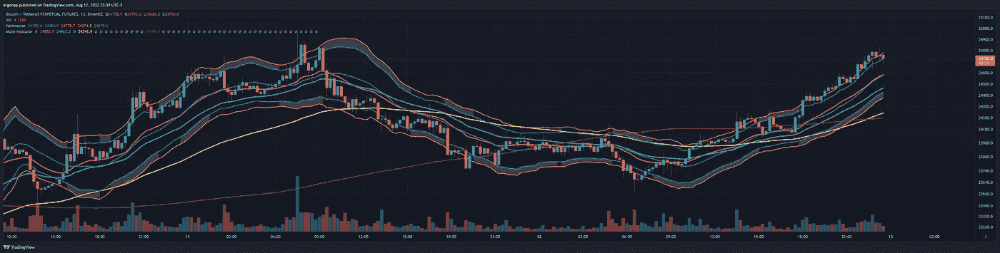
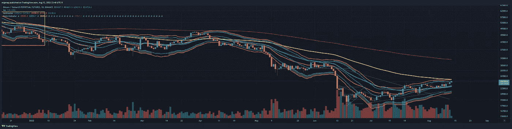
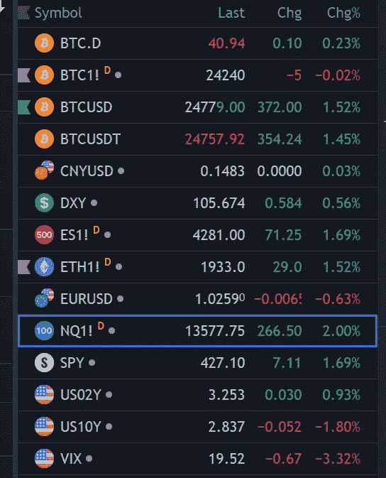

# 市场横盘整理

> 原文：<https://medium.com/coinmonks/market-go-sideways-36bf7a3293fd?source=collection_archive---------37----------------------->

比特币/加密货币市场分析 8/12

这将是一个简单的周末。我在那里没看到什么。什么都没有改变。我们看好低交易量，这是一个激烈竞争的市场。

market is bullish and stupid because market is stupid. the end. [https://www.tradingview.com/x/jtPjzwEm/](https://www.tradingview.com/x/jtPjzwEm/)

zoom out a bit, and you can see a major retest is potentially coming. 25.3k, where I will indeed be setting some shorts and expecting a rejection, unless magic happens this weekend. [https://www.tradingview.com/x/QmvssLnE/](https://www.tradingview.com/x/QmvssLnE/)

融资数据显示，多头在这个泵和/或在过去几天消退，所以听起来像是接下来要发生什么的时候了。50/50 的积累或滚出去，很多人都期待下降，我仍然不相信。如果有很多变化，黄色均线是另一个故事，但老实说，市场现在正在寻找顶部，而不是底部。

所以对我来说，我会坐在现金，放松，不要太担心。市场周末休市。我们将会看到 BTC 是否试图在芝加哥商业交易所之外寻找突破口，我对此表示怀疑。芝加哥商业交易所收于 24.2k，因此至少本周末任何高于 24.2 的价格都将再次触及。

notice BTC1 at 24.2, spot at 24.7 and BTC dominance quite low.

我认为我们会看到一些收益率反转+ dxy 月亮，但这是时间问题。

> 交易新手？试试[加密交易机器人](/coinmonks/crypto-trading-bot-c2ffce8acb2a)或者[复制交易](/coinmonks/top-10-crypto-copy-trading-platforms-for-beginners-d0c37c7d698c)