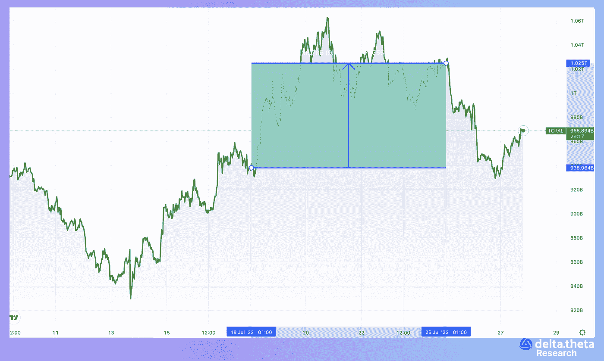
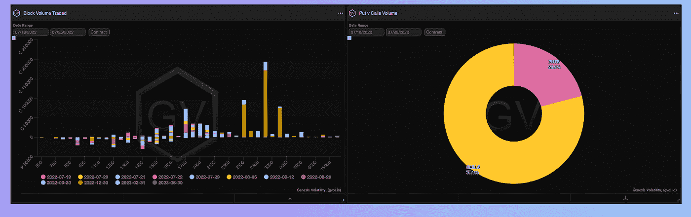

# 市场准备好迎接新的挑战。—每周回顾

> 原文：<https://medium.com/coinmonks/market-ready-to-the-new-run-weekly-revi-35d317195bd5?source=collection_archive---------21----------------------->

加密市场又经历了一周围绕“底部”的盘整。本周初，总市值指数为 9992.8 亿美元。然后，我们可能会看到 1.06 万亿美元的局部峰值(该指数在一个半月内首次回到 1 万亿美元以上)。到本报告所述期间结束时，该指数降至 9 591 亿美元。因此，总资本化指数的最终跌幅为 4.02%。

在很长一段时间内首次突破 20000–22000 走廊后，比特币价格在过去一周内重返该走廊。本报告所述期间，比特币始于 23 712 点。第一天，当地达到 24 208 点的高点。然后，到每周结束时，这一比率有系统地下降到 21 300 英镑。期末最终跌幅为 8.5%。

以太坊，在过去的一段时间里显示出一种稍微不同的动态。从 1551 的水平开始，资产比率没有超过 1640-1528 的走廊，直到期末，下降到 1457 的水平。到周末，跌幅达到 6.06%。

**新闻**

分散式音乐流媒体协议 Audius [报告了一起黑客攻击](https://decrypt.co/105913/how-audius-was-hacked-6m-ethereum-tokens)。一名黑客利用管理系统中的恶意投票从社区金库中窃取资金。CertiK 称，黑客成功改变了 Audius 管理系统使用的智能合约中的某些配置。由于这些变化，罪犯能够成为合同的“保管人”。然后，黑客创建并批准了一项管理提议，要求从社区金库转移 1800 万个音频令牌。根据链上的数据，黑客攻击发生在美国东部时间周六晚上 7 点。虽然被盗令牌的市场价值超过 600 万美元，但在市场大幅下滑的情况下，黑客只能以 705 乙醚(110 万美元)的价格出售它们。被盗资金仍在黑客的地址。

网络 3 游戏《被解放的众神》[背后的区块链游戏开发商已经裁减了“20 多名”员工](https://www.gamedeveloper.com/business/web3-developer-immutable-games-studio-hit-with-layoffs)。据 LinkedIn 上的 310 名员工称，这一数字约占 Immutable 员工总数的 8%。此次重组的重点是《不受束缚的上帝》(Gods Unchained，Immutable Games)的旗舰战略卡牌游戏，该游戏配有 NFT 代币。其他裁员集中在 Immutable 的人力资源团队。据其中一人说，裁员是在全体员工即兴开了 15 分钟会议后进行的。

在周一披露美国证券交易委员会(SEC)正在调查该交易所后，比特币基地股票在周二交易开始时下跌了 7.71%。据彭博报道，美国证券交易委员会正在调查比特币基地不当允许几个代币交易，本应登记为证券。在本文发表时，该公司的股价为 55.6 美元。

由前 Meta 员工创建的区块链初创公司 Aptos 宣布，由 FTX 风险投资公司和 Jump Crypto 领投的 1.5 亿美元[。根据一份新闻稿，这家初创公司的最新一轮融资包括新的投资者，如 Griffin Gaming Partners、Franklin Templeton、Circle Ventures 和 Superscrypt。FTX 风投此前在 3 月份加入了 Aptos 融资轮，这家区块链开发商从 a16z、Tiger Global 和 Multicoin Capital 等投资者那里筹集了 2 亿美元。FTX 风险投资公司的投资合伙人拉姆尼克·奥罗拉表示，区块链技术需要专注于可扩展性、安全性和易用性，以覆盖“下一个十亿用户”。Aptos 今年筹集了 3.5 亿美元，计划投资于开发其安全且可扩展的一级区块链。](https://www.coindesk.com/business/2022/07/25/aptos-labs-raises-150m-to-revive-diem-in-ftx-ventures-led-funding-round/)

# 市场情况

虽然比特币最大的公众持有人之一特斯拉已经出售了很大一部分股份，但以类似水平购买的其他持有人继续持有。根据分析服务公司 Glassnode 的数据，在过去的周期中，现在已经形成了三个主要的购买水平——大约 20 000/30 000/40 000。此外，20 000 点的水平是最近几个月才形成的。这一动态进一步证实了“整数”的心理价值，也表明当前市场上有大量买家准备在价格暴跌时回购 BTC。

# 期权市场

在现货市场快速上涨后，BTC 和瑞士联邦交易所的看涨期权优势仍然相当高。由于大宗交易——买入价差和“蝴蝶”交易(执行日期在今年年底),未平仓合约的水平大幅上升。目前的价格水平已经显示了相当多的积累，大多数负面事件已经反映在价格中，因此交易者有风险偏好，并期待今年年底更加成功。然而，如果我们比较去年的牛市时期，这种谨慎的乐观情绪在目标上是非常不同的。当时，现货市场上交易活跃，交易水平比目前高出数倍。现在，BTC 的目标水平是 25000-30000，这与去年的高点相差甚远。

在本周的美联储会议之前，市场正在积累流动性，并在决定做出之前避免积极的方向选择，保持谨慎的乐观态度。未来几个月在宏观统计方面将是决定性的，并将允许对全球市场的融资条件进行更准确的预测，这将为加密货币价格的未来增长增加确定性和可能的流动性。

> 交易新手？试试[加密交易机器人](/coinmonks/crypto-trading-bot-c2ffce8acb2a)或者[复制交易](/coinmonks/top-10-crypto-copy-trading-platforms-for-beginners-d0c37c7d698c)