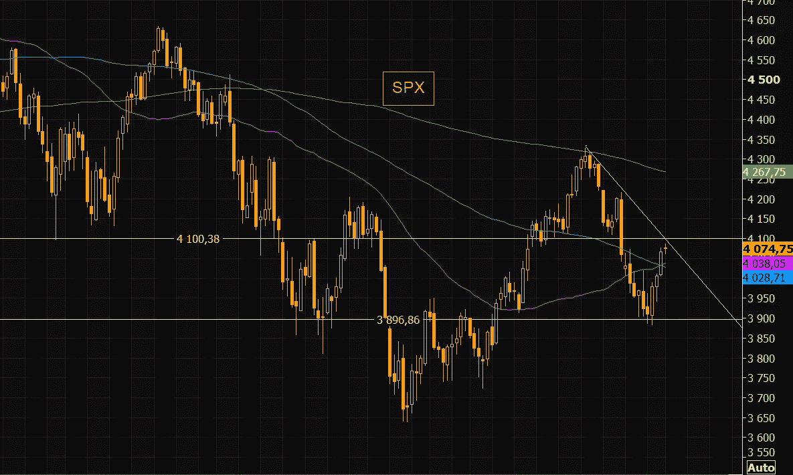

# 市场情绪尖叫买入，比特币&纳斯达克再次相遇，全球楼市已见顶

> 原文：<https://medium.com/coinmonks/market-sentiment-screaming-buy-bitcoin-nasdaq-meet-again-the-global-property-market-has-topped-cebdee79f06a?source=collection_archive---------21----------------------->

嘿，我是基兰！市场又将迎来新的一周，以下是需要注意的关键事件，以及来自投资银行的最有趣的宏观研究。我希望能在本周的[贸易挑战](http://www.traderseed.io/)中与你交谈，并且一如既往，如果你有任何问题，请在下面给我留言。

# 每周观察列表

本周，随着世界各地 8 月份 CPI 数据的公布，通胀将再次成为人们关注的焦点。印度将于周一发布 CPI 报告，德国、西班牙和美国都将于周二发布，英国将于周三发布报告，法国将于周四发布报告，意大利和整个欧元区将于周五发布报告。

人们预计美国的通胀将有所缓解，月度核心 CPI 预计为 0.3%，与上月持平；这将标志着自去年秋季以来的最低连续读数。这些期望在欧洲有很大不同；预计英国的核心 CPI 将环比增长 0.8%，这是一个显著的增长，而整体 CPI 预计将再增长 0.6%。

# 宏观视角

**极轻的定位。**高盛的情绪指标再次闪烁“极端买入”。标准普尔 500 指数的头寸仍然严重偏向下行，这往往会导致反向挤压上行。

SPX 技术面——反弹最容易的部分已经结束。SPX 指数在几个交易日内从 3900 点大幅反弹至近 4100 点。4100 是第一个更大的阻力，因为从 8 月中旬开始的负趋势线正好在这个位置。我们高于 50 和 100 日移动平均线，但仍远低于 200 日。4150 和 4200 是下一个要关注的阻力位，如果我们收在 4100 点以上的话。支持的有:4000 和 3900。

**S & P500 估值压缩。S & P 500 市盈率倍数从 1 月份的 21 倍压缩到现在的 17 倍。所有触底过程的一部分。2008 年估值低于 12 倍，因此我们仍可能看到更多的下跌。**

通常情况下，股市直到衰退中期才会见底。高盛宏观策略师吉姆·里德写道:“从历史上看，标准普尔 500 指数通常只会在衰退中见底，而且通常要到衰退中期才会见底。”里德预计，美国经济将在 2023 年进入衰退。因此，他们还认为标准普尔 500 指数“有可能”在那一年跌至低点，然后才会继续反弹。

**急需下行保护。上周，机构交易员购买了价值 81 亿美元的看跌期权。他们买入了不到 10 亿美元的看涨期权。这是 2008 年的 3 倍。**

**比特币 v 纳斯达克再次相遇。普通读者会知道，我一直在跟踪 BTC 与纳斯达克的相关性。尽管纳斯达克指数表现优异，BTC 似乎陷入了深渊，但 BTC 股市本周却有了惊人的反弹。**

**全球房地产市场已经见顶。**过去十年房价上涨最快的最热门居住城市正在放缓和逆转。再加上中国目前的房地产危机，我们可以看到，全球金融体系遭受大规模冲击的可能性正变得越来越明显。我将继续密切关注此事。

我希望你觉得这很有趣，很有用。像往常一样，把风险管理放在第一位，安全交易，保持敏捷。

祝你一周愉快！
基兰
www.traderseed.io

想要交易本周的市场吗？道具交易程序从 **$75** 开始！！点击这里查看新的 Traderseed 程序 [**！**](http://www.traderseed.io/)

> 交易新手？尝试[加密交易机器人](/coinmonks/crypto-trading-bot-c2ffce8acb2a)或[复制交易](/coinmonks/top-10-crypto-copy-trading-platforms-for-beginners-d0c37c7d698c)