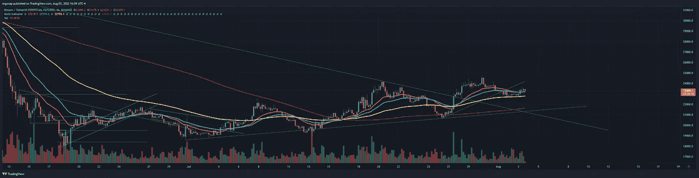
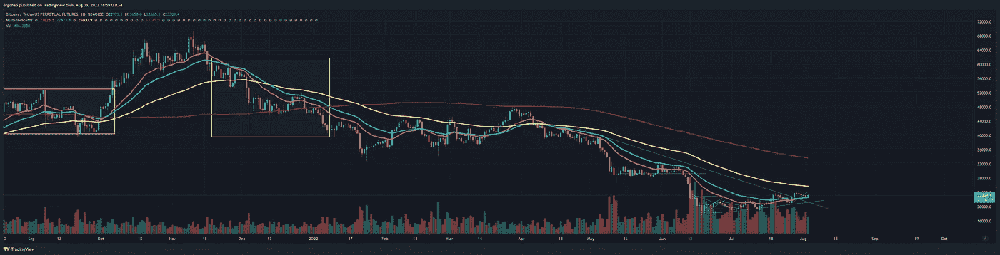
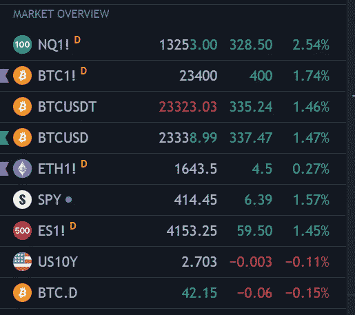
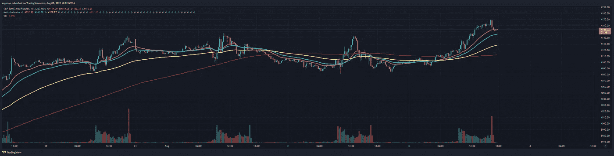
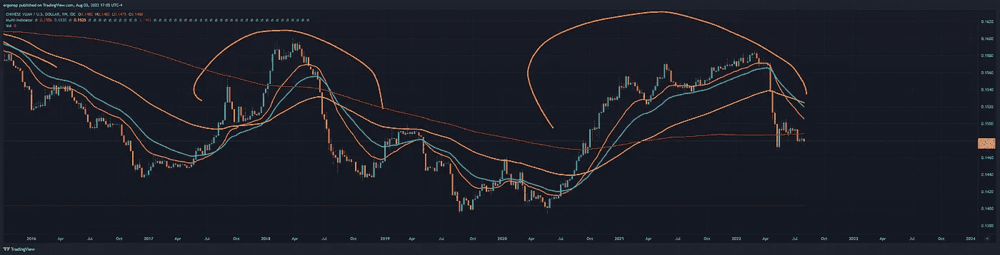
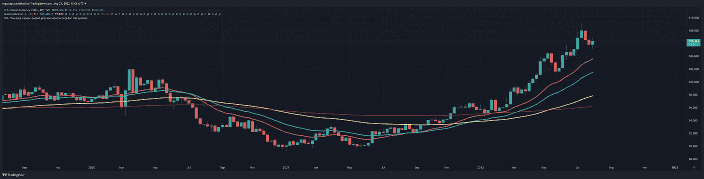
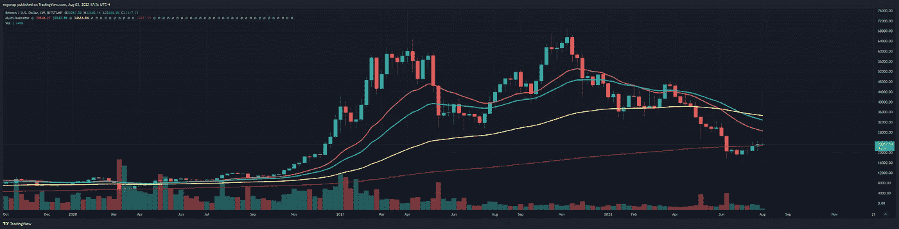
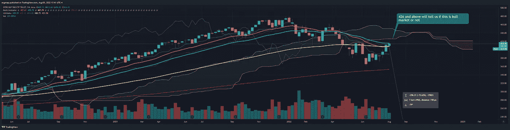

# 市场地位像往常一样由间谍主导

> 原文：<https://medium.com/coinmonks/market-status-lead-by-the-spy-as-usual-74d6d768?source=collection_archive---------48----------------------->

## 比特币/加密货币市场分析 8/3

今天，和往常一样。我们总体上看好 4h 指标，这些指标通常会领先一点，我们仍然大多看跌 1d 指标。在马的上面，在马的下面。

we are bullish overall, it’s that simple for now. [https://www.tradingview.com/x/GSgVqmzY/](https://www.tradingview.com/x/GSgVqmzY/)

keeping it simple because special people complain. [https://www.tradingview.com/x/4mDdNyVa/](https://www.tradingview.com/x/4mDdNyVa/)

这里没有太多要知道的，因为这不是一个结论性的图片。但这是简单的 TLDR。

当你面对现实时，情况确实会变得比这复杂一些。很容易在下雨的时候说下雨，很明显。日线图显示，你应该可以相对持有，因为市场是看涨的。

spy closed strong today, but bitcoin didn’t quite move all too much but went with the drop on the ES after hours

ES after hours. Red already, again. Does it tell you tomorrow? No. Not for about 8 hours, but it could.

我们的风险是什么？嗯，我可以写很多正在发生的事件，随着台湾的局势[升级](https://www.cbsnews.com/news/nancy-pelosi-taiwan-china-taipei-arrival-plane/)中国开始炫耀武力，毫不奇怪地显示出中国有多弱，因为他们什么也没做。强烈的言辞/零行动向你表明他们非常害怕美国，就像他们出于对制裁的恐惧而支持俄罗斯的反应(0)一样。这是会影响市场的事情。

CNY, see you at the bottom.

尽管像亚历克斯·琼斯这样的混蛋喜欢告诉人们一大堆阴谋和[因为太便宜而找不到好律师而陷入自己的困境](https://www.thedailybeast.com/alex-jones-damning-texts-accidentally-sent-to-sandy-hook-lawyer)，但是很多人想告诉你美国很弱/雪花/等等。他们在财务上大错特错。crypto 还会涨吗？有一点，是的，它很弱，但可能如此——鉴于 BTC 最近有点脱离 DXY。

DXY says hello. That’s bullish DXY for months, even if it pulls back.

目前这一切都是难以置信的短期行为。我提到了两个宏观方面(DXY，台/俄/中)，但我甚至没有提到最基本的:BTC。我们能重复一下 2019 年发生的[吗？也许吧。我们能重复一下 2015 年](https://www.tradingview.com/x/1F1vUkE7/)[发生的事情吗？也有可能。但是回顾过去，事情会很快改变。](https://www.tradingview.com/x/KDBNoaPs/)

this is very much not good for btc. This is a “we’re not into helldump yet”. Not a “we’re in recovery”. [https://www.tradingview.com/x/lIj3GcSz/](https://www.tradingview.com/x/lIj3GcSz/)

我们一天比一天悲观，如果我们达到 32，35k 呢？我肯定要完全回归现金。我不介意免费搭额外的钱，但是免费可以突然结束。事情会爆发，人们会忘记熊市吗？是的，绝对的。那就是它可能会回来的时候。

美国尚未称之为衰退——当他们称之为衰退时，那将是真正的底部，而不是在此之前。比特币到时候会涨吗？我的猜测是很难否定的，但时间会证明一切。

与此同时，享受牛市，但要记住——我们不是在牛市中，所以它不会永远持续下去。

下面是真正的答案。426 美元的间谍会告诉我们一切。

bull or bear is right here. Anything up till then is noise. [https://www.tradingview.com/x/NWsyAwLS/](https://www.tradingview.com/x/NWsyAwLS/)