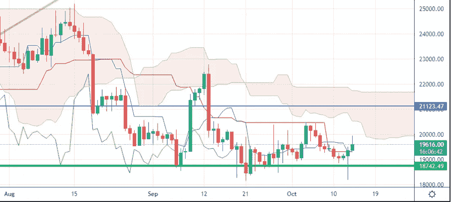

# 美国通胀数据期间的市场风暴——我的支持顶住了压力！

> 原文：<https://medium.com/coinmonks/market-storms-during-usa-inflation-data-my-support-held-the-pressure-70a543eea76d?source=collection_archive---------37----------------------->

我们将进入哪个市场阶段一直是我们上次约会的开场白。我们要听牛市还是熊市？我们会看到牛市还是熊市？
欢迎来到市场冲浪，我们已经进行了第 24 次约会，我希望通过这些简单的技术分析，我们已经在某些方面帮助了你，甚至只是评估不同的市场观点。

## 让我们从我们通常的每周视角开始

Weekly Chart — Source: Tradingview

价格再次测试了仍然作为支撑的绿线价格区域。
这是最近几周我每周市场筛选中最常出现的一句话。在[宣布美国通胀数据](https://nypost.com/2022/10/13/inflation-hits-8-2-in-september-as-core-prices-surge/)达到 8.2%期间，绿色支撑线被暂时打破。

无论如何，在比特币价格从 19100 美元跌至 18200 美元时，市场出现了最初的恐惧。一旦一些做空者和止损者被移除并执行，市场又开始在一个完美的熊市陷阱中颠簸，随之而来的是一个牛市陷阱，这就是我写这篇文章时看到的。如果空头陷阱更难发现，因为你永远无法提前衡量这样一个消息的影响，那么接下来的多头陷阱就更容易被发现并获得一些利润。(我已经在 BTC 的 19.627 美元区域卖出了一个头寸，并在 19.421 美元处下了一个限价单)。

> 如前所述，我个人认为，如果出现重大的坏消息，如巨大的电力危机、移动网络危机或俄罗斯的天然气限制，比特币价格只能跌至 15000 美元。

Screenshot on a D-TimeFrame of the Dollar Currency Index

昨日，美元强势指数也显示出一些不确定性。昨日的疲软可能是比特币反弹的导火索。但现在 DSI 正在复苏，这就是为什么我卖出了一小部分 BTC，因为我个人预计价格会收缩。

## **从日常角度来看，我期望什么？**

Daily Chart — Source: Tradingview

我们已经看到了绿色支撑下方的另一个深度运动，它立即从需求池中被吸收，产生了这种弹性反弹。

> 目前，我仍然保守地看多。

Daily Chart — Source: Tradingview

日线 TF 的 50MA 再次成为价格的阻力。逐渐突破 50MA 可能是局部看涨趋势的第一个信号，再次到达蓝色阻力。

Daily Chart — Source: Tradingview

## **特别要观察什么？**

50MA 和市卷云可以作为阻力。我预计一些小的波动将使价格回到 19000 美元的水平，然后可能延续当地的牛市趋势。

我正在等待蓝色级别的突破，以看到更多的向上运动。

让我知道你对这个新的每周约会的想法，以及你希望更多地考虑(或甚至解释)哪些指标。

请继续关注，当我的内容出来时，请务必关注。

## 促销建议

***还有一件事*** :如果你真的不关心技术分析，或者你不喜欢花时间在市场上，一定要看看 [Zignaly](https://zignaly.com/app/signup/?invite=mikezillo) 平台，这是一个管理着巨大交易量的币安官方经纪合作伙伴。他们提供很好的利润分享交易服务，你可以模仿其他专业交易者，与他们分享利润！一定要给个眼神！

如果您有兴趣提前了解我们合作伙伴的指标发布情况，请在此留下评论，以便我们了解您是否有兴趣！

> 我写的任何内容都不能代表任何形式的财务建议。所以，在采取任何行动之前，先做好自己的研究。

> 交易新手？尝试[加密交易机器人](/coinmonks/crypto-trading-bot-c2ffce8acb2a)或[复制交易](/coinmonks/top-10-crypto-copy-trading-platforms-for-beginners-d0c37c7d698c)